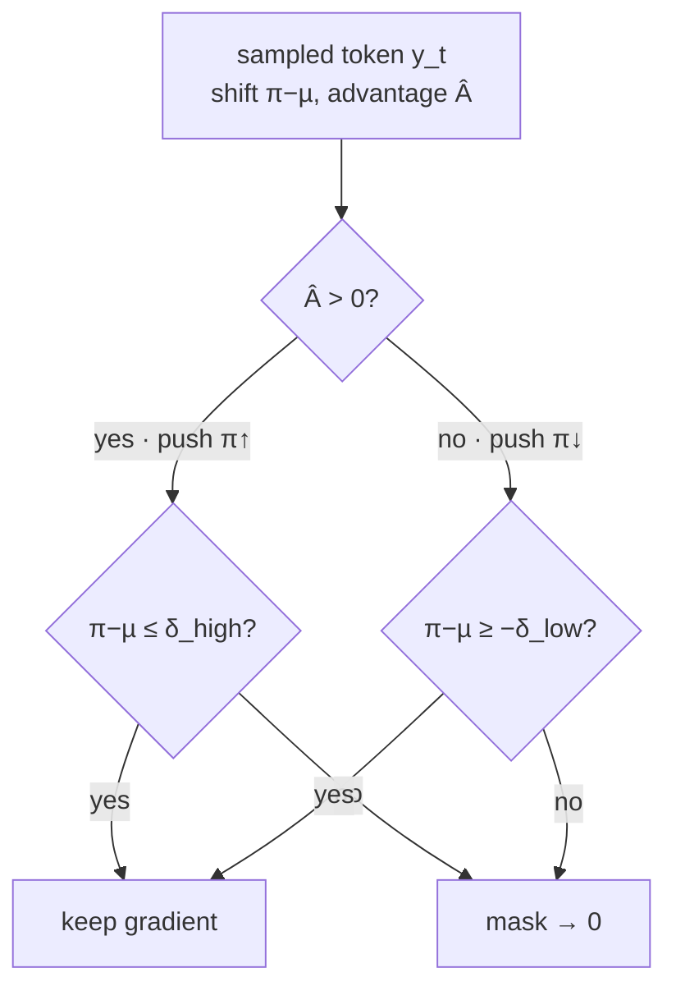

# DRPO — Divergence Regularized Policy Optimization

`ARDRPO` is the repo's **autoregressive (token-level)** RL algorithm. Instead of
PPO/GRPO's ratio-clip trust region, it enforces a **divergence-based hard mask** on
each sampled token: replay the trajectory, measure the sampled token's probability
shift between the new and old policy, and **zero** the update when that shift crosses
a threshold `δ` *in the reward-improving direction*. The kept tokens train with a
REINFORCE objective corrected by a **truncated importance ratio** (TIS). It is the
LLM analogue of [flowDPPO](../flowDPPO/) — divergence mask instead of ratio clip —
but on discrete tokens rather than a continuous SDE trajectory.

- **Code:** [`unirl/algorithms/drpo.py`](../../unirl/algorithms/drpo.py) (`ARDRPO`; loss helpers `_ar_drpo_tv_loss` / `_ar_drpo_kl_loss` / `_ar_pg_tv_penalty_loss`)
- **Recipe (SGLang):** [`recipes/llm_rl/ar_drpo_qwen3_4b_base_dpao_sglang.yaml`](../../recipes/llm_rl/ar_drpo_qwen3_4b_base_dpao_sglang.yaml) — Qwen3-4B-Base on DAPO-Math
- **Config extract:** [`config.yaml`](config.yaml)

> **⚠️ Variants — read this first.** `ARDRPO` offers three losses via `variant`:
> - **`tv`** / **`kl`** — the **DPPO hard mask**: zero the gradient when the sampled
>   token's divergence (`|π−µ|` for TV, Binary-KL for KL) crosses `δ` in the
>   reward-improving direction, with Truncated Importance Sampling on the kept tokens.
>   This is the *baseline* the sections below derive in detail.
> - **`pg_tv_penalty`** — the reference `run_qwen3_4b.sh` loss: a **soft TV penalty**,
>   `L_t = -A_t·logp_t + penalty_coef·|ratio_t − 1|` (plain REINFORCE + a continuous
>   penalty pulling the ratio toward 1; no mask, no IS weight). **This is what the
>   reproduction recipe uses.**
>
> The bundled paper *"Rethinking the Divergence Regularization in LLM RL"* proposes
> **DRPO**, whose exact form is a smooth gradient *weight*
> `w_t = 1 − sign(Â_t(r_t−1))·|π−µ|/δ`. `pg_tv_penalty` is the reference run's
> penalty-form loss in the same TV spirit (smooth, no hard cutoff); the tv/kl variants
> are the DPPO hard-mask baseline. Lineage: **PPO → GRPO → SPO → DPPO → DRPO**.

## Intuition

LLM RL is almost always **off-policy**: the rollout engine (SGLang) and the training
engine differ numerically, and one batch of rollouts is split into multiple gradient
steps. So the policy being updated `π` is not exactly the behavior policy `µ` that
generated the tokens — you need a trust region.

PPO/GRPO build that trust region from the **importance ratio** `r = π/µ`. But for LLMs
the ratio is a poor proxy for *distributional* shift: over a long-tailed vocabulary a
tiny probability change on a rare token produces a huge ratio, while a large mass move
on a common token produces only a modest ratio. A fixed ratio window therefore
over-constrains rare tokens and under-constrains common ones.

DPPO fixes the **geometry**: it measures the sampled token's **absolute probability
shift** `|π−µ|` (the "Binary-TV" surrogate) and applies a **hard mask** — drop the
gradient only when the shift exceeds `δ` *and* the update is pushing the policy
further in the direction the advantage wants. `ARDRPO` implements exactly this,
plus **Truncated Importance Sampling** (clamp `r` to `clip_ratio_c`, detached) so a
runaway ratio on a rare token can't blow up the gradient.


The figure's top strip is the pipeline this folder runs (`ARDRPO.compute_loss_and_backward`): a **prompt** is rolled out by the behavior policy `µ` (SGLang), scored into a per-prompt **group advantage** `Â`, then the trainable policy is **replayed at the sampling temperature** for new log-probs `π` — yielding the ratio `r` and the **Binary-TV shift** `|π−µ|` that drive the reweighted REINFORCE loss, looped once per batch (single update). Its centerpiece is the load-bearing distinction the **⚠️ Variants** box above sets up: the **`tv`/`kl` hard mask** (full gradient, then a cliff to `0` at `δ`) versus the paper's **smooth DRPO weight** (the formula in [The math](#the-math) — attenuating to `0` at `δ` and *reversing* into a corrective signal beyond it); the shipped reproduction recipe instead runs the `pg_tv_penalty` soft-penalty form in that same TV spirit.

## The math

Per sampled token `y_t` with state `s_t`, ratio and (signed) Binary-TV shift:

$$ r_t = \exp(\log\pi_\theta - \log\pi_{\theta_\text{old}}) = \frac{\pi(y_t|s_t)}{\mu(y_t|s_t)}, \qquad \Delta_t = \pi(y_t|s_t) - \mu(y_t|s_t) $$

The trust region is an **asymmetric, advantage-aware hard mask** — keep the token
unless it is moving the sampled probability too far in the direction the advantage
pushes:

$$ m_t = \begin{cases} \mathbb{1}[\,\Delta_t \le \delta_\text{high}\,] & \hat A_t > 0 \quad(\text{push }\pi\uparrow)\\[2pt] \mathbb{1}[\,\Delta_t \ge -\delta_\text{low}\,] & \hat A_t \le 0 \quad(\text{push }\pi\downarrow) \end{cases} $$

With the truncated ratio `r̄_t = min(r_t, C)` (detached, TIS), the loss is a
**masked REINFORCE** term:

$$ \mathcal{L} = -\,\mathbb{E}\big[\, \hat A_t \cdot \bar r_t \cdot \log\pi_\theta(y_t|s_t) \cdot m_t \,\big] $$

Because `r̄_t` is detached, the gradient flows only through `log π_θ`, giving
`−Â_t·r̄_t·∇logπ` — the *same* policy gradient as differentiating PPO's surrogate
`r_t·Â_t` (since `∇(r·Â)=·r·∇logπ`), but the TIS clamp caps the importance weight
without bending the gradient direction.

The core is literally these lines (`unirl/algorithms/drpo.py` · `_ar_drpo_tv_loss`;
log-clamp/metrics elided — the Code map below is the source of truth):

```python
ratio = torch.exp(new_logp - old_logp)                    # r = π/µ
trunc = torch.clamp(ratio, max=clip_ratio_c).detach()     # TIS — no grad through ratio
prob_delta = torch.exp(new_logp) - torch.exp(old_logp)    # π − µ  (signed Binary-TV)
valid = torch.where(adv > 0, prob_delta <= div_high,      # adv>0: block big prob ↑
                             prob_delta >= -div_low)        # adv<0: block big prob ↓
loss = (-adv * trunc * new_logp * valid.float()).mean()   # masked REINFORCE + TIS
```



**KL variant** (`variant: kl`): replaces `Δ_t` with the **Binary-KL** between the
old/new Bernoulli token probabilities — `KL(Bern(µ_t)‖Bern(π_t))`, computed from the
chosen token's log-probs only (no full-vocab logits). Its mask also "always allows a
conservative update": a high-KL token is kept if the ratio moves *opposite* to the
advantage (`ratio ≤ 1` for `Â>0`, `ratio ≥ 1` for `Â<0`).

**`pg_tv_penalty` variant (reference loss, what the recipe runs).** Instead of the hard
mask, add a *smooth* TV penalty to plain REINFORCE (no mask, no TIS weight):

$$ \mathcal{L}_t = -\,\hat A_t \,\log\pi_\theta(y_t|s_t) \;+\; \varepsilon\,|r_t - 1| $$

with `ε = penalty_coef`. This is the `run_qwen3_4b.sh` loss. The paper's exact DRPO is a
smooth gradient *weight* `w_t = 1 − sign(Â_t(r_t−1))·|π−µ|/δ ∈ [1−1/δ, 1+1/δ]` — same TV
spirit (smooth, bounded, no hard cutoff); `pg_tv_penalty` is the penalty-form loss
actually wired (`_ar_pg_tv_penalty_loss`).

## Code map

| Step | Where |
|---|---|
| Replay new per-token log-probs at sampling temperature | `ARDRPO.compute_loss_and_backward` → `stage.replay(segment, temperature=T)` → `[total_tokens]` |
| `old_logp` = rollout log-prob `µ` | `segment.log_probs` (rollout-native; **single-update only**) |
| Per-sample advantage → per-token | `ARGRPO._expand_advantages_to_tokens` (repeat over each sample's `lengths` span) |
| TV divergence + asymmetric hard mask | `_ar_drpo_tv_loss` |
| Binary-KL divergence + mask | `_ar_drpo_kl_loss` |
| Soft TV penalty (reference loss) | `_ar_pg_tv_penalty_loss` |
| TIS truncation | `torch.clamp(ratio, max=clip_ratio_c).detach()` |
| Group advantage (per-prompt mean/std) | `RolloutTrack.compute_advantages` (`adv_normalization_scope: group`) |
| Padding / eos token masking | `segment.loss_mask` |

## Key knobs ([`config.yaml`](config.yaml))

| Knob | Meaning |
|---|---|
| `variant` | `tv`/`kl` (DPPO hard mask) or `pg_tv_penalty` (soft TV penalty `-A·logp + penalty_coef·\|r−1\|`). **Recipe uses `pg_tv_penalty`.** |
| `penalty_coef` | (`pg_tv_penalty`) TV-penalty coefficient `ε`. Default `0.15`. |
| `loss_agg_mode` | `token-mean` (default) or `seq-mean-token-sum-norm` (per-seq Σ(token loss) / `horizon`, mean over seqs). |
| `normalize_adv_by_std` | `true` (default, ÷ group std) or `false` (mean-center only). Recipe uses `false`. |
| `clip_divergence` | (`tv`/`kl` only) Divergence threshold `δ`. Default `0.2`. **TV:** absolute probability shift; **KL:** nats. Not a ratio ε. |
| `clip_divergence_low` / `clip_divergence_high` | Asymmetric thresholds for the `adv<0` / `adv>0` directions; each defaults to `clip_divergence`. |
| `clip_ratio_c` | TIS truncation bound `C` for the importance ratio. Default `20.0` (large ⇒ low bias). |
| `sampling_temperature` | **MUST equal `sampling.temperature`.** Replay tempers logits (`log_softmax(logits/T)`) so `π` and the rollout `µ` live on the same distribution (`ratio_mean ≈ 1` at update 1). |
| `adv_normalization_scope` | `group` ⇒ per-prompt-group mean/std advantage (critic-free GRPO style). |

## Common pitfalls

- **Temperature must match.** If `sampling_temperature ≠ sampling.temperature`, replay
  and rollout log-probs sit on different distributions and `r` is systematically off.
  The reproduction recipe pins both to `1.0`; watch `ratio_mean ≈ 1` on the run.
- **Single update only.** `ARDRPO` does **not** freeze a train-side `old_logp` — it
  reuses the rollout log-prob. `num_updates_per_batch > 1` would conflate the
  rollout-vs-train engine gap with real policy drift, so `TrainStack` raises for it
  (`supports_multi_update = False`).
- **`clip_divergence` is tv/kl-only.** It is a TV/KL threshold on an *absolute
  probability shift*, not a PPO ratio window, and is ignored by `pg_tv_penalty` (which
  uses `penalty_coef`). The paper's exact `w_t` weight form is not wired — `pg_tv_penalty`
  is its penalty-form approximation.
- **SGLang reproducibility (from the recipe).** Match the trainside chat template
  exactly (`/no_think` + `enable_thinking: false`) or Qwen3 emits a long `<think>`
  block that overruns `max_new_tokens` before the `#### answer`; and use the **LoRA-pool**
  sync (`LocalLoraWeightSync`), not merged full-weight sync, which plateaus.

## Run it

```bash
# one-time: build the local jsonl from the raw DAPO-Math + AIME datasets
python -m unirl.utils.prepare_dapo_math --out-dir data/dapo_math

DATA_PATH=data/dapo_math/train.jsonl EVAL_DATA_PATH=data/dapo_math/aime_eval.jsonl \
python -m unirl.train_vlm --config-name=llm_rl/ar_drpo_qwen3_4b_base_dpao_sglang num_devices=64
```

The model defaults to the HF id `Qwen/Qwen3-4B-Base`; set `QWEN3_PATH` to a local
checkpoint dir to use a cache. Compose-only check (no GPU work): append `--cfg job`.

## vs. the other tutorials

- **[flowDPPO](../flowDPPO/)** is the closest sibling: same "divergence mask instead of
  ratio clip" idea, but on a **diffusion** SDE trajectory (per-step Gaussian KL on
  continuous latents) rather than discrete tokens. DRPO masks per-**token**
  Binary-TV/KL.
- **[flowGRPO](../flowGRPO/)** / **[diffusionNFT](../diffusionNFT/)** are diffusion
  algorithms; DRPO is the **LLM (AR, token-level)** entry. The AR ratio-clip
  baseline is `ARGRPO` (`unirl/algorithms/ar_grpo.py`), which shares `_grpo_clip_loss`
  with flowGRPO.

## External references

- DRPO paper (bundled): *"Rethinking the Divergence Regularization in LLM RL"* — the smooth-weight DRPO; `pg_tv_penalty` is the reference run's penalty-form loss in the same spirit.
- DPPO paper (what `ARDRPO` implements): Qi et al., *"Rethinking the Trust Region in LLM Reinforcement Learning"* — [arXiv:2602.04879](https://arxiv.org/abs/2602.04879).
- SPO: Xie et al., *"Simple Policy Optimization"* — [arXiv:2401.16025](https://arxiv.org/abs/2401.16025).

<!-- Figures: drop PNG/SVG into ./assets/ and reference e.g.  -->
