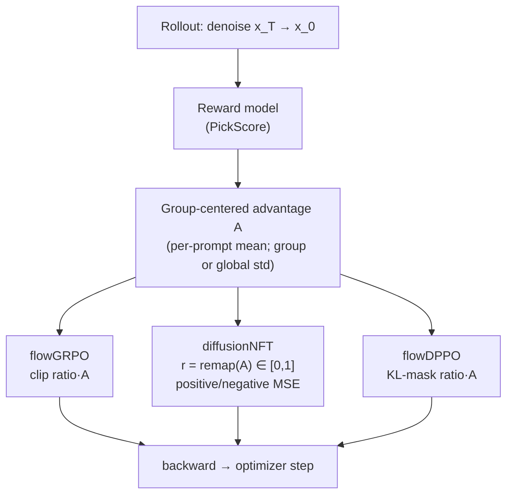

# Algorithm Tutorials

Short, code-grounded walkthroughs of the core RL algorithms in UniRL: three
**diffusion** (image) algorithms and one **LLM** (autoregressive, token-level)
algorithm. Each folder pairs a focused, annotated config extract with a README that
explains *what* the algorithm optimizes, *the math*, and *where it lives in the
code*.

If you are new to this codebase, read this page first. For the **diffusion** track,
read [`flowGRPO/`](flowGRPO/) before the other two: it establishes the common
reverse-process RL vocabulary — SDE rollout, per-step log-prob, old/new policy
ratio, and group-relative advantage. flowDPPO changes only the trust-region rule.
diffusionNFT is the different one: it does not optimize the reverse trajectory
likelihood at all. The **LLM** track is [`DRPO/`](DRPO/), a token-level
divergence-masked trust region — the autoregressive analogue of flowDPPO; it reads
independently of the diffusion three.

| Tutorial | Algorithm | Code | Canonical recipe |
|---|---|---|---|
| [`flowGRPO/`](flowGRPO/) | `DiffusionGRPO` — PPO-style ratio clipping on per-step SDE log-probs | [`unirl/algorithms/diffusion_grpo.py`](../unirl/algorithms/diffusion_grpo.py) | [`recipes/diffusion_rl/sd3_trainside.yaml`](../recipes/diffusion_rl/sd3_trainside.yaml) |
| [`flowDPPO/`](flowDPPO/) | `DiffusionDPPO` — same SDE rollout, KL-ADV masking instead of clipping | [`unirl/algorithms/dppo.py`](../unirl/algorithms/dppo.py) | [`recipes/diffusion_rl/sd3_flowdppo.yaml`](../recipes/diffusion_rl/sd3_flowdppo.yaml) |
| [`diffusionNFT/`](diffusionNFT/) | `DiffusionNFT` — forward-process dual positive/negative reconstruction | [`unirl/algorithms/nft.py`](../unirl/algorithms/nft.py) | [`recipes/diffusion_rl/sd3_nft.yaml`](../recipes/diffusion_rl/sd3_nft.yaml) |
| [`DRPO/`](DRPO/) | `ARDRPO` — **LLM (AR)** token-level divergence mask (DPPO Binary-TV/KL + TIS; `tv`/`kl`/`pg_tv_penalty`) | [`unirl/algorithms/drpo.py`](../unirl/algorithms/drpo.py) | [`recipes/llm_rl/ar_drpo_qwen3_4b_base_dpao_sglang.yaml`](../recipes/llm_rl/ar_drpo_qwen3_4b_base_dpao_sglang.yaml) |

## Quick mental model

The first three are diffusion (image); DRPO is the LLM (token-level) entry.

| Question | flowGRPO | flowDPPO | diffusionNFT | DRPO (LLM/AR) |
|---|---|---|---|---|
| What is trained? | Probability of sampled SDE denoising steps | Same probabilities, but with a KL-aware mask | Flow-matching denoising prediction on re-noised clean latents | Probability of sampled tokens, divergence-masked |
| Needs SDE log-probs? | Yes | Yes | No | No (token log-probs) |
| Uses old/new ratio? | Yes | Yes | No | Yes (TIS-truncated) |
| Main safety mechanism | PPO clip range | KL threshold + advantage-direction mask | EMA "old" adapter in a dual positive/negative objective | Binary-TV/KL hard mask on \|π−µ\| |
| Best first read? | Yes | After flowGRPO | After understanding why reverse-process RL is expensive | LLM track (independent); akin to flowDPPO |

## How they relate

All three share the same scaffold — a `StageAlgorithm`
([`unirl/algorithms/base.py`](../unirl/algorithms/base.py)) whose
`compute_loss_and_backward` is called once per micro-batch. They differ only in the
*loss* and in *what the rollout records*:



- **flowGRPO** and **flowDPPO** are reverse-process policy-gradient methods. They
  replay the SDE trajectory the rollout sampled and compare new vs. old per-step
  log-probs. They differ in how they keep updates trust-region-safe: GRPO
  **clips** the ratio; DPPO **masks** high KL-score updates that are already
  moving too aggressively in the reward-improving direction.
- **diffusionNFT** is *off-policy* (`requires_ema_rollout = True`): it never runs an
  SDE rollout for the loss. It re-noises the rollout's clean latent at many
  timesteps and trains a dual adapter (trainable vs. EMA-frozen) toward a
  reward-weighted blend of "positive" and "negative" predictions.
- **DRPO** is the **LLM (AR)** entry, a token-level analogue of flowDPPO: it
  replays the sampled tokens and **zeroes** a token's update when its probability
  shift `|π−µ|` crosses a threshold in the reward-improving direction (DPPO's hard
  mask). Kept tokens train a TIS-corrected REINFORCE loss. *(It also ships a
  `pg_tv_penalty` variant — the soft TV-penalty form of the bundled DRPO paper — which
  the reproduction recipe actually uses; see [`DRPO/`](DRPO/).)*

Advantage normalization is shared by all four through
[`RolloutTrack.compute_advantages`](../unirl/types/rollout_resp.py). The default is
GRPO-style per-prompt centering and per-prompt standardization. The shipped
flowDPPO recipe sets `adv_use_global_std: true`, which still subtracts each
prompt's group mean but divides by one batch-wide reward std; the tutorials call
out that recipe-specific difference where it matters.

## External references

- Flow-GRPO paper: [arXiv:2505.05470](https://arxiv.org/abs/2505.05470) /
  [NeurIPS 2025 proceedings](https://proceedings.neurips.cc/paper_files/paper/2025/hash/3a10c46572628d58cb44fb705f25cbbf-Abstract-Conference.html)
- Flow-GRPO official implementation: [yifan123/flow_grpo](https://github.com/yifan123/flow_grpo)
- DiffusionNFT paper: [arXiv:2509.16117](https://arxiv.org/abs/2509.16117)
- DiffusionNFT project/code: [NVIDIA project page](https://research.nvidia.com/labs/cosmos-lab/diffusionnft/) /
  [NVlabs/DiffusionNFT](https://github.com/NVlabs/DiffusionNFT)
- DPPO — the Binary-TV/KL hard mask `DRPO`'s `tv`/`kl` variants implement: [arXiv:2602.04879](https://arxiv.org/abs/2602.04879)
- SPO — smooth ratio regularizer in the lineage: [arXiv:2401.16025](https://arxiv.org/abs/2401.16025)
- DRPO — the bundled paper (smooth divergence regularizer); its penalty-form `pg_tv_penalty` is the variant the reproduction recipe runs — see [`DRPO/`](DRPO/)

## Running a tutorial

The config in each folder is an **annotated extract** for reading. To actually
train, launch the full canonical recipe (see each README):

```bash
# diffusion (flowGRPO / flowDPPO / diffusionNFT)
PRETRAINED_MODEL=stabilityai/stable-diffusion-3.5-medium \
python -m unirl.train_diffusion --config-name=diffusion_rl/sd3_trainside num_devices=8

# LLM (DRPO) — note the train_vlm entrypoint
DATA_PATH=data/dapo_math/train.jsonl EVAL_DATA_PATH=data/dapo_math/aime_eval.jsonl \
python -m unirl.train_vlm --config-name=llm_rl/ar_drpo_qwen3_4b_base_dpao_sglang num_devices=64
```

> Figures: diagrams here are GitHub-rendered [Mermaid](https://mermaid.js.org/).
> To add raster figures, drop them in a folder `assets/` next to the README and
> reference them with ``.
