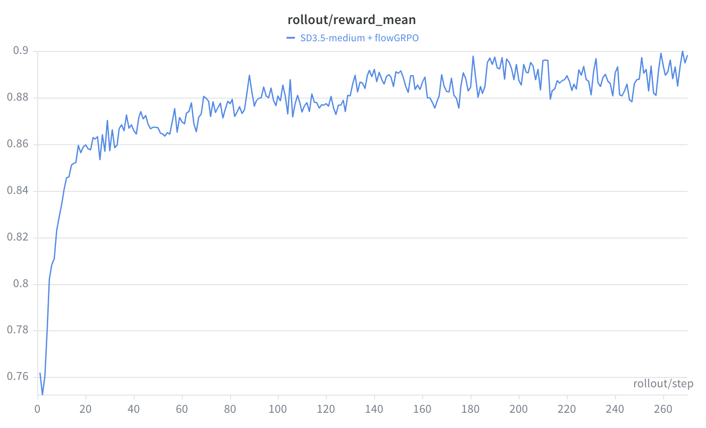

# flowGRPO — Flow-matching GRPO for diffusion

`DiffusionGRPO` treats the **stochastic (SDE) denoising trajectory** of a
flow-matching model as a sequence of policy actions and optimizes it with the
**GRPO** objective: a PPO-style clipped ratio weighted by a *group-relative* reward
advantage. It is the baseline online RL algorithm for diffusion in this repo, and it
establishes the vocabulary the other two diffusion tutorials reuse — SDE rollout,
per-step log-prob, old/new ratio, and the critic-free group advantage.

- **Loss:** [`unirl/algorithms/diffusion_grpo.py`](../../unirl/algorithms/diffusion_grpo.py) · shared helper `_grpo_clip_loss` in [`unirl/algorithms/base.py`](../../unirl/algorithms/base.py)
- **SDE transition math:** [`unirl/sde/kernels.py`](../../unirl/sde/kernels.py) (`FlowSDEStrategy`)
- **Recipe:** [`recipes/diffusion_rl/sd3_trainside.yaml`](../../recipes/diffusion_rl/sd3_trainside.yaml) · **Config extract:** [`config.yaml`](config.yaml)
- **Checkpoints:** [🤗 zhouzhuoxin/unirl-checkpoint](https://huggingface.co/zhouzhuoxin/unirl-checkpoint/tree/main)
- **Paper:** *"Flow-GRPO: Training Flow Matching Models via Online RL"* — Liu et al., NeurIPS 2026 ([arXiv:2505.05470](https://arxiv.org/abs/2505.05470)).

Read this tutorial first. flowDPPO reuses the same rollout/replay path and only
changes the trust-region rule; diffusionNFT is easier to understand once this
reverse-process policy-gradient path is clear.

## What problem it solves

A flow-matching sampler turns noise `x_T` into an image `x_0` by integrating a
deterministic ODE, `dx_t/dt = v_θ(x_t, t, c)`. A deterministic transition has no
density for "the action just taken", so there is nothing for a policy gradient to act
on. Flow-GRPO fixes this with an **ODE-to-SDE conversion**: with `eta > 0`, selected
denoising steps become Gaussian transitions `π(x_{t−1} | x_t)` whose log-probability
is computable, while the trajectory's marginals stay aligned with the original flow.
In this repo that transition is `FlowSDEStrategy`: for one step it forms a Gaussian
mean `prev_sample_mean`, samples the next latent during rollout, evaluates the stored
next latent during replay, and reduces the per-sample log-prob over latent dims into
`segment.sde_logp[:, k]`.

For each prompt the rollout samples a group of `G = samples_per_prompt` images, scores
them, and turns the rewards into **group-relative advantages**: the group is its own
baseline, so no value network is needed (the "G" in GRPO). Above-mean samples get
positive advantage and the loss pushes up the probability of the SDE steps that
produced them; below-mean samples get negative advantage and the loss pushes those
steps down. PPO clipping bounds how far the ratio can move in one optimizer step.

![flowGRPO overview: a critic-free, group-relative advantage with a PPO-clipped update. For one prompt the SDE sampler draws a group of G images, PickScore rewards each, and the group is its own baseline, so the advantage is reward minus the group mean (no value network). Above-mean samples get positive advantage that pushes their SDE step probabilities up; below-mean samples get negative advantage that pushes them down. The update is kept small by a PPO clip on the per-step ratio, and only the early high-noise SDE steps record log-probs and receive RL loss; the rest are ordinary sampling steps.](assets/overview.png)

## The math

For one prompt, the **group-relative advantage** centers each reward on its prompt
group. The shipped recipe sets `adv_use_global_std: true`, so the std is one batch-wide
value, not per-group:

$$ A_i = \frac{R_i - \mathrm{mean}_{j\in\text{group}(i)} R_j}{\mathrm{std}_{\text{batch}}(R) + \epsilon} $$

The group-mean baseline is what makes GRPO critic-free; the batch-wide std is the
recipe's choice for v1 parity (see [Key knobs](#key-knobs)). For each trained SDE step,
GRPO compares the current policy to the frozen old policy via the ratio `ρ`, and
minimizes PPO's clipped surrogate:

$$ \rho_{i,k} = \exp\big(\log\pi_\theta(a_{i,k}\,|\,s_{i,k}) - \log\pi_{\theta_\text{old}}(a_{i,k}\,|\,s_{i,k})\big) $$

$$ \mathcal{L} = \mathbb{E}_{i,k}\big[\, \max(-A_i\,\rho_{i,k},\; -A_i\,\mathrm{clip}(\rho_{i,k},\,1-\epsilon,\,1+\epsilon))\,\big] $$

where the state `s_{i,k}` is `(prompt, σ_k, x_k)` and the action `a_{i,k}` is the
sampled next latent `x_{k+1}`. The `max` of the two negated terms is exactly PPO's
`−min(ρA, clip(ρ)A)`. The core is literally the shared `_grpo_clip_loss` (cast/detach
elided — the [Math → code map](#math--code-map) is the source of truth):

```python
ratio = torch.exp(new_logp - old_logp)                   # ρ  (per trained SDE step)
unclipped = -adv * ratio                                 # −A·ρ
clipped   = -adv * torch.clamp(ratio, 1.0 - clip_range, 1.0 + clip_range)
loss = torch.maximum(unclipped, clipped).mean()          # = −min(A·ρ, A·clip(ρ))
```

`old_logp` is the pre-update policy anchor, frozen once in `prepare_segment` (and lazily
filled there under `torch.no_grad()` in SGLang replay-mode rollouts). It stays fixed
across all `stack.num_updates_per_batch` mini-batches (`supports_multi_update = True`),
so later optimizer steps still compare against the same `π_old`.

> The Flow-GRPO paper also studies a KL-to-reference term for reward-hacking control.
> The `sd3_trainside` recipe does **not** wire that term into `DiffusionGRPO`; the train
> loss here is the clipped-ratio surrogate above.

## Math → code map

| Math object | Repo object |
|---|---|
| Prompt `c` | `track.conditions` (`SD3Conditions`) |
| Reverse state `x_t` | `segment.latents_at(step_idx)` |
| Action `x_{t−1}` (next latent) | `segment.latents_at(step_idx + 1)` |
| Selected SDE step `k` | `segment.sde_indices` |
| Old log-prob `log π_old(a\|s)` | `segment.sde_logp`, aligned with `sde_indices`, frozen by `prepare_segment` |
| New log-prob `log π_θ(a\|s)` | `DiffusionStage.replay(...).log_probs` (→ `new_logp`) |
| Ratio `ρ` | `torch.exp(new_logp − old_logp)` in `_grpo_clip_loss` |
| Advantage `A_i` | `track.advantages`, broadcast to `[B, S]` as `adv_b` |
| PPO clip `ε` | `algorithm.clip_range` |
| Per-step Gaussian log-prob | `FlowSDEStrategy.step` / `compute_log_prob` |

## From rollout to update

1. `unirl.train_diffusion` builds `DiffusionTrainer`.
2. `DiffusionTrainer._build_req` stamps the sampling params and the SDE indices resolved
   by `DiffusionSamplingParams.resolve_sde_indices`.
3. `TrainsideRolloutEngine` runs the SD3 pipeline; `SD3DiffusionStage.diffuse` loops the
   σ schedule and, on each selected step, calls `step_with_logp(..., eta=params.eta)`,
   storing `latents`, `sigmas`, `sde_indices`, and `sde_logp` in a `LatentSegment`.
4. `RewardService.score_and_attach` writes `track.rewards` (PickScore,
   [`unirl/reward/local/pickscore.py`](../../unirl/reward/local/pickscore.py)).
5. `RolloutTrack.compute_advantages(normalize=True, use_global_std=True)` writes
   `track.advantages`.
6. `TrainStack.train_track` calls `DiffusionGRPO.prepare_segment` **once** (freeze
   `old_logp`; replay-mode fills it via a `no_grad` replay).
7. Each micro-batch calls `DiffusionGRPO.compute_loss_and_backward`: replay the same
   selected steps at current weights for `new_logp`, gather frozen `old_logp`, broadcast
   advantages, run `_grpo_clip_loss`, and `backward()`.

## Which steps are trained

Inference runs `num_inference_steps: 10`, but only `num_sde_steps: 3` steps record
log-probs and receive GRPO loss, drawn from the high-σ window `timestep_fraction:
[0, 0.5]` (steps 0–4):

| Inference step | What happens |
|---|---|
| Candidate steps `0..4` | `AllSDEScheduler.get_sde_indices` selects **3 of these at random** (`np.random.default_rng(step).choice(pool, 3)`, seeded by the step index) for SDE treatment. |
| The 3 selected steps | Run as stochastic SDE transitions, store `log π(x_{t−1}\|x_t)`, receive GRPO loss. |
| Non-selected candidates `0..4` | Ordinary denoising; no log-prob, no RL gradient this step. |
| Tail steps `5..9` | Low-σ; deterministic, never trained in this recipe. |

So `num_sde_steps` is **not** the inference step count — it is how many transitions
enter the policy-gradient objective.

## Key knobs ([`config.yaml`](config.yaml))

| Knob | Meaning |
|---|---|
| `clip_range` | PPO ε. Default `1e-4` — deliberately tight; one SDE step's log-prob moves fast. |
| `clip_schedule` | `constant` / `linear_decay` / `cosine_decay` via `_resolve_clip_range_from_schedule`. |
| `sampling.eta` | SDE stochasticity. Must be `> 0` for log-probs to exist. |
| `sampling.samples_per_prompt` | Group size `G` for the group-relative advantage. |
| `sampling.scheduler.num_sde_steps` | How many steps record log-probs (the trained steps). |
| `sampling.scheduler.timestep_fraction` | Window the SDE steps are drawn from (`[0, 0.5]` = early/high-σ). |
| `stack.num_updates_per_batch` | PPO mini-batches per rollout; `π_old` frozen once before them. |
| `adv_use_global_std` (top-level) | `true` here: per-group mean, **one batch-wide std**. The code default (flag absent) is per-group std; every shipped diffusion recipe overrides it to `true`. |

## Debug checklist

| Symptom | First files / variables to check |
|---|---|
| `ratio_mean` not ≈ 1 on update #1 | rollout↔replay weight sync; `sampling.eta`; `segment.sde_logp` source; `prepare_segment` |
| Nearly everything clipped | `clip_fraction`, `ratio_min/max`, `clip_range` (with `ε = 1e-4`, high clip is expected) |
| `approx_kl` / `ratio_max` spiking | LR too high, or `eta` too large making a transition very unlikely |
| Advantages all zero | `track.rewards`, group size, all-correct/all-wrong groups, `compute_advantages` |
| No gradient / zero trained steps | `segment.sde_indices`, `sampling.eta`, `num_sde_steps` |
| Replay can't find latents / SDE mismatch | `LatentSegment.latents_at`, `sde/kernels.py::FlowSDEStrategy`, `SD3DiffusionStage.replay` |

Metric source: every `ratio_*`, `clip_fraction`, and `approx_kl` value is emitted by
`_grpo_clip_loss`.

## Run it

```bash
PRETRAINED_MODEL=stabilityai/stable-diffusion-3.5-medium \
python -m unirl.train_diffusion --config-name=diffusion_rl/sd3_trainside num_devices=8
```

Compose-only check (no GPU work): append `--cfg job --resolve`.



A healthy run climbs `rollout/reward_mean` quickly and then keeps inching up — here
SD3.5-medium goes from ~0.76 to ~0.90 over ~270 steps.

## vs. the other tutorials

- **[flowDPPO](../flowDPPO/)** keeps the same SDE rollout and ratio but replaces the
  PPO clip with an exact Gaussian-KL mask using `segment.sde_means`.
- **[diffusionNFT](../diffusionNFT/)** drops the reverse-process log-prob path entirely
  and trains the forward process off-policy with a positive/negative reconstruction loss.
- **[DRPO](../DRPO/)** is the AR analogue: actions are tokens and old log-probs are
  `TextSegment.log_probs`; its ratio-clip cousin `ARGRPO` shares this `_grpo_clip_loss`.
