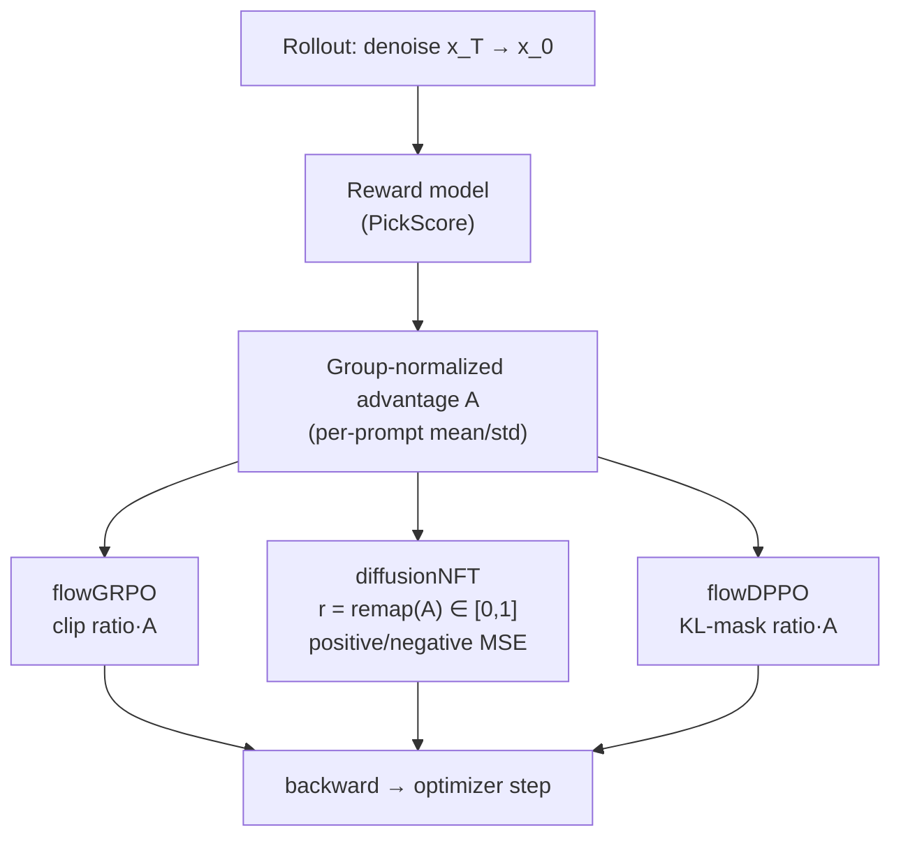

# Algorithm Tutorials

Short, code-grounded walkthroughs of the three core **diffusion-RL** algorithms in
UniRL. Each folder pairs a focused, annotated config extract with a README that
explains *what* the algorithm optimizes, *the math*, and *where it lives in the
code*.

| Tutorial | Algorithm | Code | Canonical recipe |
|---|---|---|---|
| [`flowGRPO/`](flowGRPO/) | `DiffusionGRPO` — PPO-style ratio clipping on per-step SDE log-probs | [`unirl/algorithms/diffusion_grpo.py`](../unirl/algorithms/diffusion_grpo.py) | [`recipes/diffusion_rl/sd3_trainside.yaml`](../recipes/diffusion_rl/sd3_trainside.yaml) |
| [`diffusionNFT/`](diffusionNFT/) | `DiffusionNFT` — forward-process, dual positive/negative reconstruction | [`unirl/algorithms/nft.py`](../unirl/algorithms/nft.py) | [`recipes/diffusion_rl/sd3_nft.yaml`](../recipes/diffusion_rl/sd3_nft.yaml) |
| [`flowDPPO/`](flowDPPO/) | `DiffusionDPPO` — KL-divergence masking instead of clipping | [`unirl/algorithms/dppo.py`](../unirl/algorithms/dppo.py) | [`recipes/diffusion_rl/sd3_flowdppo.yaml`](../recipes/diffusion_rl/sd3_flowdppo.yaml) |

## How they relate

All three share the same scaffold — a `StageAlgorithm`
([`unirl/algorithms/base.py`](../unirl/algorithms/base.py)) whose
`compute_loss_and_backward` is called once per micro-batch. They differ only in the
*loss* and in *what the rollout records*:



- **flowGRPO** and **flowDPPO** are *on-policy*: they replay the SDE trajectory the
  rollout sampled and compare new vs. old per-step log-probs. They differ in how
  they keep updates trust-region-safe — GRPO **clips** the ratio; DPPO **masks**
  updates by their per-step Gaussian KL.
- **diffusionNFT** is *off-policy* (`requires_ema_rollout = True`): it never runs an
  SDE rollout for the loss. It re-noises the rollout's clean latent at many
  timesteps and trains a dual adapter (trainable vs. EMA-frozen) toward a
  reward-weighted blend of "positive" and "negative" predictions.

## Running a tutorial

The config in each folder is an **annotated extract** for reading. To actually
train, launch the full canonical recipe (see each README):

```bash
PRETRAINED_MODEL=stabilityai/stable-diffusion-3.5-medium \
python -m unirl.train_diffusion --config-name=diffusion_rl/sd3_trainside num_devices=8
```

> Figures: diagrams here are GitHub-rendered [Mermaid](https://mermaid.js.org/).
> To add raster figures, drop them in a folder `assets/` next to the README and
> reference them with ``.
