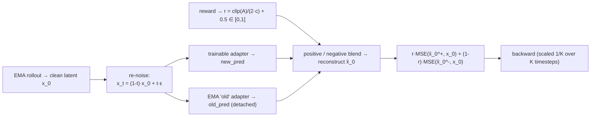

# diffusionNFT — Negative-aware Fine-Tuning (forward-process diffusion RL)

`DiffusionNFT` trains the policy **across the whole noise spectrum without running
an SDE rollout for the loss**. Instead of replaying a trajectory, it re-noises the
rollout's clean final latent at many timesteps and trains a *dual adapter* —
a trainable adapter vs. an EMA-frozen "old" adapter — toward a reward-weighted blend
of a **positive** and a **negative** prediction.

- **Code:** [`unirl/algorithms/nft.py`](../../unirl/algorithms/nft.py)
- **Recipe:** [`recipes/diffusion_rl/sd3_nft.yaml`](../../recipes/diffusion_rl/sd3_nft.yaml)
- **Config extract:** [`config.yaml`](config.yaml)

## Intuition

GRPO/DPPO need a stochastic rollout so per-step log-probs exist. NFT sidesteps that:
take the rollout's clean image latent `x_0`, re-noise it to `x_t` at a chosen
timestep, and ask the model to denoise it. Turn the scalar reward into a weight
`r ∈ [0,1]`; high-reward samples are pulled toward a **positive** target (lean into
the trainable adapter) and low-reward samples toward a **negative** target (lean
away). Sweeping many timesteps per micro-step updates every noise level the rollout
actually visited.

Because the rollout only needs to produce a good `x_0`, NFT runs it under
**EMA-smoothed weights** — it is off-policy (`requires_ema_rollout = True`).



## The math

Reward → weight (advantages clipped to `±c = adv_clip_max`, linearly remapped):

$$ r = \mathrm{clip}\!\Big(\tfrac{\mathrm{clip}(A,-c,c)}{2c} + \tfrac12,\ 0,\ 1\Big) $$

For each of `K` timesteps `t`, with `x_t = (1-t)\,x_0 + t\,\varepsilon`, blend the
trainable prediction `new` and the EMA prediction `old` (β = `beta`):

$$ \text{pos} = \beta\,\text{new} + (1-\beta)\,\text{old}, \qquad \text{neg} = (1+\beta)\,\text{old} - \beta\,\text{new} $$

reconstruct `x̂_0 = x_t - t·pred` from each, and weight the two reconstruction MSEs
by `r`:

$$ \mathcal{L} = \mathbb{E}\Big[\, \tfrac{r}{\beta}\lVert \hat x_0^{+} - x_0\rVert^2 + \tfrac{1-r}{\beta}\lVert \hat x_0^{-} - x_0\rVert^2 \,\Big]\cdot c $$

With `use_adaptive_weight`, each per-sample MSE is divided by its mean-abs-error so
noise levels contribute on a comparable scale. The `K` timesteps come from the
rollout's own σ schedule (`train_timestep_mode: all`, terminal `t=0` dropped); each
contributes one backward scaled by `1/K`.

## Code map

| Step | Where |
|---|---|
| Reward → `r ∈ [0,1]` | `DiffusionNFT.compute_loss_and_backward` (clamp + linear remap) |
| Resolve the `K` timesteps | `DiffusionNFT._resolve_timesteps` (`all` ⇒ from `segment.sigmas`) |
| Re-noise, dual forward, blend, reconstruct, MSE | `DiffusionNFT._compute_loss_at_t` |
| Trainable vs. EMA "old" prediction | `stage.predict_noise_at_step(...)` + `nft_lora_policy.use_shadow()` |
| EMA handle wiring | resolved off `backend.ema` by the trainer (see `__init__`) |

## Key knobs ([`config.yaml`](config.yaml))

| Knob | Meaning |
|---|---|
| `beta` | Dual-blend coefficient. `1.0` ⇒ positive = new, negative = `2·old − new`. |
| `adv_clip_max` | Clip range `c` for the advantage→`r` remap (and the gradient-scale restore). |
| `use_adaptive_weight` | Normalize each MSE by its mean-abs-error (matches the original NFT recipe). |
| `train_timestep_mode` | `all` (rollout's σ schedule) or `random` (fresh uniforms per micro-step). |
| `training_timestep_fraction` | Fraction of the schedule kept after dropping terminal `t=0`. |
| `sampling.eta` / `num_sde_steps` | Both `0` — NFT does **not** record an SDE trajectory. |
| `kl_coef` | KL-to-base penalty — not implemented; any `> 0` fails fast. |

## Run it

```bash
PRETRAINED_MODEL=stabilityai/stable-diffusion-3.5-medium \
python -m unirl.train_diffusion --config-name=diffusion_rl/sd3_nft num_devices=8
```

NFT requires the backend's EMA ("dual adapter"); the recipe wires it automatically.

## vs. the other tutorials

- **[flowGRPO](../flowGRPO/)** / **[flowDPPO](../flowDPPO/)** are on-policy and need
  the SDE rollout's per-step log-probs; NFT is off-policy and trains the forward
  process directly, so it has no ratio and no trajectory replay.

<!-- Figures: drop PNG/SVG into ./assets/ and reference e.g.  -->
