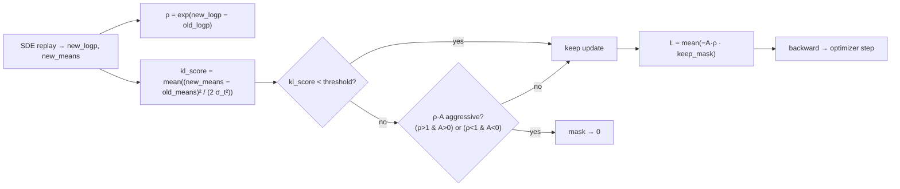

# flowDPPO — KL-masked diffusion policy optimization

`DiffusionDPPO` keeps GRPO's setup — the same SDE rollout, the same
group-relative advantage, the same per-step ratio — but **replaces PPO's uniform
clipping with a KL-ADV mask**. Updates pass freely while the per-step Gaussian
mean shift between the new and old policy is small, and are zeroed only when an
update *both* diverges far from the old policy *and* pushes too aggressively in
the reward-improving direction.

- **Code:** [`unirl/algorithms/dppo.py`](../../unirl/algorithms/dppo.py) (`_gaussian_kl_div`, `_dppo_kl_adv_loss`)
- **Recipe:** [`recipes/diffusion_rl/sd3_flowdppo.yaml`](../../recipes/diffusion_rl/sd3_flowdppo.yaml)
- **Config extract:** [`config.yaml`](config.yaml)

## Intuition

Clipping is a blunt trust region: it caps every step's ratio by the same `ε`,
even when the step barely changed the distribution. DPPO measures the *actual*
mean shift in the SDE transition distribution — implemented as a KL-style
variance-normalized squared error — and only brakes the updates that are genuinely
too large. This lets it take bigger, faster steps in the safe regime while still
preventing runaway updates.

Do not confuse this repo's `DiffusionDPPO` with the robotics paper "Diffusion
Policy Policy Optimization" just because both abbreviate to DPPO. Here, flowDPPO
is specifically the diffusion image-generation variant wired in
[`unirl/algorithms/dppo.py`](../../unirl/algorithms/dppo.py): GRPO replay plus a
KL-ADV mask.



> **Trajectory:** the rollout and which steps are SDE-gated are identical to
> **[flowGRPO](../flowGRPO/)** (same `eta`, same `num_sde_steps` window — see its
> trajectory timeline). flowDPPO changes only what the loss does to those steps.

## The math

Per-step ratio and (unmasked) objective, as in GRPO:

$$ \rho = \exp(\log\pi_\theta - \log\pi_{\theta_\text{old}}), \qquad \ell = -A\,\rho $$

Per-sample KL-style score between the two Gaussian transition means (shared
variance), **averaged over latent dimensions in this implementation**, with the
flow-matching noise scale
$\sigma_t = \text{std\_dev}_t\sqrt{-dt}$, $\text{std\_dev}_t = \sqrt{\sigma/(1-\sigma)}\,\eta$:

$$ \mathrm{kl\_score} = \mathrm{mean}_{C,H,W}\left[\frac{(\mu_\text{new} - \mu_\text{old})^2}{2\,\sigma_t^2}\right] $$

The mask keeps a sample unless its KL-style score is high **and** its move is
aggressive:

$$ \text{drop} = (\mathrm{kl\_score} \ge \tau)\ \wedge\ \big[(\rho>1 \wedge A>0)\ \vee\ (\rho<1 \wedge A<0)\big] $$

$$ \mathcal{L} = \mathbb{E}\big[\, \ell \cdot \mathbb{1}[\neg\,\text{drop}]\,\big] $$

In code (`unirl/algorithms/dppo.py` · `_dppo_kl_adv_loss`; casts/detach/metrics
elided — the Code map below is the source of truth):

```python
kl = ((new_means - old_means) ** 2 / (2 * sigma_t ** 2)).mean(dim=latent_dims)  # per sample
keep   = kl < kl_mask_threshold                  # low divergence → always keep
pos_rm = (~keep) & (ratio > 1) & (adv > 0)       # high-KL, over-pushing a good sample
neg_rm = (~keep) & (ratio < 1) & (adv < 0)       # high-KL, over-suppressing a bad sample
loss = torch.where(~(pos_rm | neg_rm), -adv * ratio, 0.0).mean()
```

with `τ = kl_mask_threshold`. Setting `add_kl_coefficient: false` uses the raw
squared-mean difference divided by 2 instead of the σ-normalized score. Like
GRPO, `old_logp` **and** `old_means` are frozen once per rollout so the anchor
holds across all mini-batches.

The canonical flowDPPO recipe also sets `adv_use_global_std: true`. That still
subtracts each prompt group's mean reward, but divides by one batch-wide reward
standard deviation. This differs from the default flowGRPO recipe, which divides
by each prompt group's own std.

## Code map

| Step | Where |
|---|---|
| Replay new log-probs **and** `prev_sample_means` | `DiffusionDPPO.compute_loss_and_backward` → `stage.replay` |
| Freeze `old_logp` + `old_means` for multi-update | `DiffusionDPPO.prepare_segment` |
| σ_t = `std_dev_t · √(-dt)` | `DiffusionDPPO._compute_sigma_t` |
| KL-style mean-shift score | `_gaussian_kl_div` + mean reduction over latent dims |
| KL-style mask + advantage-aware mask + masked loss | `_dppo_kl_adv_loss` |

The masking is the whole point: `kl_mask` admits low-divergence steps unconditionally;
`pos_rm_mask`/`neg_rm_mask` remove only the high-score steps already moving in the
advantageous direction (the ones at risk of over-shooting).

## Key knobs ([`config.yaml`](config.yaml))

| Knob | Meaning |
|---|---|
| `kl_mask_threshold` | `τ`. Per-sample KL-style score below this passes freely; above it the advantage-aware mask applies. |
| `add_kl_coefficient` | `true` ⇒ normalize the mean-shift score by σ_t (flow-matching scale); `false` ⇒ raw mean-difference² / 2. |
| `sampling.eta` | SDE stochasticity (needed for log-probs and the means); same as flowGRPO. |
| `sampling.scheduler.num_sde_steps` | Steps that record log-probs + means (the trained steps). |
| `stack.num_updates_per_batch` | Number of optimizer mini-batches over one rollout shard; `old_logp` and `old_means` are frozen once before them. |

Watch `masked_fraction` / `kl_mask_fraction` in the logged metrics. If almost
everything is masked, the threshold is too low for the current update scale (or
the LR is too high); raising `kl_mask_threshold` or lowering LR are the first
checks.

## Run it

```bash
PRETRAINED_MODEL=stabilityai/stable-diffusion-3.5-medium \
python -m unirl.train_diffusion --config-name=diffusion_rl/sd3_flowdppo num_devices=8
```

## vs. the other tutorials

- **[flowGRPO](../flowGRPO/)** is the same pipeline with PPO clipping instead of the
  KL-style mask — start there for the baseline.
- **[diffusionNFT](../diffusionNFT/)** removes the SDE rollout and trains the forward
  process off-policy; it has no ratio and no KL-style mask.

<!-- Figures: drop PNG/SVG into ./assets/ and reference e.g.  -->
