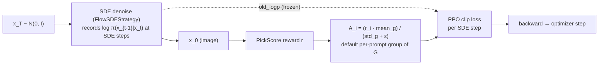
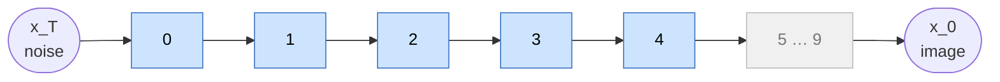

# flowGRPO — Flow-matching GRPO for diffusion

`DiffusionGRPO` treats the **stochastic (SDE) denoising trajectory** of a
flow-matching model as a sequence of policy actions and optimizes it with the
**GRPO** objective: a PPO-style clipped ratio weighted by a *group-normalized*
reward advantage. It is the baseline online RL algorithm for diffusion in UniRL.

- **Code:** [`unirl/algorithms/diffusion_grpo.py`](../../unirl/algorithms/diffusion_grpo.py) · loss helper `_grpo_clip_loss` in [`unirl/algorithms/base.py`](../../unirl/algorithms/base.py)
- **Recipe:** [`recipes/diffusion_rl/sd3_trainside.yaml`](../../recipes/diffusion_rl/sd3_trainside.yaml)
- **Config extract:** [`config.yaml`](config.yaml)

Read this tutorial first. flowDPPO reuses the same rollout/replay path and only
changes the trust-region rule; diffusionNFT is easier to understand once this
reverse-process policy-gradient path is clear.

## Intuition

A flow-matching sampler turns noise `x_T` into an image `x_0`. The original flow
sampler is deterministic, so it is awkward to treat as an RL policy. Flow-GRPO
uses the ODE-to-SDE idea from the Flow-GRPO paper: when `eta > 0`, selected
denoising steps become Gaussian transitions. Those steps have log-probabilities,
so the trainer can replay the sampled trajectory and ask, "under the current
weights, how likely is the exact same transition?"

For each prompt, the rollout samples a group of `G = samples_per_prompt` images,
scores them, and turns the rewards into relative advantages. Good samples get
positive advantage, weak samples get negative advantage. The loss pushes up the
probability of the SDE steps that produced good samples and pushes down the
probability of steps that produced weak samples. PPO clipping keeps the ratio
from moving too far in one optimizer step.



## The math

For each trained SDE step the policy ratio between current and pre-update weights is

$$ \rho = \exp(\log\pi_\theta - \log\pi_{\theta_\text{old}}) $$

and the per-element clipped objective (minimized) is

$$ \mathcal{L} = \mathbb{E}\big[\, \max(-A\rho,\; -A\,\mathrm{clip}(\rho,\,1-\epsilon,\,1+\epsilon))\,\big] $$

where `ε = clip_range` and `A` is the **group-normalized advantage** — rewards are
standardized within each prompt's group of `G = samples_per_prompt` images in the
default GRPO recipe, so the algorithm needs no learned value function. `max` of
the two negated terms is exactly PPO's `-min(ρA, clip(ρ)A)`.

The core is literally these lines (`unirl/algorithms/base.py` · `_grpo_clip_loss`,
shared with `ARGRPO`; dtype casts/detach elided — the Code map below is the source
of truth):

```python
ratio = torch.exp(new_logp - old_logp)                   # ρ
unclipped = -adv * ratio                                 # −A·ρ
clipped   = -adv * torch.clamp(ratio, 1 - clip_range, 1 + clip_range)
loss = torch.maximum(unclipped, clipped).mean()          # = −min(A·ρ, A·clip(ρ))
```

`old_logp` is the pre-update policy anchor. In train-side rollout it may already
be present on the segment; in replay-logprob mode `prepare_segment` fills it once
with `torch.no_grad()`. Either way, it stays frozen across all
`stack.num_updates_per_batch` mini-batches, so later optimizer steps still compare
against the same old policy rather than a moving target.

The SDE steps are usually sparse. In the canonical SD3 recipe, inference uses
`num_inference_steps: 10`, but only `num_sde_steps: 3` selected from
`timestep_fraction: [0, 0.5]` record log-probs and receive GRPO loss.



Blue = the high-σ candidate window `timestep_fraction: [0, 0.5]` (steps 0–4). Each
training step, `num_sde_steps: 3` of those 5 are chosen **at random** (seeded by the
step index, in `AllSDEScheduler`) to run as stochastic SDE transitions; only the
chosen 3 record `log π(x_{t−1}|x_t)` and receive GRPO loss. Grey steps (5–9, low σ)
are ordinary sampling steps the loss never touches.

## Code map

| Step | Where |
|---|---|
| SDE rollout + per-step log-probs | `DiffusionStage.replay(...)` via `unirl/sde/kernels.py::FlowSDEStrategy` |
| Freeze `old_logp` for multi-update | `DiffusionGRPO.prepare_segment` |
| Replay new log-probs, build ratio, clip, backward | `DiffusionGRPO.compute_loss_and_backward` |
| The clip math + ratio/KL metrics | `_grpo_clip_loss` (`base.py`) |
| Group-normalized advantage | the rollout track's `compute_advantages()` (grouped by prompt; `adv_use_global_std` is off in this recipe) |

The class itself is ~20 lines of ratio-clip math; CFG batching, noise prediction,
SDE integration and per-step iteration all live in `stage.replay`.

## Key knobs ([`config.yaml`](config.yaml))

| Knob | Meaning |
|---|---|
| `clip_range` | PPO ε. Default `1e-4` — deliberately tight; one SDE step's log-prob is sensitive. |
| `clip_schedule` | `constant` / `linear_decay` / `cosine_decay` against training progress. |
| `sampling.eta` | SDE stochasticity. Must be `> 0` for log-probs to exist. |
| `sampling.samples_per_prompt` | Group size `G` for advantage normalization. |
| `sampling.scheduler.num_sde_steps` | How many steps record log-probs (the trained steps). |
| `sampling.scheduler.timestep_fraction` | Window the SDE noise is confined to (`[0, 0.5]` = early/high-σ steps in the denoising schedule). |
| `stack.num_updates_per_batch` | Number of optimizer mini-batches over one rollout shard; `π_old` is frozen once before them. |

## Common pitfalls

- `eta = 0` makes the selected transition deterministic, so replay cannot compute
  a useful Gaussian log-prob. GRPO needs `eta > 0` on the SDE-gated steps.
- `num_sde_steps` is not the total inference step count. It is the number of
  denoising steps that receive RL loss.
- The advantage is per sample, then broadcast to each selected SDE step for that
  sample. There is no learned value model in this implementation.

## Run it

```bash
PRETRAINED_MODEL=stabilityai/stable-diffusion-3.5-medium \
python -m unirl.train_diffusion --config-name=diffusion_rl/sd3_trainside num_devices=8
```

Compose-only check (no GPU work): append `--cfg job`.

## vs. the other tutorials

- **[flowDPPO](../flowDPPO/)** keeps the same SDE rollout but replaces clipping with
  a **KL-style mask** — large updates are allowed when the per-step Gaussian
  mean-shift score is small.
- **[diffusionNFT](../diffusionNFT/)** drops the SDE rollout entirely and trains the
  **forward process** off-policy with a dual positive/negative reconstruction loss.

<!-- Figures: drop PNG/SVG into ./assets/ and reference e.g.  -->
