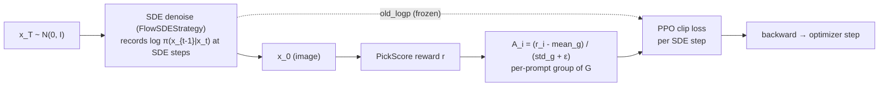

# flowGRPO — Flow-matching GRPO for diffusion

`DiffusionGRPO` treats the **stochastic (SDE) denoising trajectory** of a
flow-matching model as a sequence of policy actions and optimizes it with the
**GRPO** objective: a PPO-style clipped ratio weighted by a *group-normalized*
reward advantage. It is the baseline online RL algorithm for diffusion in UniRL.

- **Code:** [`unirl/algorithms/diffusion_grpo.py`](../../unirl/algorithms/diffusion_grpo.py) · loss helper `_grpo_clip_loss` in [`unirl/algorithms/base.py`](../../unirl/algorithms/base.py)
- **Recipe:** [`recipes/diffusion_rl/sd3_trainside.yaml`](../../recipes/diffusion_rl/sd3_trainside.yaml)
- **Config extract:** [`config.yaml`](config.yaml)

## Intuition

A flow-matching sampler turns noise `x_T` into an image `x_0`. Run it as an **SDE**
(`eta > 0`) and each denoising step `x_t → x_{t-1}` becomes a draw from a Gaussian
policy, so it has a well-defined log-probability. Sample a group of `G` images per
prompt, score them, and push up the probability of the steps that led to
above-average images — clipped so no single update moves the policy too far.



## The math

For each trained SDE step the policy ratio between current and pre-update weights is

$$ \rho = \exp(\log\pi_\theta - \log\pi_{\theta_\text{old}}) $$

and the per-element clipped objective (minimized) is

$$ \mathcal{L} = \mathbb{E}\big[\, \max(-A\rho,\; -A\,\mathrm{clip}(\rho,\,1-\epsilon,\,1+\epsilon))\,\big] $$

where `ε = clip_range` and `A` is the **group-normalized advantage** — rewards are
standardized within each prompt's group of `G = samples_per_prompt` images, so the
algorithm needs no learned value function. `max` of the two negated terms is exactly
PPO's `-min(ρA, clip(ρ)A)`.

`old_logp` is frozen once per rollout (in `prepare_segment`), so the ratio stays
anchored across all `stack.num_updates_per_batch` PPO mini-epochs.

## Code map

| Step | Where |
|---|---|
| SDE rollout + per-step log-probs | `DiffusionStage.replay(...)` via `unirl/sde/kernels.py::FlowSDEStrategy` |
| Freeze `old_logp` for multi-update | `DiffusionGRPO.prepare_segment` |
| Replay new log-probs, build ratio, clip, backward | `DiffusionGRPO.compute_loss_and_backward` |
| The clip math + ratio/KL metrics | `_grpo_clip_loss` (`base.py`) |
| Group-normalized advantage | the rollout track's `compute_advantages()` (grouped by prompt) |

The class itself is ~20 lines of ratio-clip math; CFG batching, noise prediction,
SDE integration and per-step iteration all live in `stage.replay`.

## Key knobs ([`config.yaml`](config.yaml))

| Knob | Meaning |
|---|---|
| `clip_range` | PPO ε. Default `1e-4` — deliberately tight; one SDE step's log-prob is sensitive. |
| `clip_schedule` | `constant` / `linear_decay` / `cosine_decay` against training progress. |
| `sampling.eta` | SDE stochasticity. Must be `> 0` for log-probs to exist. |
| `sampling.samples_per_prompt` | Group size `G` for advantage normalization. |
| `sampling.scheduler.num_sde_steps` | How many steps record log-probs (the trained steps). |
| `sampling.scheduler.timestep_fraction` | Window the SDE noise is confined to (`[0, 0.5]` = early/high-σ). |
| `stack.num_updates_per_batch` | PPO mini-epochs per rollout (π_old frozen once). |

## Run it

```bash
PRETRAINED_MODEL=stabilityai/stable-diffusion-3.5-medium \
python -m unirl.train_diffusion --config-name=diffusion_rl/sd3_trainside num_devices=8
```

Compose-only check (no GPU work): append `--cfg job`.

## vs. the other tutorials

- **[flowDPPO](../flowDPPO/)** keeps the same SDE rollout but replaces clipping with
  a **KL mask** — large updates are allowed when the per-step Gaussian KL is small.
- **[diffusionNFT](../diffusionNFT/)** drops the SDE rollout entirely and trains the
  **forward process** off-policy with a dual positive/negative reconstruction loss.

<!-- Figures: drop PNG/SVG into ./assets/ and reference e.g.  -->
