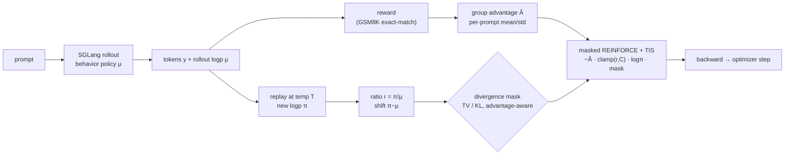
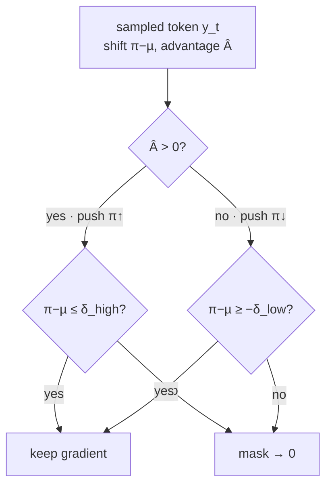

# spoDPPO — divergence-masked trust region for LLM/VLM RL (AR, token-level)

`ARSPODPPO` is the repo's **autoregressive (token-level)** RL algorithm. Instead of
PPO/GRPO's ratio-clip trust region, it enforces a **divergence-based hard mask** on
each sampled token: replay the trajectory, measure the sampled token's probability
shift between the new and old policy, and **zero** the update when that shift crosses
a threshold `δ` *in the reward-improving direction*. The kept tokens train with a
REINFORCE objective corrected by a **truncated importance ratio** (TIS). It is the
LLM/VLM analogue of [flowDPPO](../flowDPPO/) — divergence mask instead of ratio clip —
but on discrete tokens rather than a continuous SDE trajectory.

- **Code:** [`unirl/algorithms/spo_dppo.py`](../../unirl/algorithms/spo_dppo.py) (`ARSPODPPO`; loss helpers `_ar_spo_dppo_tv_loss` / `_ar_spo_dppo_kl_loss`)
- **Recipe (SGLang):** [`recipes/llm_rl/ar_spo_dppo_qwen3_4x8_sglang.yaml`](../../recipes/llm_rl/ar_spo_dppo_qwen3_4x8_sglang.yaml)
- **Recipe (trainside):** [`recipes/llm_rl/ar_spo_dppo_qwen3_4x8.yaml`](../../recipes/llm_rl/ar_spo_dppo_qwen3_4x8.yaml)
- **Config extract:** [`config.yaml`](config.yaml) (SGLang)

> **⚠️ Paper vs. implementation — read this first.** The bundled paper *"Rethinking
> the Divergence Regularization in LLM RL"* proposes **DRPO**, which replaces DPPO's
> *hard mask* with a **smooth** advantage-weighted regularizer — a continuous
> per-token gradient weight `w_t = 1 − sign(Â_t(r_t−1))·|π−µ|/δ` that decays to 0 at
> the boundary and *reverses* (corrective) beyond it. **The code here implements the
> DPPO hard-mask baseline that DRPO builds on — not DRPO's smooth regularizer.** This
> tutorial documents what `ARSPODPPO` actually runs (DPPO Binary-TV / Binary-KL) and
> uses the paper for the *why*. The lineage is **PPO → GRPO → SPO → DPPO → DRPO**; the
> code sits at **DPPO**. (The class name "SPO-DPPO" is historical — there is no SPO
> smoothness in it today.)

## Intuition

LLM RL is almost always **off-policy**: the rollout engine (SGLang) and the training
engine differ numerically, and one batch of rollouts is split into multiple gradient
steps. So the policy being updated `π` is not exactly the behavior policy `µ` that
generated the tokens — you need a trust region.

PPO/GRPO build that trust region from the **importance ratio** `r = π/µ`. But for LLMs
the ratio is a poor proxy for *distributional* shift: over a long-tailed vocabulary a
tiny probability change on a rare token produces a huge ratio, while a large mass move
on a common token produces only a modest ratio. A fixed ratio window therefore
over-constrains rare tokens and under-constrains common ones.

DPPO fixes the **geometry**: it measures the sampled token's **absolute probability
shift** `|π−µ|` (the "Binary-TV" surrogate) and applies a **hard mask** — drop the
gradient only when the shift exceeds `δ` *and* the update is pushing the policy
further in the direction the advantage wants. `ARSPODPPO` implements exactly this,
plus **Truncated Importance Sampling** (clamp `r` to `clip_ratio_c`, detached) so a
runaway ratio on a rare token can't blow up the gradient.



## The math

Per sampled token `y_t` with state `s_t`, ratio and (signed) Binary-TV shift:

$$ r_t = \exp(\log\pi_\theta - \log\pi_{\theta_\text{old}}) = \frac{\pi(y_t|s_t)}{\mu(y_t|s_t)}, \qquad \Delta_t = \pi(y_t|s_t) - \mu(y_t|s_t) $$

The trust region is an **asymmetric, advantage-aware hard mask** — keep the token
unless it is moving the sampled probability too far in the direction the advantage
pushes:

$$ m_t = \begin{cases} \mathbb{1}[\,\Delta_t \le \delta_\text{high}\,] & \hat A_t > 0 \quad(\text{push }\pi\uparrow)\\[2pt] \mathbb{1}[\,\Delta_t \ge -\delta_\text{low}\,] & \hat A_t \le 0 \quad(\text{push }\pi\downarrow) \end{cases} $$

With the truncated ratio `r̄_t = min(r_t, C)` (detached, TIS), the loss is a
**masked REINFORCE** term:

$$ \mathcal{L} = -\,\mathbb{E}\big[\, \hat A_t \cdot \bar r_t \cdot \log\pi_\theta(y_t|s_t) \cdot m_t \,\big] $$

Because `r̄_t` is detached, the gradient flows only through `log π_θ`, giving
`−Â_t·r̄_t·∇logπ` — the *same* policy gradient as differentiating PPO's surrogate
`r_t·Â_t` (since `∇(r·Â)=·r·∇logπ`), but the TIS clamp caps the importance weight
without bending the gradient direction.

The core is literally these lines (`unirl/algorithms/spo_dppo.py` · `_ar_spo_dppo_tv_loss`;
log-clamp/metrics elided — the Code map below is the source of truth):

```python
ratio = torch.exp(new_logp - old_logp)                    # r = π/µ
trunc = torch.clamp(ratio, max=clip_ratio_c).detach()     # TIS — no grad through ratio
prob_delta = torch.exp(new_logp) - torch.exp(old_logp)    # π − µ  (signed Binary-TV)
valid = torch.where(adv > 0, prob_delta <= div_high,      # adv>0: block big prob ↑
                             prob_delta >= -div_low)        # adv<0: block big prob ↓
loss = (-adv * trunc * new_logp * valid.float()).mean()   # masked REINFORCE + TIS
```



**KL variant** (`variant: kl`): replaces `Δ_t` with the **Binary-KL** between the
old/new Bernoulli token probabilities — `KL(Bern(µ_t)‖Bern(π_t))`, computed from the
chosen token's log-probs only (no full-vocab logits). Its mask also "always allows a
conservative update": a high-KL token is kept if the ratio moves *opposite* to the
advantage (`ratio ≤ 1` for `Â>0`, `ratio ≥ 1` for `Â<0`).

**What DRPO (the paper) would change.** DRPO keeps the same Binary-TV boundary but
swaps the hard `m_t ∈ {0,1}` for a *smooth* weight — **not implemented here**:

$$ w_t = 1 - \mathrm{sign}\!\big(\hat A_t (r_t-1)\big)\frac{|\pi-\mu|}{\delta} \in \Big[1-\tfrac1\delta,\ 1+\tfrac1\delta\Big] $$

i.e. attenuate to 0 at the boundary and reverse (corrective) beyond it, with a bounded
weight even in the low-probability tail where SPO's ratio weight diverges.

## Code map

| Step | Where |
|---|---|
| Replay new per-token log-probs at sampling temperature | `ARSPODPPO.compute_loss_and_backward` → `stage.replay(segment, temperature=T)` → `[total_tokens]` |
| `old_logp` = rollout log-prob `µ` | `segment.log_probs` (rollout-native; **single-update only**) |
| Per-sample advantage → per-token | `ARGRPO._expand_advantages_to_tokens` (repeat over each sample's `lengths` span) |
| TV divergence + asymmetric hard mask | `_ar_spo_dppo_tv_loss` |
| Binary-KL divergence + mask | `_ar_spo_dppo_kl_loss` |
| TIS truncation | `torch.clamp(ratio, max=clip_ratio_c).detach()` |
| Group advantage (per-prompt mean/std) | `RolloutTrack.compute_advantages` (`adv_normalization_scope: group`) |
| Padding / eos token masking | `segment.loss_mask` |

## Key knobs ([`config.yaml`](config.yaml))

| Knob | Meaning |
|---|---|
| `variant` | `tv` (mask on \|π−µ\|, true Total Variation) or `kl` (mask on Binary-KL, nats). Recipe uses `tv`. |
| `clip_divergence` | Divergence threshold `δ`. Default `0.2`. **TV:** absolute probability shift; **KL:** nats. Not a ratio ε. |
| `clip_divergence_low` / `clip_divergence_high` | Asymmetric thresholds for the `adv<0` / `adv>0` directions; each defaults to `clip_divergence`. |
| `clip_ratio_c` | TIS truncation bound `C` for the importance ratio. Default `20.0` (large ⇒ low bias). |
| `sampling_temperature` | **MUST equal `sampling.temperature`.** Replay tempers logits (`log_softmax(logits/T)`) so `π` and the rollout `µ` live on the same distribution (`ratio_mean ≈ 1` at update 1). |
| `adv_normalization_scope` | `group` ⇒ per-prompt-group mean/std advantage (critic-free GRPO style). |

## Common pitfalls

- **Temperature must match.** If `sampling_temperature ≠ sampling.temperature`, replay
  and rollout log-probs sit on different distributions and `r` is systematically off.
  The SGLang recipe pins both to `0.7`; watch `ratio_mean ≈ 1` on the run.
- **Single update only.** `ARSPODPPO` does **not** freeze a train-side `old_logp` — it
  reuses the rollout log-prob. `num_updates_per_batch > 1` would conflate the
  rollout-vs-train engine gap with real policy drift, so `TrainStack` raises for it
  (`supports_multi_update = False`).
- **This is the hard mask, not DRPO.** `clip_divergence` is a TV/KL threshold on an
  *absolute probability shift*, not a PPO ratio window. The smooth DRPO weight is not
  wired.
- **SGLang reproducibility (from the recipe).** Match the trainside chat template
  exactly (`/no_think` + `enable_thinking: false`) or Qwen3 emits a long `<think>`
  block that overruns `max_new_tokens` before the `#### answer`; and use the **LoRA-pool**
  sync (`LocalLoraWeightSync`), not merged full-weight sync, which plateaus.

## Run it

```bash
QWEN3_PATH=/root/sync/models/Qwen3-8B DATA_PATH=/root/sync/datasets/gsm8k/train.jsonl \
python -m unirl.train_vlm --config-name=ar_spo_dppo_qwen3_4x8_sglang num_devices=32
```

Compose-only check (no GPU work): append `--cfg job`. Trainside (no SGLang) variant:
swap the config name to `ar_spo_dppo_qwen3_4x8`.

For **VLM**: the loss operates on packed-varlen token log-probs and is
modality-agnostic — point `bundle` / `pipeline` / `conditions_cls` at a
vision-language AR stack (e.g. `qwen_vl`) and the same `ARSPODPPO` loss applies
unchanged.

## vs. the other tutorials

- **[flowDPPO](../flowDPPO/)** is the closest sibling: same "divergence mask instead of
  ratio clip" idea, but on a **diffusion** SDE trajectory (per-step Gaussian KL on
  continuous latents) rather than discrete tokens. spoDPPO masks per-**token**
  Binary-TV/KL.
- **[flowGRPO](../flowGRPO/)** / **[diffusionNFT](../diffusionNFT/)** are diffusion
  algorithms; spoDPPO is the **LLM/VLM (AR, token-level)** entry. The AR ratio-clip
  baseline is `ARGRPO` (`unirl/algorithms/ar_grpo.py`), which shares `_grpo_clip_loss`
  with flowGRPO.

## External references

- DRPO paper (bundled): *"Rethinking the Divergence Regularization in LLM RL"* — proposes the smooth regularizer (not yet implemented here).
- DPPO paper (what `ARSPODPPO` implements): Qi et al., *"Rethinking the Trust Region in LLM Reinforcement Learning"* — [arXiv:2602.04879](https://arxiv.org/abs/2602.04879).
- SPO: Xie et al., *"Simple Policy Optimization"* — [arXiv:2401.16025](https://arxiv.org/abs/2401.16025).

<!-- Figures: drop PNG/SVG into ./assets/ and reference e.g.  -->
