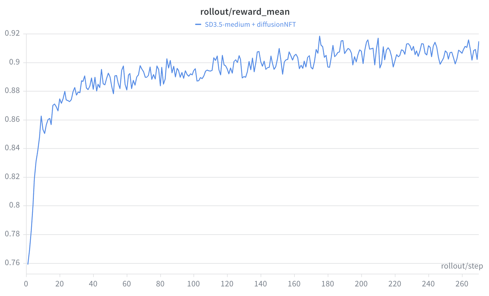

# diffusionNFT — Negative-aware Fine-Tuning (forward-process diffusion RL)

`DiffusionNFT` is the forward-process alternative to GRPO-style diffusion RL. It still
collects online samples and rewards, but the loss does **not** replay a reverse SDE
trajectory and does **not** compute old/new likelihood ratios. It takes the rollout's
clean final latent `x_0`, re-noises it on the forward process, and optimizes a
reward-weighted **positive/negative** reconstruction objective with a dual adapter
(trainable vs. EMA-frozen).

- **Loss:** [`unirl/algorithms/nft.py`](../../unirl/algorithms/nft.py)
- **Recipe:** [`recipes/diffusion_rl/sd3_nft.yaml`](../../recipes/diffusion_rl/sd3_nft.yaml) · **Config extract:** [`config.yaml`](config.yaml)
- **Checkpoints:** [🤗 DiffusionNFT](https://huggingface.co/zhouzhuoxin/sd3.5-nft)
- **Paper:** *"DiffusionNFT: Online Diffusion Reinforcement with Forward Process"* — Zheng et al., [arXiv:2509.16117](https://arxiv.org/abs/2509.16117) (ICLR 2026 Oral).

This is the most different tutorial. flowGRPO/flowDPPO ask "how likely was the sampled
reverse SDE step under the new policy?" NFT asks "given the clean latent the old policy
produced, how should the model's *forward-process* denoising prediction move for good
vs. bad samples?" There is no old/new log-prob ratio in the loss.

## What problem it solves

Reverse-process RL needs tractable per-step transition probabilities, which forces the
sampler onto an SDE path and requires storing/replaying a trajectory. DiffusionNFT
avoids both: use online rewards to decide how a clean generated sample should influence
training, then train with a supervised flow-matching objective on the *forward* noising
process. The paper reports this is up to ~25× more sample-efficient than Flow-GRPO.

| Paper claim | What it means here |
|---|---|
| No likelihood estimation | `DiffusionNFT` never reads `segment.sde_logp` and never forms a `ratio`. |
| No reverse trajectory in the loss | The loss reads `segment.latents[:, -1]` as the clean `x_0`. |
| Off-policy sampling | The rollout uses an EMA "old" policy; no importance-sampling correction. |
| Forward-process consistency | Training builds `x_t` from `x_0` + fresh noise, then runs ordinary denoising prediction. |

The SD3 recipe sets `eta: 0.0` and `num_sde_steps: 0` on purpose: the rollout exists to
produce clean images and rewards, not trainable SDE log-probs.

![DiffusionNFT overview: an off-policy EMA rollout turns each sample's group-relative advantage into a weight r in [0,1]; one clean latent x_0 is re-noised on the forward process and passed through a trainable new adapter and a frozen EMA old adapter that cross-merge into a positive and a negative reconstruction target, which a reward-weighted MSE is pulled toward (weight r) or away from (1-r) before minimizing over the trainable adapter; after the gradient step the old adapter EMA-tracks the new one, and a bottom inset contrasts this forward-process loss with GRPO/PPO's reverse-SDE per-step ratio.](assets/overview.png)

## The math

**The paper** converts a reward into an optimality probability `r ∈ [0,1]`, defines
implicit positive/negative velocity predictors (β = `beta`), and minimizes a
reward-weighted flow-matching loss:

$$ v_\theta^{+} = (1-\beta)\,v_\text{old} + \beta\,v_\theta, \qquad v_\theta^{-} = (1+\beta)\,v_\text{old} - \beta\,v_\theta $$

$$ \mathcal{L} = \mathbb{E}_{c,x_0,t,\varepsilon}\Big[\, r\,\lVert v_\theta^{+} - v\rVert^2 + (1-r)\,\lVert v_\theta^{-} - v\rVert^2 \,\Big] $$

with `x_t = α_t x_0 + σ_t ε` and `v` the flow-matching target; the old policy is updated
softly by EMA.

**The repo** implements the same positive/negative idea in SD3's rectified-flow `x_0`
**reconstruction** space — using the velocity identity `x̂_0 = x_t − t·pred` (since
`v = ε − x_0` gives `x_t − t·v = x_0`):

```python
x0 = segment.latents[:, -1]
xt = (1.0 - t) * x0 + t * noise

new_pred = stage.predict_noise_at_step(...)          # trainable adapter
with torch.no_grad(), nft_lora_policy.use_shadow():
    old_pred = stage.predict_noise_at_step(...)      # EMA / shadow adapter

positive_pred = beta * new_pred + (1.0 - beta) * old_pred
negative_pred = (1.0 + beta) * old_pred - beta * new_pred
x0_pos = xt - t * positive_pred
x0_neg = xt - t * negative_pred
loss = (r * mse(x0_pos, x0) / beta + (1.0 - r) * mse(x0_neg, x0) / beta).mean() * adv_clip_max
```

With the shipped `beta: 1.0` the branches read cleanly:

| Branch | At `β = 1` | Interpretation |
|---|---|---|
| Positive | `positive_pred = new_pred` | high-`r` samples pull the trainable adapter toward reconstructing `x_0` |
| Negative | `negative_pred = 2·old_pred − new_pred` | low-`r` samples train through a mirrored branch around the EMA adapter |

With `use_adaptive_weight: true`, each per-sample MSE is divided by a stop-gradient
mean-abs-error, keeping different noise levels on a comparable scale (matches the paper's
adaptive weighting).

### Reward → `r`

The full recipe sets `adv_use_global_std: true`, so the scalar the loss uses is a
**bounded optimality weight derived from the normalized advantage**, not the raw reward:

1. Subtract each prompt group's mean reward; divide by one batch-wide std →
   `track.advantages`.
2. In `compute_loss_and_backward`, clip the advantage to `[−c, c]` (`c = adv_clip_max`)
   and remap:

$$ r = \mathrm{clip}\!\Big(\tfrac{A}{2c} + \tfrac12,\ 0,\ 1\Big) $$

## Math → code map

| Math object | Repo object |
|---|---|
| Clean sample `x_0` | `segment.latents[:, -1]` |
| Forward noising `x_t` | `xt = (1 − t) * x0 + t * noise` in `_compute_loss_at_t` |
| Training policy `v_θ` | `new_pred` from `stage.predict_noise_at_step` |
| Old/data-collection policy `v_old` | `old_pred` under `nft_lora_policy.use_shadow()` |
| Positive predictor `v_θ⁺` | `positive_pred = β·new + (1−β)·old` |
| Negative predictor `v_θ⁻` | `negative_pred = (1+β)·old − β·new` |
| Reconstruction `x̂_0` | `xt - t * pred` |
| Optimality weight `r` | clipped/remapped `track.advantages` |
| Adaptive loss weighting | `use_adaptive_weight` block in `_compute_loss_at_t` |
| Soft old-policy update | `backend.ema`, advanced at the rollout boundary (`TrainStack.on_rollout_end`) |

## From rollout to update

1. The recipe installs `backend.ema_lora_cfg`, creating a trainable adapter and an EMA
   "old" adapter.
2. `DiffusionNFT.requires_ema_rollout = True`: the trainer applies the EMA adapter for
   rollout (`backend.apply_eval_ema()`), then restores the trainable one
   (`restore_from_eval()`) before the loss.
3. Rollout uses `eta: 0.0`, `num_sde_steps: 0`, so no SDE log-probs are stored — the
   `LatentSegment` carries the dense latent path and the σ schedule.
4. Reward scoring + advantage computation run as in the other diffusion recipes.
5. `TrainStack.train_track` calls `DiffusionNFT.compute_loss_and_backward`, which reads
   `x_0 = segment.latents[:, -1]`, resolves the `K` timesteps from `segment.sigmas`, and
   loops them — each constructs fresh `x_t`, predicts with both adapters, computes the
   positive/negative loss, and backprops with scale `loss_scale / K`.
6. After the optimizer step, `TrainStack.on_rollout_end` advances `backend.ema` so the
   old adapter tracks the trainable one.

## Timestep selection

```
                       ┌── re-noise → x_{t1} ──┐
clean latent x_0  ─────┼── re-noise → x_{t2} ──┼──→ dual-adapter loss at each t,  backward × 1/K
  (segment.latents)    │          ⋮            │
                       └── re-noise → x_{tK} ──┘
```

With `train_timestep_mode: all`, `_resolve_timesteps` reads `segment.sigmas`, drops
terminal `t = 0` (it collapses `x_t → x_0` and gives no signal), applies
`training_timestep_fraction`, optionally shuffles, and trains every remaining scalar
timestep — so one micro-step updates one clean latent across the whole noise spectrum.
`train_timestep_mode: random` instead draws fresh uniforms.

## Key knobs ([`config.yaml`](config.yaml))

| Knob | Meaning |
|---|---|
| `beta` | Positive/negative blend. `1.0` ⇒ `positive = new`, `negative = 2·old − new`. |
| `adv_clip_max` | Clip range `c` for the advantage→`r` remap (multiplied back into the loss to preserve scale). |
| `use_adaptive_weight` | Divide each MSE by a stop-gradient mean-abs-error per sample. |
| `train_timestep_mode` | `all` (rollout's σ schedule) or `random` (fresh uniforms). |
| `training_timestep_fraction` | Fraction of resolved timesteps kept after dropping terminal `t=0`. |
| `sampling.eta` / `num_sde_steps` | Both `0` — NFT records no SDE trajectory. |
| `kl_coef` | KL-to-base penalty — not implemented; any `> 0` raises. |

## Debug checklist

| Symptom | First files / variables to check |
|---|---|
| Constructor error about `use_shadow` | `backend.ema_lora_cfg`, `backend.ema`, `nft_lora_policy` injection |
| `segment.latents` missing | rollout must return the clean latent path; `LatentSegment.latents` |
| No timesteps resolved (`K = 0`) | `segment.sigmas`, `train_timestep_mode`, `training_timestep_fraction` |
| `r_mean` stuck near 0.5 | rewards may be uninformative — `track.rewards`, `track.advantages`, `adv_use_global_std` |
| `prediction_deviation` blows up | trainable adapter drifting from EMA — EMA decay under `ema_lora_cfg`, LR |
| Rollout quality regresses abruptly | EMA decay + rollout-end update timing (`on_rollout_end`) |

Metric source: `r_mean`, `pos_loss_mean`, `neg_loss_mean`, `prediction_deviation`,
`num_timesteps`, `t_value` are emitted by `_compute_loss_at_t`.

## Run it

```bash
PRETRAINED_MODEL=stabilityai/stable-diffusion-3.5-medium \
python -m unirl.train_diffusion --config-name=diffusion_rl/sd3_nft num_devices=8
```

NFT requires the backend EMA/shadow adapter; the recipe wires it through
`backend.ema_lora_cfg` (the constructor raises if the EMA handle lacks `use_shadow`, so
a mis-wired recipe fails loud rather than silently skipping EMA).



A healthy run climbs `rollout/reward_mean` quickly and then keeps inching up — here
SD3.5-medium goes from ~0.76 to ~0.91 over ~270 steps.

## vs. the other tutorials

- **[FlowGRPO](../FlowGRPO/)** / **[FlowDPPO](../FlowDPPO/)** optimize the probability of
  sampled reverse SDE transitions and need `segment.sde_logp` (DPPO also `sde_means`);
  NFT ignores both and optimizes a forward-process reconstruction loss.
- NFT is naturally off-policy (the loss is supervised-style with an EMA old adapter),
  whereas GRPO/DPPO need old log-probs frozen against the same sampled trajectory.
- **[DRPO](../DRPO/)** is the LLM track and unrelated to NFT's forward-process idea.
