# DiffusionRL Component Architecture

> Auto-generated from codebase analysis. Reflects the state after the Phase-2 refactoring
> (algorithm-owned loss, advantage, batch assembly, compute_loss_and_backward).

---

## 1. Component Overview

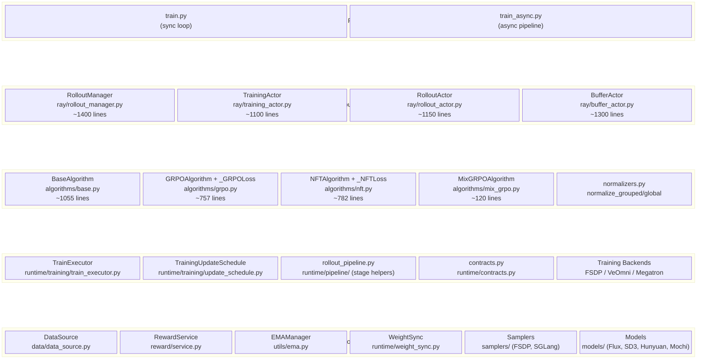

---

## 2. Component Interaction — High-Level

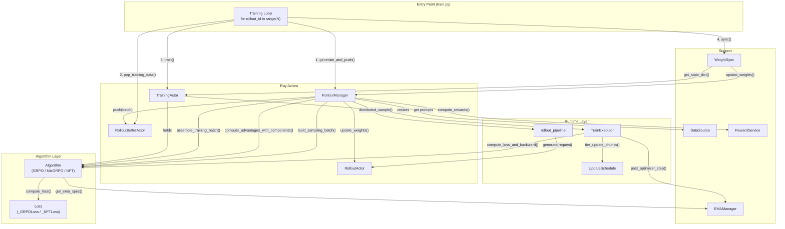

---

## 3. Synchronous Training Loop — Sequence Diagram

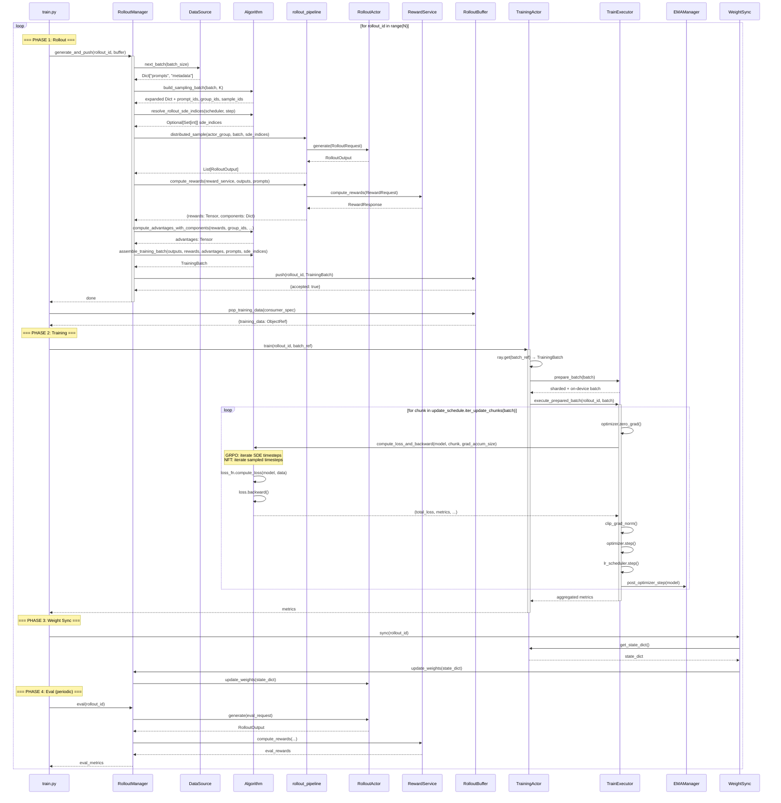

---

## 4. Interface Objects — Class Diagram

```mermaid
classDiagram
    direction TB

    class RolloutRequest {
        +prompts: List~str~
        +num_inference_steps: int
        +guidance_scale: float
        +height: int
        +width: int
        +num_frames: int
        +sde_indices: Optional~Set~int~~
        +return_trajectories: bool
        +return_log_probs: bool
        +latents: Optional~Tensor~
        +kwargs: Dict
        +slice_prompts(start, end) RolloutRequest
    }

    class RolloutOutput {
        +latents: Tensor
        +timesteps: Tensor
        +trajectories: Optional~Tensor~
        +log_probs: Optional~LogProbData~
        +embeddings: Optional~PromptEmbeddings~
        +decoded_images: Optional~List~
        +step_indices: Optional~Tensor~
        +metadata: Dict
        +batch_size: int
        +sde_indices: Set~int~
        +to_device(device) RolloutOutput
        +validate_contract()
    }

    class LogProbData {
        +data: Dict~int_Tensor~
        +sde_indices: Set~int~
        +slice(start, end) LogProbData
        +reindex(indices) LogProbData
        +to_device(device) LogProbData
    }

    class PromptEmbeddings {
        +prompt_embeds: Tensor
        +pooled_prompt_embeds: Optional~Tensor~
        +encoder_attention_mask: Optional~Tensor~
        +negative_prompt_embeds: Optional~Tensor~
        +negative_pooled_prompt_embeds: Optional~Tensor~
        +text_ids: Optional~Tensor~
        +image_ids: Optional~Tensor~
        +slice(start, end) PromptEmbeddings
        +reindex(indices) PromptEmbeddings
        +to_dict() Dict
    }

    class BackwardTrainingBatch {
        +trajectories: Tensor
        +log_probs: LogProbData
        +timesteps: Tensor
        +advantages: Tensor
        +embeddings: PromptEmbeddings
        +rewards: Optional~Tensor~
        +prompts: Optional~List~str~~
        +prompt_ids: Optional~List~str~~
        +sample_ids: Optional~List~str~~
        +group_ids: Optional~List~str~~
        +step_indices: Optional~Tensor~
        +target_sde_indices: Optional~Set~int~~
        +batch_size: int
        +get_timestep_data_by_step(step_idx) TimestepData
        +slice(start, end) BackwardTrainingBatch
        +shuffle(indices) BackwardTrainingBatch
        +validate()
    }

    class ForwardTrainingBatch {
        +clean_latents: Tensor
        +advantages: Tensor
        +embeddings: PromptEmbeddings
        +rewards: Optional~Tensor~
        +prompts: Optional~List~str~~
        +prompt_ids: Optional~List~str~~
        +sample_ids: Optional~List~str~~
        +group_ids: Optional~List~str~~
        +timesteps: Optional~Tensor~
        +batch_size: int
        +slice(start, end) ForwardTrainingBatch
        +shuffle(indices) ForwardTrainingBatch
        +validate()
    }

    class TimestepData {
        +latents: Tensor
        +next_latents: Tensor
        +log_prob: Optional~Tensor~
        +sigma: Tensor
        +sigma_next: Tensor
        +timestep_idx: int
        +sigmas: Optional~Tensor~
        +to_device(device) TimestepData
    }

    class RewardRequest {
        +images: Optional~List~
        +videos: Optional~List~Tensor~~
        +prompts: List~str~
        +prompt_ids: Optional~List~str~~
        +sample_ids: Optional~List~str~~
        +group_ids: Optional~List~str~~
        +metadata: Optional~List~Dict~~
        +batch_size: int
    }

    class RewardResponse {
        +rewards: List~float~
        +reward_components: Dict~str_List~float~~
        +successes: List~bool~
        +compute_time: float
        +batch_size: int
    }

    class SamplingRequirements {
        +requires_trajectory: bool
        +requires_log_prob: bool
        +requires_embeddings: bool
        +extras: Dict
        +sde_ratio: float
        +requires_clean_latents: bool
        +is_trajectory_based: bool
        +is_forward_process: bool
        +is_mixed_sampling: bool
    }

    class EMASpec {
        +enable_eval_ema: bool
        +eval_decay: float
        +eval_update_interval: int
        +reference_mode: str
        +reference_decay: float
        +reference_decay_type: str
        +old_adapter_name: str
        +new_adapter_name: str
    }

    RolloutOutput --> LogProbData
    RolloutOutput --> PromptEmbeddings
    BackwardTrainingBatch --> LogProbData
    BackwardTrainingBatch --> PromptEmbeddings
    ForwardTrainingBatch --> PromptEmbeddings
    BackwardTrainingBatch --> TimestepData : get_timestep_data_by_step
```

---

## 5. Algorithm Hierarchy — Class Diagram

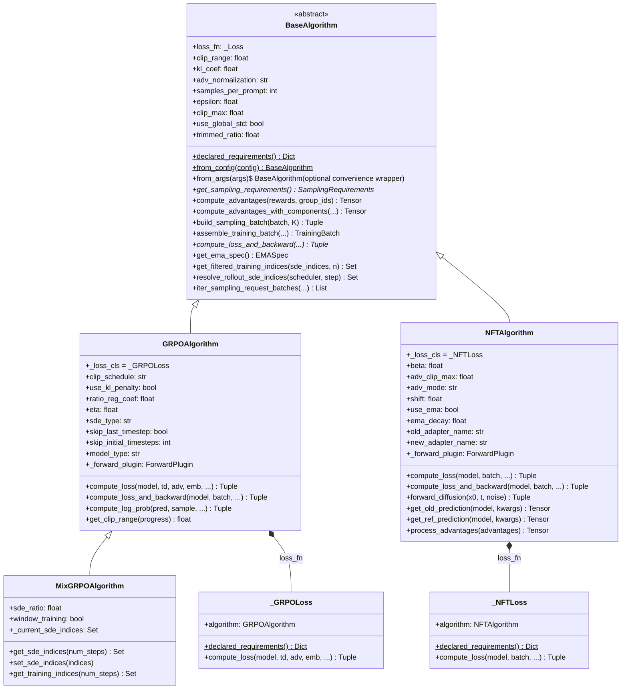

---

## 6. Component Responsibilities

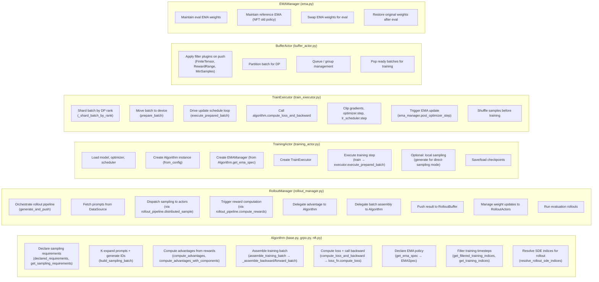

---

## 7. Interface Contracts Between Components

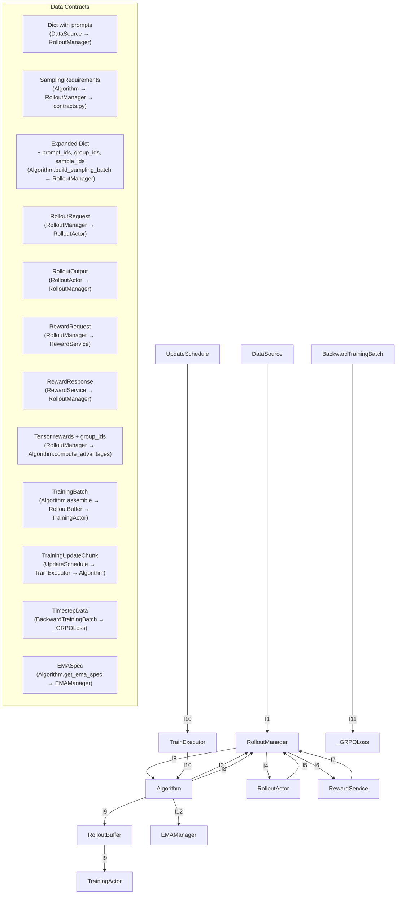

---

## 8. Training Step — Internal Call Chain

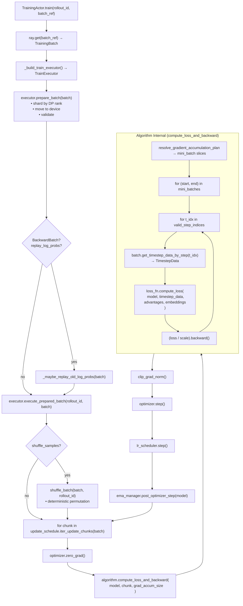

---

## 9. Rollout Pipeline — Internal Stages

```mermaid
flowchart TD
    START["RolloutManager._generate_training_data()"] --> STAGE0

    STAGE0["STAGE 0: _prepare_batch(data_source)\n→ Dict with prompts, metadata"]
    STAGE0 --> EXPAND

    EXPAND["Algorithm.build_sampling_batch(batch, K)\n• K-repeat prompts (prompt-major)\n• Generate prompt_ids, group_ids, sample_ids\n• Repeat metadata and latents"]
    EXPAND --> SDE

    SDE["Algorithm.resolve_rollout_sde_indices(scheduler, step)\n→ Set[int] SDE indices for MixGRPO\n→ None for pure GRPO/NFT"]
    SDE --> STAGE1

    STAGE1["STAGE 1: rollout_pipeline.distributed_sample()\n• Build RolloutRequest from batch\n• actor_group.generate(request)\n→ List of RolloutOutput"]
    STAGE1 --> VALIDATE

    VALIDATE["_validate_sampler_outputs()\n• Check contract (trajectory, log_prob, embeddings)\n• Attach missing embeddings if needed"]
    VALIDATE --> STAGE2

    STAGE2["STAGE 2: rollout_pipeline.compute_rewards()\n• Check precomputed_rewards in metadata\n• Extract images/videos from outputs\n• Build RewardRequest\n• reward_service.compute_rewards()\n→ rewards: Tensor, components: Dict"]
    STAGE2 --> STAGE3

    STAGE3["STAGE 3: Algorithm.compute_advantages_with_components()\n• If reward: compute_advantages(rewards, group_ids)\n• If advantage: per-component advantages + weighted sum\n• Uses normalize_grouped() or normalize_global()\n→ advantages: Tensor"]
    STAGE3 --> STAGE4

    STAGE4["STAGE 4: Algorithm.assemble_training_batch()\n• GRPO → _assemble_backward_batch() → BackwardTrainingBatch\n  - Concatenate trajectories, merge log_probs, validate timesteps\n  - Apply get_filtered_training_indices (skip_last_timestep, frozen_init)\n• NFT → _assemble_forward_batch() → ForwardTrainingBatch\n  - Concatenate clean_latents, merge embeddings\n→ TrainingBatch"]
    STAGE4 --> IDENTITY

    IDENTITY["_attach_batch_identities()\n• Set batch.prompt_ids, sample_ids, group_ids\n  from sampling batch metadata"]
    IDENTITY --> PUSH

    PUSH["RolloutBuffer.push()\n• Plugin chain: FiniteTensorFilter → RewardRangeFilter → MinSamplesGuard\n• Partition for DP if configured\n• ray.put()"]
```

---

## 10. Component × Method Matrix

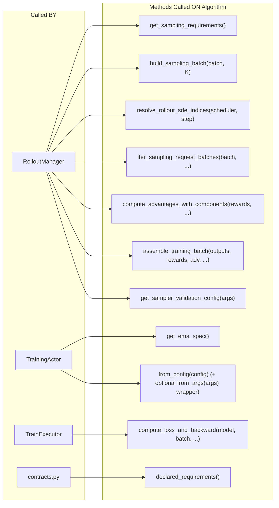

---

## 11. Weight Sync Flow

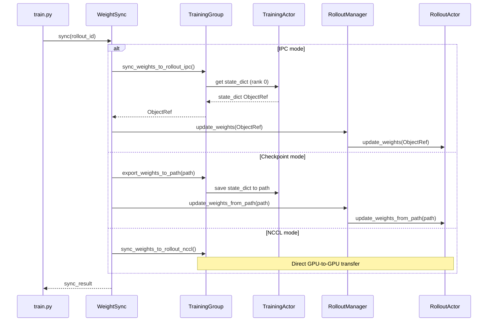

---

## 12. Buffer Plugin Chain

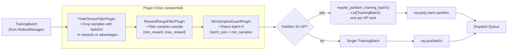

---

## 13. EMA Lifecycle

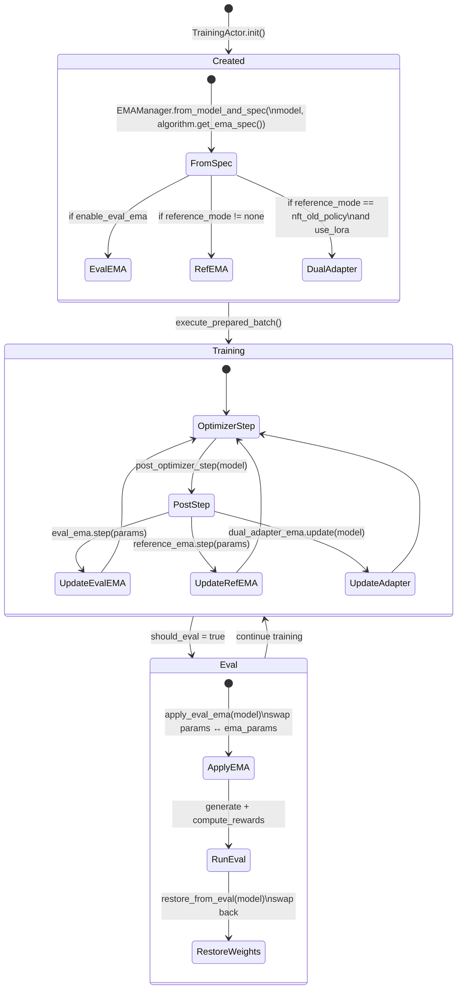
