# DiffusionRL 框架设计分析报告

---

> 文档状态（2026-03-22）：
> 这份分析报告是阶段性设计快照，保留了部分历史结构与旧术语示例。
> 当前实现已经完成 semantic package migration：`diffusionrl/runtime/`、
> `SamplingModePlugin`、`config/defaults.py` 都不再是现行主线结构。
> 当前代码行为请以 `README.md`、`docs/entry_map.md`、`docs/Component_Architecture.md`
> 以及 `diffusionrl/` 实际实现为准。
> 文中若出现 `FastVideo`、`ray/rollout_buffer.py`、`weight_sync_mode`、
> `weight_sync_dir`、`losses/`、`from_args()`、`--loss-path`、
> `SamplingModePlugin`、`config/defaults.py`、`AsyncPipelineRuntime` 权重版本追踪
> 等旧术语，请按当前实现对应到 `FSDP/SGLang`、`ray/buffer_actor.py`、
> `sync.protocol`、`sync.dir`、algorithm-owned loss、`from_config()`、
> `algorithm.algorithm_kwargs`、driver-local helper、`scripts/minimal_*.yaml`、
> 以及 `train_async.py` 内联的最小 async 状态机。

## 目录

1. [Stage Placement (阶段资源分配)](#1-stage-placement-阶段资源分配)
2. [Data Flow Control (数据流控制)](#2-data-flow-control-数据流控制)
3. [Modules、生命周期与数据结构](#3-modules生命周期与数据结构)
4. [Design Details](#4-design-details)
5. [Class Diagram](#5-class-diagram)
6. [Component Diagram](#6-component-diagram)
7. [Colocate 与 Ray 架构分析](#7-colocate-与-ray-架构分析)
8. [Reward 系统架构](#8-reward-系统架构)
9. [配置参数详解](#9-配置参数详解)
10. [总结](#10-总结)

---

## 1. Stage Placement (阶段资源分配)

### 1.1 Placement Group 架构

框架通过 `ray/placement_group.py` 实现 GPU 资源的统一管理。核心配置类如下：

```python
@dataclass
class RuntimePlacementConfig:
    """Resource allocation configuration for diffusionRL training."""

    # Inference resources
    rollout_num_nodes: int = 1
    rollout_num_gpus_per_node: int = 4

    # Training resources
    training_num_nodes: int = 1
    training_num_gpus_per_node: int = 4

    # Reward computation resources (optional)
    reward_dedicated_num_gpus: int = 0  # 0 means use CPU

    # Deployment strategy
    colocate_rollout_training: bool = False
    strategy: str = "PACK"  # "PACK" or "SPREAD"
```

**参数说明**：

| 参数 | 说明 |
|------|------|
| `rollout_num_nodes` | 推理使用的节点数 |
| `rollout_num_gpus_per_node` | 每个节点用于推理的 GPU 数 |
| `training_num_nodes` | 训练使用的节点数 |
| `training_num_gpus_per_node` | 每个节点用于训练的 GPU 数 |
| `colocate_rollout_training` | 是否让推理和训练共享 GPU |
| `strategy` | `PACK`=尽量放同一节点，`SPREAD`=分散到不同节点 |

> **资源调度**：统一使用单 PG + `{"GPU": 1}` uniform bundle 模式（slime 风格）。
> "训推分离"通过**单 PG 内按节点切片**实现（逻辑隔离）。
> 多 GPU rollout 引擎（例如 SGLang TP）通过 NOSET_VISIBLE_DEVICES + `base_gpu_id` 实现。

### 1.2 两种部署模式

#### 模式 A: Separate

推理和训练使用**独立的 GPU 资源**，适合资源充足的场景。

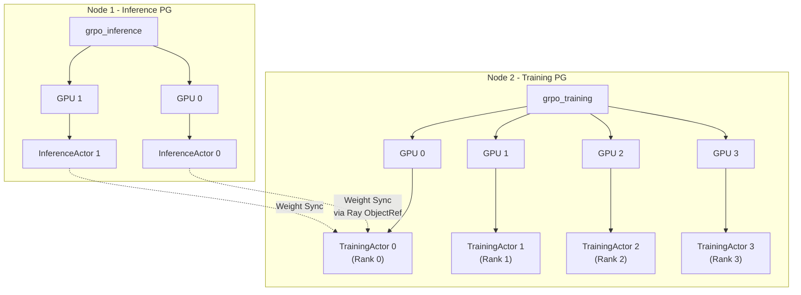
```mermaid
graph TB
    subgraph Node1["Node 1 - Inference PG"]
        IG["grpo_inference"]
        IG --> GPU0_I["GPU 0"]
        IG --> GPU1_I["GPU 1"]
        GPU0_I --> IA0["InferenceActor 0"]
        GPU1_I --> IA1["InferenceActor 1"]
    end

    subgraph Node2["Node 2 - Training PG"]
        TG["grpo_training"]
        TG --> GPU0_T["GPU 0"]
        TG --> GPU1_T["GPU 1"]
        TG --> GPU2_T["GPU 2"]
        TG --> GPU3_T["GPU 3"]
        GPU0_T --> TA0["TrainingActor 0<br/>(Rank 0)"]
        GPU1_T --> TA1["TrainingActor 1<br/>(Rank 1)"]
        GPU2_T --> TA2["TrainingActor 2<br/>(Rank 2)"]
        GPU3_T --> TA3["TrainingActor 3<br/>(Rank 3)"]
    end

    IA0 -.->|"Weight Sync<br/>via Ray ObjectRef"| TA0
    IA1 -.->|"Weight Sync"| TA0
```

**特点**：
- 推理和训练可以**并行执行**（异步模式下）
- 需要更多 GPU 资源（例如：4 推理 + 4 训练 = 8 GPU）
- 无需 offload/onload 操作
- 适合追求**最大吞吐量**的场景

#### 模式 B: Colocate

推理和训练**共享同一组 GPU**，通过 offload/onload 切换，适合资源有限的场景。

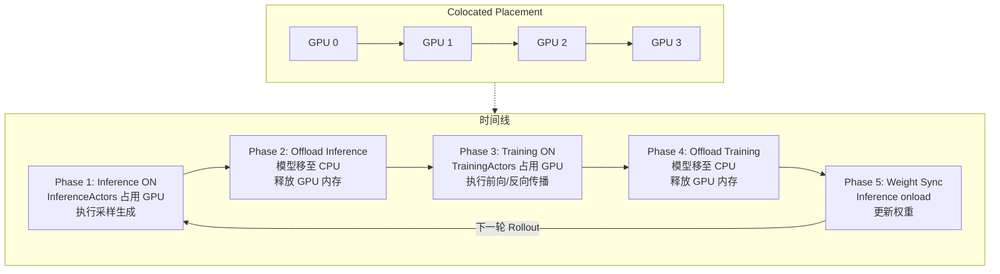
```mermaid
graph TB
    subgraph ColocatedPG["Colocated Placement"]
        GPU0["GPU 0"] --> GPU1["GPU 1"] --> GPU2["GPU 2"]--> GPU3["GPU 3"]
    end

    subgraph Timeline["时间线"]
        P1["Phase 1: Inference ON<br/>InferenceActors 占用 GPU<br/>执行采样生成"]
        P2["Phase 2: Offload Inference<br/>模型移至 CPU<br/>释放 GPU 内存"]
        P3["Phase 3: Training ON<br/>TrainingActors 占用 GPU<br/>执行前向/反向传播"]
        P4["Phase 4: Offload Training<br/>模型移至 CPU<br/>释放 GPU 内存"]
        P5["Phase 5: Weight Sync<br/>Inference onload<br/>更新权重"]

        P1 --> P2 --> P3 --> P4 --> P5
        P5 -->|"下一轮 Rollout"| P1
    end

    ColocatedPG -.-> Timeline
```

**特点**：
- 只需要 4 GPU（而非 8 GPU）
- 通过 offload/onload 在推理和训练间切换
- 存在 PCIe 带宽开销（模型在 CPU/GPU 间移动）
- 适合**资源受限**但追求高效利用的场景

### 1.3 核心代码逻辑

`placement_group.py:160-206` 中的 `create_placement_groups()` 函数实现了两种模式的创建：

```python
def create_placement_groups(config: RuntimePlacementConfig):
    if config.colocate_rollout:
        # 共享 Placement Group - 取最大值
        total_gpus = max(inference_total_gpus, training_total_gpus)
        pg = _create_placement_group(total_gpus, strategy, name="grpo_colocated")

        # 推理和训练共用同一个 PG
        result["inference"] = (pg, bundle_indices[:inference_gpus], gpu_ids)
        result["training"] = (pg, bundle_indices[:training_gpus], gpu_ids)
    else:
        # 独立 Placement Group
        inference_pg = _create_placement_group(inference_gpus, name="grpo_inference")
        training_pg = _create_placement_group(training_gpus, name="grpo_training")
        result["inference"] = (inference_pg, ...)
        result["training"] = (training_pg, ...)
```

### 1.4 GPU 信息收集与重排序

框架通过 `InfoActor` 收集每个 bundle 的 GPU 信息，并重新排序确保同节点的 GPU 连续，这对 NCCL 通信效率至关重要：

```python
@ray.remote(num_cpus=1)
class InfoActor:
    """收集 GPU 信息：节点 IP 和 GPU ID"""
    def __init__(self):
        self.ip = socket.gethostbyname(socket.gethostname())
        cuda_devices = os.environ.get("CUDA_VISIBLE_DEVICES", "")
        self.gpu_ids = [int(x) for x in cuda_devices.split(",")]

def _reorder_bundles_by_node(gpu_info):
    """重排序：同节点的 GPU 连续排列，优化 NCCL 通信"""
    # 按节点分组 → 节点内按 GPU ID 排序 → 扁平化
```

---

## 2. Data Flow Control (数据流控制)

### 2.1 完整数据流管道

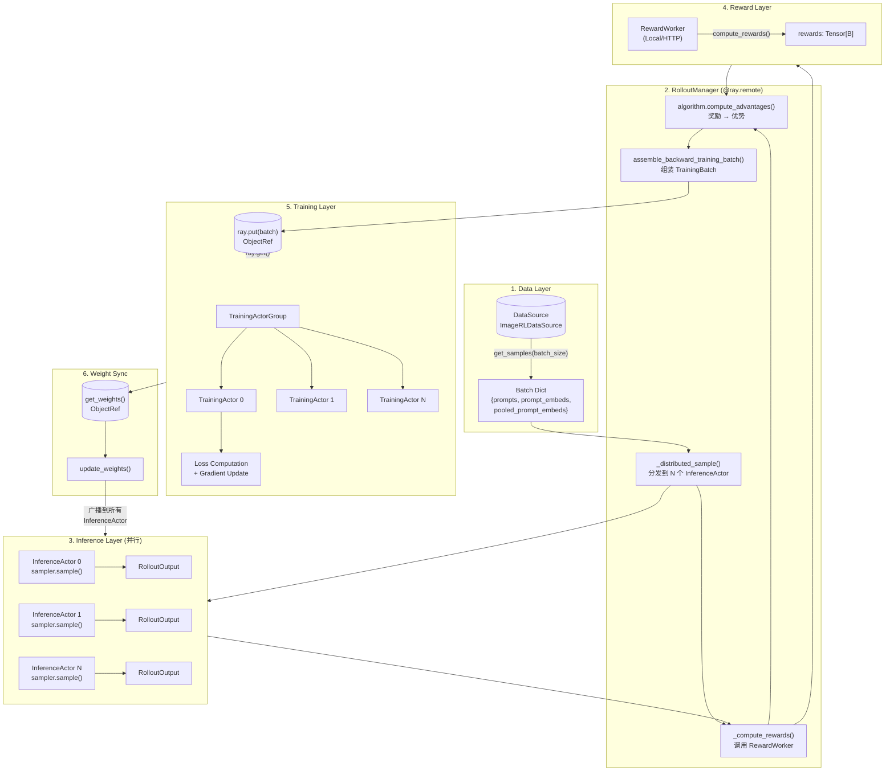
```mermaid
flowchart TB
    subgraph DataLayer["1. Data Layer"]
        DS[("DataSource<br/>ImageRLDataSource")]
        DS -->|"get_samples(batch_size)"| Batch["Batch Dict<br/>{prompts, prompt_embeds,<br/>pooled_prompt_embeds}"]
    end

    subgraph RolloutManager["2. RolloutManager (@ray.remote)"]
        direction TB
        Step1["_distributed_sample()<br/>分发到 N 个 InferenceActor"]
        Step2["_compute_rewards()<br/>调用 RewardWorker"]
        Step3["algorithm.compute_advantages()<br/>奖励 → 优势"]
        Step4["assemble_backward_training_batch()<br/>组装 TrainingBatch"]

        Step1 --> Step2 --> Step3 --> Step4
    end

    subgraph InferenceLayer["3. Inference Layer (并行)"]
        IA1["InferenceActor 0<br/>sampler.sample()"]
        IA2["InferenceActor 1<br/>sampler.sample()"]
        IA3["InferenceActor N<br/>sampler.sample()"]

        IA1 --> SO1["RolloutOutput"]
        IA2 --> SO2["RolloutOutput"]
        IA3 --> SO3["RolloutOutput"]
    end

    subgraph RewardLayer["4. Reward Layer"]
        RW["RewardWorker<br/>(Local/HTTP)"]
        RW -->|"compute_rewards()"| Rewards["rewards: Tensor[B]"]
    end

    subgraph TrainingLayer["5. Training Layer"]
        BatchRef[("ray.put(batch)<br/>ObjectRef")]
        TG["TrainingActorGroup"]
        TG --> TA1["TrainingActor 0"]
        TG --> TA2["TrainingActor 1"]
        TG --> TA3["TrainingActor N"]

        TA1 --> Loss["Loss Computation<br/>+ Gradient Update"]
    end

    subgraph WeightSync["6. Weight Sync"]
        Weights[("get_weights()<br/>ObjectRef")]
        Update["update_weights()"]
    end

    Batch --> Step1
    Step1 --> InferenceLayer
    InferenceLayer --> Step2
    Step2 --> RewardLayer
    RewardLayer --> Step3
    Step4 --> BatchRef
    BatchRef -->|"ray.get()"| TrainingLayer

    TrainingLayer --> Weights
    Weights --> Update
    Update -->|"广播到所有<br/>InferenceActor"| InferenceLayer
```

### 2.2 同步训练循环 (train.py)

`train.py` 是主训练入口。

**当前主线实现**：主循环使用 `distributed/weight_sync.py` 中的
coordinator 模型，将权重同步统一收口到 `sync.protocol`
（`disabled` / `tensor_payload` / `nccl_broadcast` / `checkpoint_path`）。
异步 inflight 状态目前是 `train_async.py` 内部的私有 helper，而不是单独
的 runtime 包。

```python
def create_weight_sync(args):
    """按 sync.protocol 创建当前权重同步 coordinator。"""
    if args.sync.protocol == "checkpoint_path":
        return CheckpointWeightSync(args)
    if args.sync.protocol == "tensor_payload":
        return TensorPayloadWeightSync(args)
    if args.sync.protocol == "nccl_broadcast":
        return NCCLBroadcastWeightSync(args)
    return DisabledWeightSync(args)


def train(args):
    """Main training loop."""
    configure_logger()
    set_seed(args.seed)

    # 1. 初始化 Ray
    if not ray.is_initialized():
        ray.init(address=args.ray_address, ...) if args.ray_address else ray.init()

    # 2. 初始化 WandB (仅 rank 0)
    wandb_logger = init_logger(...) if args.report_to_wandb else None

    # 3. 创建 Placement Groups (资源分配)
    pgs = create_placement_groups_from_args(args)

    # 4. 创建 RolloutManager / ActorGroups / RolloutBuffer
    algorithm_config = build_algorithm_config(args)
    rollout_manager, dataset_step_info = create_rollout_manager(
        args,
        reward_pg_result=reward_pg_result,
        algorithm_config=algorithm_config,
    )
    rollout_group, rollout_runtime = create_rollout_actor_group(...)
    training_group, training_runtime = create_training_actor_group(...)
    rollout_buffer = create_buffer_actor(args)
    ray.get(rollout_manager.attach_sampling_group.remote(rollout_group))

    # 5. 建立权重同步 coordinator
    weight_sync = create_weight_sync(args, mode=sync_mode)
    weight_sync.setup(training_runtime=training_runtime, rollout_runtime=rollout_runtime)

    # 6. 核心同步训练循环
    for rollout_id in range(args.rollout.start_rollout_id, args.rollout.num_rollout):
        rollout_on_gpu = _ensure_rollout_on_gpu(...)
        _produce_and_push_rollout(...)
        rollout_payload = ray.get(
            rollout_buffer.pop_training_data.remote(...)
        )

        if args.ray.offload_rollout:
            rollout_runtime.sleep()

        metrics = training_group.train(rollout_id, rollout_payload["training_data"])

        _offload_train_phase(...)
        if should_sync:
            sync_result = weight_sync.sync(rollout_id=rollout_id)

        if should_eval(rollout_id, args):
            eval_metrics = ray.get(rollout_manager.eval.remote(rollout_id))

    # 清理
    ray.get(rollout_manager.dispose.remote())
    training_group.dispose()
```

#### 当前主线中的状态切换收口

当前主线不再使用 `SamplingModePlugin`。offload/onload 与权重同步的状态
切换主要集中在 driver helper 和 coordinator 上：

- `_ensure_rollout_on_gpu()`
- `_offload_train_phase()`
- `WeightSyncCoordinator.sync()`

### 2.3 三个阶段的详细说明

| 阶段 | 操作 | GPU 占用 | 说明 |
|------|------|----------|------|
| **Phase 1: Rollout** | `rollout_manager.generate()` | InferenceActors | 采样生成轨迹、计算奖励、转换为训练数据 |
| **Phase 2: Training** | `training_group.train()` | TrainingActors | 前向/反向传播、梯度更新 |
| **Phase 3: Weight Sync** | `weight_sync.sync()` | 短暂两者都用 | 通过 `WeightSyncCoordinator` 同步最新权重到 rollout 侧 |

### 2.4 RolloutManager 内部流程

`rollout_manager.py` 是 rollout-side producer facade。当前主线里它不再承担
权重同步或 rollout actor 生命周期控制；这些能力已经收口到
`ray/group_runtime.py` 中的 `RolloutGroupRuntime`。`RolloutManager` 负责：

- 动态加载算法 / 数据源 / manager-local reward runtime
- 挂接 sampling actor group
- 暴露 `build_training_batch()` / `produce_training_payload()` / `eval()` 等 driver 入口
- 保留 rollout 侧 metadata、计数器与 debug seam

当前主线更接近下面的结构：

```python
@ray.remote
class RolloutManager:
    def init(self):
        self.algorithm = algorithm_cls.from_config(algorithm_config)
        self.reward_service = create_manager_reward_executor(...)
        self.data_source = data_source_cls(self.args)
        self.eval_runner = EvalRunner(...)
        self.rollout_workflow = RolloutWorkflow(...)

    def attach_sampling_group(self, actor_group):
        self.sampling_group = actor_group

    def build_training_batch(self, rollout_id: int, ...):
        return self.rollout_workflow.build_training_batch(
            rollout_id=rollout_id,
            execute_sampling_request=self._execute_sampling_request,
            ...
        )

    def produce_training_payload(self, rollout_id: int, ...) -> Dict[str, Any]:
        batch = self.build_training_batch(rollout_id, ...)
        return {
            "training_data": ray.put(batch),
            "sample_count": ...,
            "metadata": ...,
        }

    def eval(self, rollout_id: int) -> Dict[str, Any]:
        return self.eval_runner.run(...)

    def dispose(self):
        if self.reward_service is not None:
            self.reward_service.shutdown()
```

#### RolloutManager 工厂函数

```python
def create_rollout_manager(
    args,
    reward_pg_result: Optional[Tuple] = None,
    *,
    algorithm_config: Dict[str, Any],
) -> Tuple[ray.ObjectRef, Dict[str, Any]]:
    """
    创建 RolloutManager Actor

    返回:
        (rollout_manager_handle, dataset_step_info)
    """
```

---

## 3. Modules、生命周期与数据结构

### 3.1 模块目录结构

```
diffusionRL/
├── README.md
├── docs/
├── scripts/
├── diffusionrl/
│   ├── train.py                    # driver / sync loop / async dispatch
│   ├── train_async.py              # async-only loop + private AsyncPipelineRuntime
│   ├── algorithms/                 # builtin algorithms + loss/backward ownership
│   ├── config/                     # args / validation / resolution / domain config
│   ├── orchestration/              # rollout / eval / train workflows
│   ├── ray/                        # actors / groups / placement / Ray plumbing
│   ├── buffer/                     # rollout-to-train queueing / reassembly semantics
│   ├── training/                   # train executor / update schedule / backends
│   ├── distributed/                # weight sync / checkpoint publish protocols
│   ├── reward/                     # reward services / scoring pipeline / scorers
│   ├── samplers/                   # FSDP + SGLang sampling backends
│   ├── models/
│   ├── data/
│   ├── types/
│   └── utils/
└── diffusionrl_plugins/            # external extension namespace
```

### 3.2 Actor 概念与生命周期

#### 3.2.1 什么是 Actor？

在 Ray 框架中，**Actor 是一个有状态的远程进程**。与普通函数不同，Actor 可以：
- 持有 GPU 资源和模型权重
- 被多次远程调用（通过 `.remote()` 方法）
- 在调用之间保持内部状态

```python
# 普通函数：无状态，每次调用都是独立的
def generate(model_path, prompt):
    model = load_model(model_path)  # 每次都要重新加载
    return model(prompt)

# Ray Actor：有状态，模型只加载一次
@ray.remote(num_gpus=1)
class InferenceActor:
    def __init__(self):
        self.model = None  # 状态持久存在

    def init(self, model_path):
        self.model = load_model(model_path)  # 只加载一次

    def generate(self, prompt):
        return self.model(prompt)  # 复用已加载的模型
```

**核心思想**：模型只加载一次，Actor 作为"模型的载体"持久存在于 GPU 上。

#### 3.2.2 框架中的两类 Actor

本框架使用两类 Actor，分别负责 GRPO 训练的两个核心阶段：

| Actor 类型 | 职责 | 持有的资源 | 核心方法 |
|-----------|------|-----------|---------|
| **InferenceActor** | 采样生成轨迹 | ModelBundle（transformer + text_encoder + VAE）、Sampler | `generate()` → `RolloutOutput` |
| **TrainingActor** | 执行梯度更新 | FSDP 包装的模型、Optimizer、LR Scheduler、Loss 函数 | `train()` → metrics dict |

**为什么要分两个 Actor？**

```
┌─────────────────────────────────────────────────────────────────┐
│                      InferenceActor                             │
│  ┌───────────────────────────────────────────────────────────┐  │
│  │  模型状态: eval() 模式，torch.no_grad()                    │  │
│  │  作用: 根据 prompt 生成图像/视频的采样轨迹                  │  │
│  │  输出: RolloutOutput (latents, trajectories, log_probs)   │  │
│  └───────────────────────────────────────────────────────────┘  │
└─────────────────────────────────────────────────────────────────┘
                                ↓
                    RolloutManager 计算 reward 和 advantage
                                ↓
┌─────────────────────────────────────────────────────────────────┐
│                      TrainingActor                              │
│  ┌───────────────────────────────────────────────────────────┐  │
│  │  模型状态: train() 模式，需要计算梯度                       │  │
│  │  作用: 根据 advantage 执行 PPO-style 策略更新               │  │
│  │  特性: FSDP 分布式训练，多卡并行                            │  │
│  └───────────────────────────────────────────────────────────┘  │
└─────────────────────────────────────────────────────────────────┘
```

- **InferenceActor**：模型处于推理模式，不计算梯度，专注于高效采样
- **TrainingActor**：模型被 FSDP 包装，支持多卡分布式训练，执行反向传播

#### 3.2.3 Actor 的创建与调度

Actor 通过 Ray 的 PlacementGroup 调度到指定的 GPU 上：

```python
# 1. 创建 Actor（此时只是空壳，不占用 GPU 内存）
actor = InferenceActor.options(
    num_gpus=1,
    scheduling_strategy=PlacementGroupSchedulingStrategy(
        placement_group=pg,
        placement_group_bundle_index=0,  # 指定使用哪个 GPU
    )
).remote(rank=0, world_size=4)

# 2. 初始化 Actor（此时加载模型到 GPU）
ray.get(actor.init.remote(sampler_config))

# 3. 调用 Actor 方法（远程执行，返回 ObjectRef）
output_ref = actor.generate.remote(prompts, embeddings)
output = ray.get(output_ref)  # 获取实际结果
```

#### 3.2.4 生命周期状态机

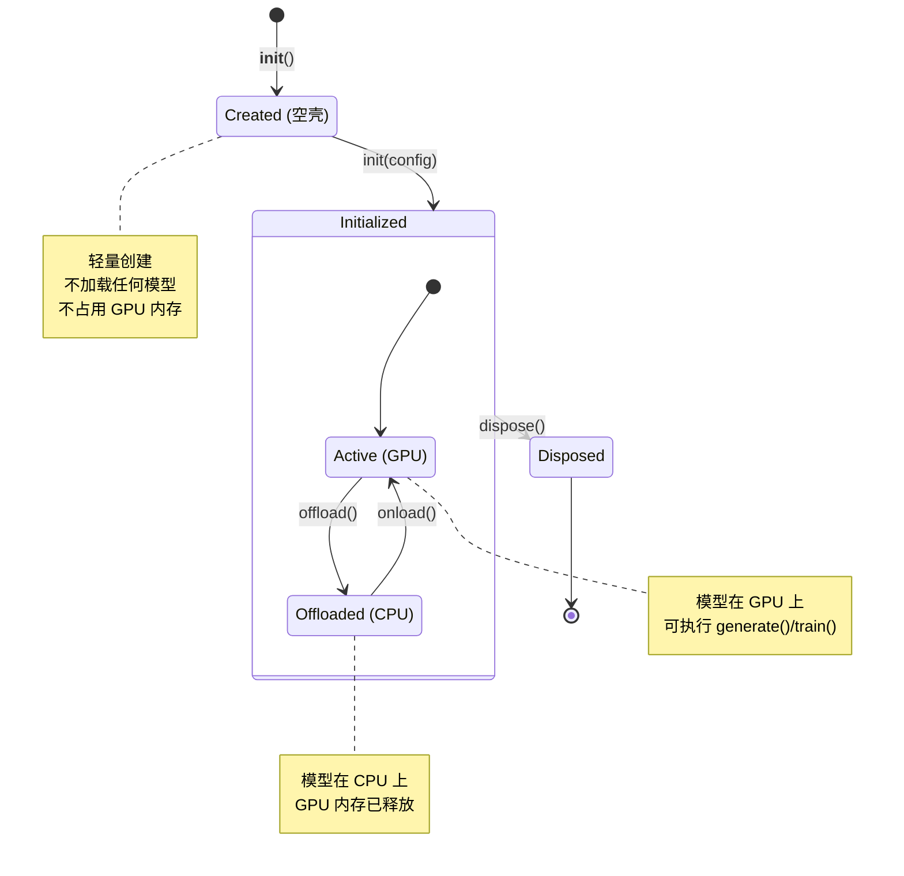
```mermaid
stateDiagram-v2
    [*] --> Created: __init__()

    state "Created (空壳)" as Created
    note right of Created
        轻量创建
        不加载任何模型
        不占用 GPU 内存
    end note

    Created --> Initialized: init(config)

    state "Initialized" as Initialized {
        [*] --> Active

        state "Active (GPU)" as Active
        note right of Active
            模型在 GPU 上
            可执行 generate()/train()
        end note

        Active --> Offloaded: offload()

        state "Offloaded (CPU)" as Offloaded
        note right of Offloaded
            模型在 CPU 上
            GPU 内存已释放
        end note

        Offloaded --> Active: onload()
    }

    Initialized --> Disposed: dispose()
    Disposed --> [*]
```

**生命周期方法说明**：

| 方法 | InferenceActor | TrainingActor |
|------|----------------|---------------|
| `__init__()` | 空，设置标志位 | 空，设置标志位 |
| `init(config)` | 加载 ModelBundle、Sampler、VAE | 初始化分布式环境、加载模型、FSDP 包装、创建 Optimizer/Loss |
| `generate()`/`train()` | 执行采样生成 | 执行训练步骤 |
| `offload()` | `model.to("cpu")` | `model.to("cpu")` + optimizer state → CPU |
| `onload()` | `model.to("cuda")` | `model.to("cuda")` + optimizer state → GPU |
| `dispose()` | 清理资源 | 清理资源 |

### 3.3 核心数据结构 (types/*)

**v4.0 新增**：`SampleStatus` 枚举（管道中样本状态）、`RolloutRequest` 数据类、`is_backward_batch()` / `is_forward_batch()` 类型判断函数。

```python
class SampleStatus(Enum):                  # [v4.0 NEW]
    """管道中样本的状态"""
    PENDING = "pending"
    COMPLETED = "completed"
    TRUNCATED = "truncated"
    FAILED = "failed"

def is_backward_batch(batch) -> bool: ...      # [v4.0 NEW] 类型判断
def is_forward_batch(batch) -> bool: ...       # [v4.0 NEW] 类型判断
```

#### 3.3.1 LogProbData - 对数概率存储

**用途**：存储采样过程中每个时间步的对数概率（log probability），用于 PPO 的重要性采样比率计算。支持稀疏存储，适配 MixGRPO 只有部分时间步有 log_prob 的场景。

```python
@dataclass
class LogProbData:
    """
    稀疏存储对数概率，支持 MixGRPO（只有部分时间步有 log_prob）

    data: Dict[int, Tensor]
        - key: 时间步索引
        - value: 对数概率 Tensor[B]
    """
    data: Dict[int, torch.Tensor]

    @classmethod
    def from_tensor(cls, tensor: torch.Tensor) -> "LogProbData":
        """从稠密 Tensor[B, T] 创建"""
        return cls(data={i: tensor[:, i] for i in range(tensor.shape[1])})

    @classmethod
    def from_dict(cls, d: Dict[int, torch.Tensor]) -> "LogProbData":
        """从稀疏字典创建（MixGRPO 场景）"""
        return cls(data=d.copy())

    @property
    def sde_indices(self) -> Set[int]:
        """返回有 log_prob 的时间步索引（即 SDE 步骤）"""
        return set(self.data.keys())

    def slice(self, start: int, end: int) -> "LogProbData":
        """沿 batch 维度切片，用于 micro-batch 梯度累积"""
        return LogProbData(data={k: v[start:end] for k, v in self.data.items()})
```

#### 3.3.2 PromptEmbeddings - 统一嵌入容器

**用途**：封装文本 prompt 的嵌入向量，提供跨模型（Flux、SD3、Hunyuan 等）的统一接口。不同模型需要的嵌入格式不同，该类统一管理这些差异。

```python
@dataclass
class PromptEmbeddings:
    """
    跨模型的统一嵌入容器，支持 Flux、SD3、Hunyuan 等
    """
    prompt_embeds: torch.Tensor                      # [B, seq_len, hidden_dim] 必需
    pooled_prompt_embeds: Optional[Tensor] = None    # [B, hidden_dim] SD3/Flux 需要
    encoder_attention_mask: Optional[Tensor] = None  # encoder token attention mask [NEW]
    negative_prompt_embeds: Optional[Tensor] = None  # [B, seq, hidden] 负向嵌入 [NEW]
    negative_pooled_prompt_embeds: Optional[Tensor] = None  # [B, hidden] 负向池化嵌入 [NEW]
    text_ids: Optional[Tensor] = None                # Flux 特有
    image_ids: Optional[Tensor] = None               # Flux 特有
```

#### 3.3.3 TimestepData - 单时间步数据

**用途**：封装单个去噪时间步的所有数据，作为 Loss 函数 `compute_timestep()` 的输入。将轨迹中的一个切片打包传递，避免在 Loss 计算中进行复杂的索引操作。

```python
@dataclass
class TimestepData:
    """
    单个时间步的数据，用于 GRPO Loss 计算
    """
    latents: torch.Tensor       # x_t 当前噪声 latent [B, C, H, W]
    next_latents: torch.Tensor  # x_{t-1} 下一步 latent [B, C, H, W]
    log_prob: Optional[Tensor]  # 旧策略的对数概率 [B]，ODE 步为 None
    sigma: torch.Tensor         # 当前 sigma 值
    sigma_next: torch.Tensor    # 下一步 sigma 值
    timestep_idx: int           # 时间步索引
```

#### 3.3.4 BackwardTrainingBatch - 轨迹型训练批次

**用途**：GRPO/MixGRPO 算法的训练数据包。包含完整的采样轨迹和对数概率，用于计算 PPO 的重要性采样比率 `ratio = exp(log_prob_new - log_prob_old)`。通过 Ray ObjectRef 从 RolloutManager 传递到 TrainingActor。

```python
@dataclass
class BackwardTrainingBatch:
    """
    GRPO/MixGRPO 算法使用的训练批次
    需要完整的采样轨迹和对数概率用于重要性采样
    """
    trajectories: torch.Tensor      # [B, T+1, C, H, W] 完整采样轨迹
    log_probs: LogProbData          # 每个 SDE 步的对数概率
    timesteps: torch.Tensor         # [T+1] sigma schedule
    advantages: torch.Tensor        # [B] 每个样本的优势值
    embeddings: PromptEmbeddings    # 文本嵌入
    rewards: Optional[Tensor]       # [B] 原始奖励（用于日志）
    prompts: Optional[List[str]]    # 原始文本（用于日志）
    num_steps: int = 50             # 采样步数

    def get_timestep_data(self, t_idx: int) -> TimestepData:
        """提取指定时间步的数据"""
        return TimestepData(
            latents=self.trajectories[:, t_idx],
            next_latents=self.trajectories[:, t_idx + 1],
            log_prob=self.log_probs[t_idx],  # 可能为 None
            sigma=self.timesteps[t_idx],
            sigma_next=self.timesteps[t_idx + 1],
            timestep_idx=t_idx,
        )

    def slice(self, start: int, end: int) -> "BackwardTrainingBatch":
        """Batch 维度切片，用于 micro-batch 梯度累积"""
        # 支持 image [B,T,C,H,W] 和 video [B,T,C,F,H,W]
```

#### 3.3.5 ForwardTrainingBatch - NFT 训练批次

**用途**：NFT（Noise-Free Training）算法的训练数据包。与 GRPO 不同，NFT 不需要完整轨迹和 log_prob，只需要干净的 latent 和 advantage。训练时在 Loss 内部进行前向扩散（加噪），大幅减少内存占用。

```python
@dataclass
class ForwardTrainingBatch:
    """
    NFT (Noise-Free Training) 算法使用的训练批次
    只需要干净的 latent，前向扩散在 loss 中进行
    """
    clean_latents: torch.Tensor     # [B, C, H, W] 干净图像的 latent
    advantages: torch.Tensor        # [B] 每个样本的优势值
    embeddings: PromptEmbeddings    # 文本嵌入
    rewards: Optional[Tensor]       # [B] 原始奖励
```

#### 3.3.6 RolloutOutput - 采样器输出

**用途**：InferenceActor 中 Sampler 的统一输出格式。封装采样生成的所有结果，包括最终 latent、完整轨迹、log_prob 等。RolloutManager 收集多个 Actor 的 RolloutOutput 后，计算 reward 并转换为 TrainingBatch。

```python
@dataclass
class RolloutOutput:
    """
    采样器的统一输出格式
    """
    latents: torch.Tensor                    # [B, C, H, W] 最终去噪结果
    timesteps: torch.Tensor                  # [T+1] sigma schedule
    trajectories: Optional[Tensor] = None    # [B, T+1, C, H, W] 完整轨迹
    log_probs: Optional[LogProbData] = None  # 对数概率
    embeddings: Optional[PromptEmbeddings]   # 使用的嵌入
    decoded_images: Optional[List[PIL.Image]] # 解码后的图像（用于奖励计算）
    metadata: Dict[str, Any]                 # 额外元数据
```

### 3.4 数据结构关系图

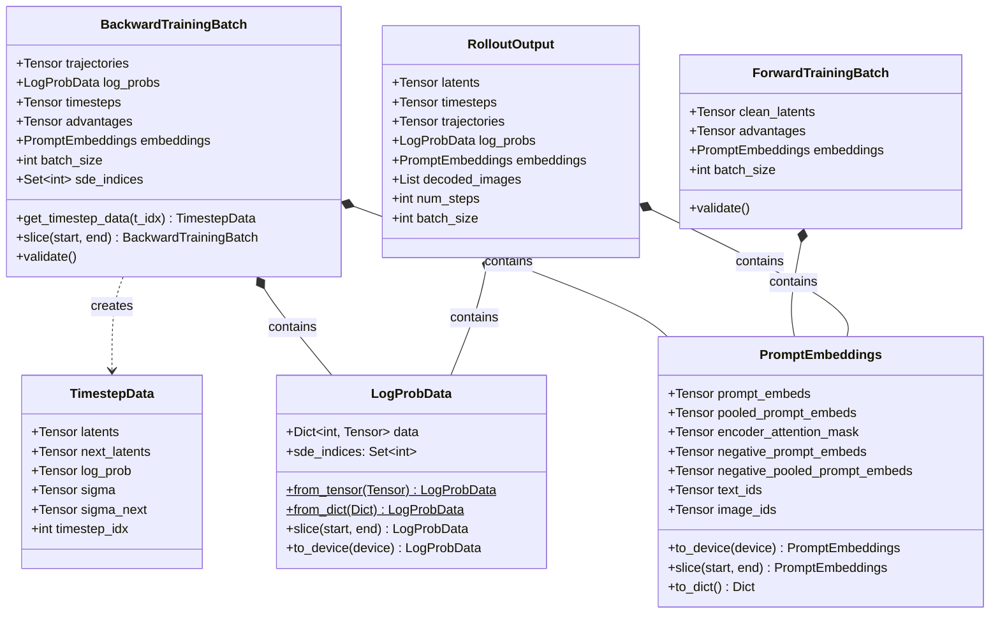
```mermaid
classDiagram
    class LogProbData {
        +Dict~int, Tensor~ data
        +from_tensor(Tensor) LogProbData$
        +from_dict(Dict) LogProbData$
        +sde_indices: Set~int~
        +slice(start, end) LogProbData
        +to_device(device) LogProbData
    }

    class PromptEmbeddings {
        +Tensor prompt_embeds
        +Tensor pooled_prompt_embeds
        +Tensor encoder_attention_mask
        +Tensor negative_prompt_embeds
        +Tensor negative_pooled_prompt_embeds
        +Tensor text_ids
        +Tensor image_ids
        +to_device(device) PromptEmbeddings
        +slice(start, end) PromptEmbeddings
        +to_dict() Dict
    }

    class TimestepData {
        +Tensor latents
        +Tensor next_latents
        +Tensor log_prob
        +Tensor sigma
        +Tensor sigma_next
        +int timestep_idx
    }

    class BackwardTrainingBatch {
        +Tensor trajectories
        +LogProbData log_probs
        +Tensor timesteps
        +Tensor advantages
        +PromptEmbeddings embeddings
        +int batch_size
        +Set~int~ sde_indices
        +get_timestep_data(t_idx) TimestepData
        +slice(start, end) BackwardTrainingBatch
        +validate()
    }

    class ForwardTrainingBatch {
        +Tensor clean_latents
        +Tensor advantages
        +PromptEmbeddings embeddings
        +int batch_size
        +validate()
    }

    class RolloutOutput {
        +Tensor latents
        +Tensor timesteps
        +Tensor trajectories
        +LogProbData log_probs
        +PromptEmbeddings embeddings
        +List decoded_images
        +int num_steps
        +int batch_size
    }

    BackwardTrainingBatch *-- LogProbData : contains
    BackwardTrainingBatch *-- PromptEmbeddings : contains
    BackwardTrainingBatch ..> TimestepData : creates

    ForwardTrainingBatch *-- PromptEmbeddings : contains

    RolloutOutput *-- LogProbData : contains
    RolloutOutput *-- PromptEmbeddings : contains
```

---

## 4. Design Details

### 4.1 设计原则

| 原则 | 实现方式 | 代码示例 |
|------|----------|----------|
| **动态加载** | 通过 module path 字符串加载组件 | `importlib.import_module(args.algorithm_path)` |
| **类型安全** | 使用 `dataclass` + `validate()` 方法 | `batch.validate()` 检查维度一致性 |
| **延迟初始化** | Actor 的 `__init__` 轻量 | 模型在 `init()` 中加载 |
| **内存优化** | offload/onload 模式 | `model.to("cpu")` / `model.to("cuda")` |
| **工厂模式** | 统一创建函数 | `get_loss()`, `get_algorithm()`, `create_rollout_manager()` |

### 4.2 Algorithm 设计

#### SamplingRequirements - 算法采样需求

```python
@dataclass
class SamplingRequirements:
    """定义算法对采样过程的需求"""
    requires_trajectory: bool = True     # 是否需要完整轨迹
    requires_log_prob: bool = True       # 是否需要对数概率
    sde_ratio: float = 1.0               # SDE 步骤比例 (MixGRPO < 1.0)
    requires_clean_latents: bool = False # NFT 需要干净 x0
    forward_diffusion_in_loss: bool = False  # NFT 在 loss 中做前向扩散

    @property
    def is_mixed_sampling(self) -> bool:
        """是否混合 SDE/ODE 采样"""
        return 0 < self.sde_ratio < 1.0

    @property
    def is_trajectory_based(self) -> bool:
        """是否基于轨迹的算法"""
        return self.requires_trajectory

    @property
    def is_forward_process(self) -> bool:
        """是否使用前向扩散（NFT）"""
        return self.requires_clean_latents and not self.requires_trajectory
```

#### 算法文件结构 (v3.0 更新)

算法实现从单文件拆分为 4 个文件：

| 文件 | 类 | 行数 | 说明 |
|------|-----|------|------|
| `base.py` | `BaseAlgorithm`, `SamplingRequirements` | ~351 | 抽象基类 + 算法 Hook 系统 |
| `grpo.py` | `GRPOAlgorithm` | ~320 | 标准 GRPO + group/global advantage normalization |
| `mix_grpo.py` | `MixGRPOAlgorithm` | ~110 | 混合 SDE/ODE + window_training |
| `nft.py` | `NFTAlgorithm` | ~286 | NFT 双 adapter + EMA Hook |

> **注意**: AWM (Advantage-Weighted Mixing) 算法已从代码中移除。

#### 算法 Hook 系统 (v3.0 新增)

`BaseAlgorithm` 提供了 Hook 机制，允许算法自定义训练行为而不需要修改 TrainingActor：

```python
class BaseAlgorithm:
    # ... 基础方法 ...

    def post_backward_hook(self, model, batch) -> None:
        """反向传播后调用"""
        pass

    def post_optimizer_step_hook(self, model, optimizer, batch) -> Dict:
        """优化器步骤后调用（NFT 使用此 Hook 执行 EMA 更新）"""
        return {}

    def requires_ema_update(self) -> bool:
        """是否需要 EMA 更新（NFT 返回 True）"""
        return False

    def get_ema_decay(self) -> float:
        """获取 EMA 衰减率"""
        return 0.0

    def get_filtered_training_indices(self, sde_indices, num_steps) -> Set[int]:
        """获取过滤后的训练时间步（支持 skip_last_timestep, skip_initial_timesteps）"""
        ...

    def compute_aggregated_loss(self, model, batch, **kwargs):
        """跨所有时间步聚合损失"""
        ...
```

#### 算法继承层次

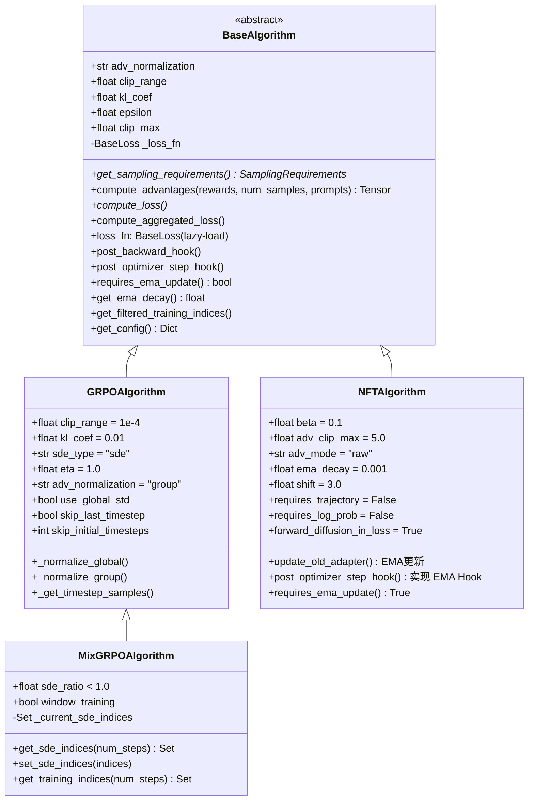
```mermaid
classDiagram
    class BaseAlgorithm {
        <<abstract>>
        +str adv_normalization
        +float clip_range
        +float kl_coef
        +float epsilon
        +float clip_max
        -BaseLoss _loss_fn
        +get_sampling_requirements()* SamplingRequirements
        +compute_advantages(rewards, num_samples, prompts) Tensor
        +compute_loss()*
        +compute_aggregated_loss()
        +loss_fn: BaseLoss  (lazy-load)
        +post_backward_hook()
        +post_optimizer_step_hook()
        +requires_ema_update() bool
        +get_ema_decay() float
        +get_filtered_training_indices()
        +get_config() Dict
    }

    class GRPOAlgorithm {
        +float clip_range = 1e-4
        +float kl_coef = 0.01
        +str sde_type = "sde"
        +float eta = 1.0
        +str adv_normalization = "group"
        +bool use_global_std
        +bool skip_last_timestep
        +int skip_initial_timesteps
        +_normalize_global()
        +_normalize_group()
        +_get_timestep_samples()
    }

    class MixGRPOAlgorithm {
        +float sde_ratio < 1.0
        +bool window_training
        -Set _current_sde_indices
        +get_sde_indices(num_steps) Set
        +set_sde_indices(indices)
        +get_training_indices(num_steps) Set
    }

    class NFTAlgorithm {
        +float beta = 0.1
        +float adv_clip_max = 5.0
        +str adv_mode = "raw"
        +float ema_decay = 0.001
        +float shift = 3.0
        +requires_trajectory = False
        +requires_log_prob = False
        +forward_diffusion_in_loss = True
        +update_old_adapter() EMA更新
        +post_optimizer_step_hook() 实现 EMA Hook
        +requires_ema_update() True
    }

    BaseAlgorithm <|-- GRPOAlgorithm
    GRPOAlgorithm <|-- MixGRPOAlgorithm
    BaseAlgorithm <|-- NFTAlgorithm
```

#### 各算法特点对比

| 算法 | 需要轨迹 | 需要 log_prob | SDE 比例 | 特点 |
|------|---------|--------------|----------|------|
| **GRPO** | Yes | Yes | 100% | 标准 PPO-style，所有步骤都是 SDE |
| **MixGRPO** | Yes | 部分 | < 100% | 混合 ODE/SDE，加速采样，窗口调度 |
| **NFT** | No | No | N/A | 前向扩散训练，双 adapter + EMA |

#### GRPOAlgorithm 高级特性 (当前主线)

| 特性 | 配置参数 | 说明 |
|------|---------|------|
| **Global Normalization** | `adv_normalization="global"` | 全批次 reward 归一化 |
| **Group Normalization** | `adv_normalization="group"` | 按显式 `group_ids` 分组归一化 |
| **全局标准差** | `use_global_std=True` | grouped normalization 时使用全局 std |
| **忽略最后时间步** | `skip_last_timestep=True` | MixGRPO 稳定性：跳过 t→0 的不稳定 log_prob |
| **冻结初始时间步** | `skip_initial_timesteps=N` | MixGRPO 稳定性：跳过前 N 步高方差区域 |

#### Advantage 归一化策略

| 策略类型 | 描述 | 使用场景 |
|---------|------|---------|
| **global** | 全批次统计归一化 | 标准 RL |
| **group** | 按显式 sample-aligned `group_ids` 分组归一化 | GRPO/MixGRPO |

```python
# 当前 GRPO / MixGRPO 归一化相关配置
adv_normalization: str = "group"   # "global" 或 "group"
use_global_std: bool = False       # grouped normalization 时是否使用全局 std
trimmed_ratio: float = 0.0         # grouped normalization 的裁剪比例
```

### 4.3 Loss 函数设计

#### 当前主线：Algorithm-Owned Loss

```python
class _GRPOLoss:
    def __init__(self, algorithm: "GRPOAlgorithm"):
        self.algorithm = algorithm

    def compute_loss(self, ...):
        ...


class GRPOAlgorithm(BaseAlgorithm):
    _loss_cls = _GRPOLoss

    @classmethod
    def from_config(cls, config: dict) -> "GRPOAlgorithm":
        ...
```

#### LossOutput 数据结构

```python
@dataclass
class LossOutput:
    """统一的 Loss 输出格式"""
    loss: torch.Tensor           # 总损失
    policy_loss: torch.Tensor    # 策略损失分量
    metrics: Dict[str, Any]      # 日志指标

    def to_dict(self) -> Dict[str, Any]:
        return {"loss": self.loss.item(), "policy_loss": self.policy_loss.item(), **self.metrics}
```

#### GRPOLoss - PPO-style 损失

```python
class GRPOLoss(BaseLoss):
    """
    GRPO 损失函数，基于 PPO 的 clipped objective

    公式:
        ratio = exp(log_prob_new - log_prob_old)
        L_clip = min(ratio * A, clip(ratio, 1-eps, 1+eps) * A)
        L = -E[L_clip] + kl_coef * KL_penalty

    特性:
        - 多种 SDE 类型: sde, cps, dance, flux_dance, flux_flow, flow
        - 动态 clip_range: constant, linear_decay, cosine_decay
        - KL 惩罚: 支持参考模型或 LoRA disable_adapter
        - ratio_reg_coef: 重要性采样比率正则化 [v3.0 新增]
        - model_type: 模型类型感知 [v3.0 新增]
    """

    def __init__(
        self,
        clip_range: float = 1e-4,
        clip_schedule: str = "constant",  # constant, linear_decay, cosine_decay
        kl_coef: float = 0.01,
        sde_type: str = "sde",  # sde, cps, dance, flux_dance, flux_flow
        use_kl_penalty: bool = True,
        ratio_reg_coef: float = 0.0,  # 比率正则化系数 [v3.0 新增]
        model_type: str = "flux",     # 模型类型 [v3.0 新增]
        **kwargs
    ):
        pass

    def get_clip_range(self, progress: float) -> float:
        """根据训练进度获取 clip_range"""
        if self.clip_schedule == "constant":
            return self.clip_range
        elif self.clip_schedule == "linear_decay":
            return self.clip_range * (1 - progress)
        elif self.clip_schedule == "cosine_decay":
            return self.clip_range * 0.5 * (1 + math.cos(math.pi * progress))

    def compute_log_prob(self, noise_pred, prev_sample, sample, sigma, sigma_next, eta):
        """根据 sde_type 计算 log_prob"""
        return compute_sde_log_prob(
            noise_pred, prev_sample, sample, sigma, sigma_next, eta, self.sde_type
        )

    def compute(self, model, timestep_data, embeddings, advantages, **kwargs):
        # 1. 模型前向获取 noise_pred
        # 2. 计算新策略的 log_prob
        # 3. 计算重要性采样比率
        # 4. PPO clipped objective
        # 5. 可选的 KL 惩罚
        return LossOutput(loss, policy_loss, metrics)
```

#### NFTLoss - 前向扩散损失

```python
class NFTLoss(BaseLoss):
    """
    NFT (Noise-Free Training) 损失函数

    特性:
        - 双 adapter 机制: new_adapter (训练) + old_adapter (EMA 参考)
        - 前向扩散: Flow Matching forward process
        - 优势加权: positive/negative 预测加权组合

    公式:
        loss = r * L_positive + (1-r) * L_negative
        其中 r 由 advantage 决定
    """

    def __init__(
        self,
        beta: float = 0.1,           # 正负预测的插值权重
        adv_clip_max: float = 5.0,   # 优势裁剪
        adv_mode: str = "raw",       # raw, sign, binary, one_only
        use_adaptive_weight: bool = True,  # 自适应损失权重
        **kwargs
    ):
        pass

    def process_advantages(self, advantages: Tensor) -> Tensor:
        """根据 adv_mode 处理优势值"""
        if self.adv_mode == "raw":
            return advantages.clamp(-self.adv_clip_max, self.adv_clip_max)
        elif self.adv_mode == "sign":
            return advantages.sign()
        elif self.adv_mode == "binary":
            return (advantages > 0).float()
        elif self.adv_mode == "one_only":
            return torch.ones_like(advantages)

    def forward_diffusion(self, clean_latents, t):
        """Flow Matching 前向扩散"""
        noise = torch.randn_like(clean_latents)
        sigma = self.sigmas[t]
        noisy_latents = (1 - sigma) * clean_latents + sigma * noise
        return noisy_latents, noise

    def get_old_prediction(self, model, noisy_latents, t, embeddings):
        """使用 old_adapter 获取参考预测"""
        with model.disable_adapter():  # 或切换到 old_adapter
            return model(noisy_latents, t, embeddings)

    def update_old_adapter(self, decay: float):
        """EMA 更新 old_adapter 权重"""
        # new_weights * (1 - decay) + old_weights * decay
```

### 4.4 Sampler 设计

框架采用**引擎（Engine）+ 采样器（Sampler）**的分层架构，支持多种推理后端。

#### 引擎架构

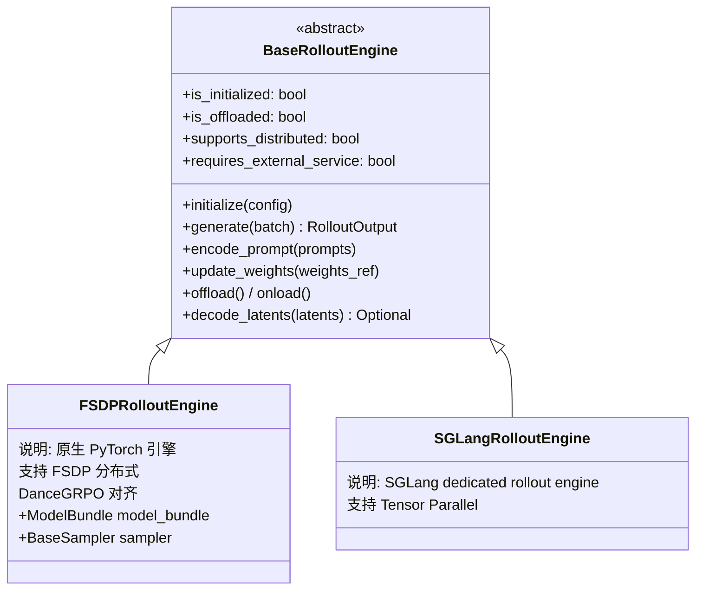
```mermaid
classDiagram
    class BaseRolloutEngine {
        <<abstract>>
        +is_initialized: bool
        +is_offloaded: bool
        +supports_distributed: bool
        +requires_external_service: bool
        +initialize(config)
        +generate(batch) RolloutOutput
        +encode_prompt(prompts)
        +update_weights(weights_ref)
        +offload() / onload()
        +decode_latents(latents) Optional
    }

    class FSDPRolloutEngine {
        说明: 原生 PyTorch 引擎
        支持 FSDP 分布式
        DanceGRPO 对齐
        +ModelBundle model_bundle
        +BaseSampler sampler
    }

    class SGLangRolloutEngine {
        说明: SGLang dedicated rollout engine
        支持 Tensor Parallel
    }

    BaseRolloutEngine <|-- FSDPRolloutEngine
    BaseRolloutEngine <|-- SGLangRolloutEngine
```

#### 采样器继承结构

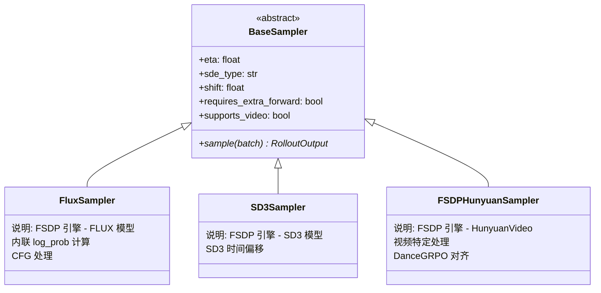
```mermaid
classDiagram
    class BaseSampler {
        <<abstract>>
        +eta: float
        +sde_type: str
        +shift: float
        +sample(batch)* RolloutOutput
        +requires_extra_forward: bool
        +supports_video: bool
    }

    class FluxSampler {
        说明: FSDP 引擎 - FLUX 模型
        内联 log_prob 计算
        CFG 处理
    }

    class SD3Sampler {
        说明: FSDP 引擎 - SD3 模型
        SD3 时间偏移
    }

    class FSDPHunyuanSampler {
        说明: FSDP 引擎 - HunyuanVideo
        视频特定处理
        DanceGRPO 对齐
    }

    BaseSampler <|-- FluxSampler
    BaseSampler <|-- SD3Sampler
    BaseSampler <|-- FSDPHunyuanSampler
```

> 注：`TrajectoryReplaySampler` / `FastVideoSampler` 属于历史设计，当前主线代码已删除。

#### 模型到引擎/采样器映射

```python
# 引擎类型映射 (自动选择)
MODEL_TYPE_TO_SAMPLER_ENGINE = {
    "flux": "fsdp",      # FSDP 原生 PyTorch
    "sd3": "fsdp",       # FSDP 原生 PyTorch
    "hunyuan": "fsdp",   # FSDP 原生 PyTorch 视频采样
    "mochi": "sglang",   # dedicated rollout engine
}

# 采样器路径映射
MODEL_TYPE_TO_SAMPLER = {
    "flux": "diffusionRL.samplers.fsdp.flux_sampler.FluxSampler",
    "sd3": "diffusionRL.samplers.fsdp.sd3_sampler.SD3Sampler",
    "hunyuan": "diffusionRL.samplers.fsdp.hunyuan_sampler.FSDPHunyuanSampler",
    "mochi": "diffusionRL.samplers.sglang.engine.SGLangRolloutEngine",
}

# FSDP 采样器 (视频模型可选)
FSDP_SAMPLERS = {
    "hunyuan": "diffusionRL.samplers.fsdp.hunyuan_sampler.FSDPHunyuanSampler",
}
```

#### 共享噪声生成 (v3.0 新增)

`samplers/noise_utils.py` (~172 行) 提供 `generate_shared_noise()` 函数，实现 `init_same_noise` 功能（DanceGRPO/MixGRPO），确保同一 prompt 的多个采样共享初始噪声。

#### SDE 类型与 Log Probability 计算

| SDE 类型 | 描述 | 适用模型 |
|---------|------|---------|
| **sde** / **flow** | 标准 SDE (flow_grpo) | 通用 |
| **cps** | Coefficient-Preserving Sampling | FLUX |
| **dance** | DanceGRPO 变体 | Hunyuan |
| **flux_dance** | DanceGRPO for FLUX | FLUX |
| **flux_flow** | Flow-GRPO for FLUX | FLUX |

> **v3.0 新增**: FLUX 模型的 SDE 类型自动标准化：`validate_args()` 中 `dance` → `flux_dance`，`sde`/`flow` → `flux_flow`（当 `model_type=="flux"` 时）。

```python
# log_prob.py 核心函数
def compute_sde_log_prob(
    noise_pred, prev_sample, sample, sigma, sigma_next, eta, sde_type
) -> Tuple[Tensor, Tensor]:
    """
    计算 SDE 步骤的对数概率

    返回: (log_prob [B], prev_sample_mean)
    """
```

#### Timestep Window Scheduler (MixGRPO)

```python
class TimestepScheduler:
    """时间步调度器基类"""
    pass

class AllSDEScheduler(TimestepScheduler):
    """所有步骤使用 SDE (标准 GRPO)，支持 timestep_fraction (DanceGRPO)"""
    pass

class WindowScheduler(TimestepScheduler):
    """
    MixGRPO 的滑动窗口调度器

    策略:
        - all: 所有步骤都是 SDE
        - progressive: 窗口逐步向前滑动
        - random: 每次随机选择窗口
        - decay: 窗口大小逐渐衰减
        - exp_decay: 指数衰减

    配置参数:
        - group_size: 窗口大小
        - iters_per_group: 每组迭代次数
        - overlap: 是否重叠
        - roll_back: 是否循环
    """
    def get_sde_indices(self, rollout_id: int, num_steps: int) -> Set[int]:
        """返回当前 rollout 使用 SDE 的时间步索引"""
```

---

## 5. Class Diagram

### 5.1 Ray Actor 层次结构

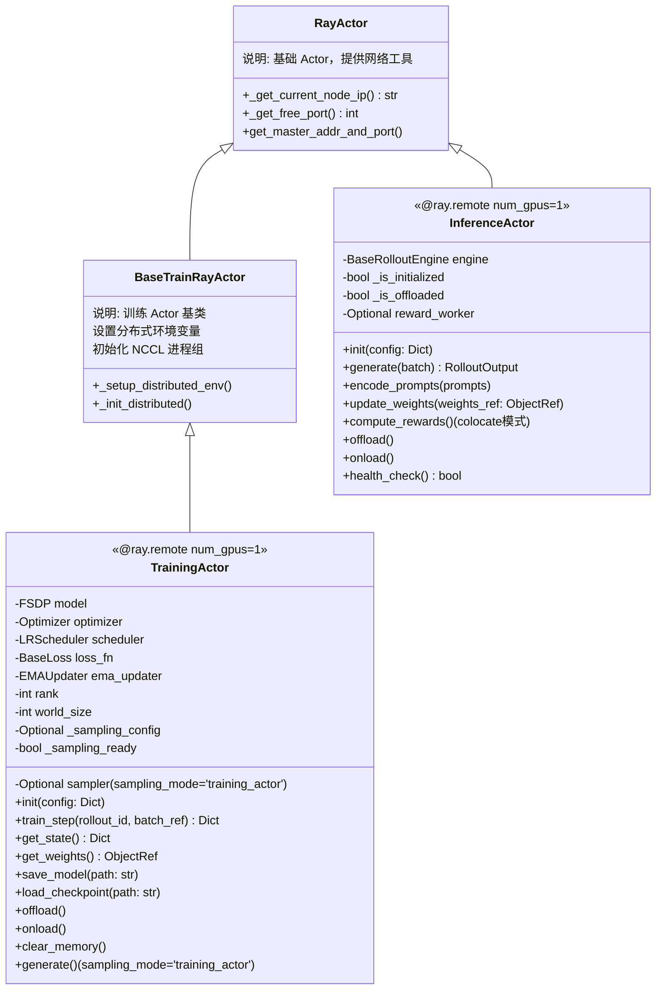
```mermaid
classDiagram
    class RayActor {
        +_get_current_node_ip() str
        +_get_free_port() int
        +get_master_addr_and_port()
        说明: 基础 Actor，提供网络工具
    }

    class BaseTrainRayActor {
        +_setup_distributed_env()
        +_init_distributed()
        说明: 训练 Actor 基类
        设置分布式环境变量
        初始化 NCCL 进程组
    }

    class InferenceActor {
        <<@ray.remote num_gpus=1>>
        -BaseRolloutEngine engine
        -bool _is_initialized
        -bool _is_offloaded
        -Optional reward_worker
        +init(config: Dict)
        +generate(batch) RolloutOutput
        +encode_prompts(prompts)
        +update_weights(weights_ref: ObjectRef)
        +compute_rewards() (colocate模式)
        +offload()
        +onload()
        +health_check() bool
    }

    class TrainingActor {
        <<@ray.remote num_gpus=1>>
        -FSDP model
        -Optimizer optimizer
        -LRScheduler scheduler
        -BaseLoss loss_fn
        -EMAUpdater ema_updater
        -int rank
        -int world_size
        -Optional sampler (sampling_mode='training_actor')
        -Optional _sampling_config
        -bool _sampling_ready
        +init(config: Dict)
        +train_step(rollout_id, batch_ref) Dict
        +get_state() Dict
        +get_weights() ObjectRef
        +save_model(path: str)
        +load_checkpoint(path: str)
        +offload()
        +onload()
        +clear_memory()
        +generate() (sampling_mode='training_actor')
    }

    RayActor <|-- BaseTrainRayActor
    RayActor <|-- InferenceActor
    BaseTrainRayActor <|-- TrainingActor
```

#### InferenceActor 引擎支持

InferenceActor 通过 `BaseRolloutEngine` 抽象支持多种推理后端。v3.0 新增 `num_gpus_allocated` 参数：

| 引擎类型 | 配置参数 | GPU 分配 | 特点 |
|---------|---------|---------|------|
| **FSDP** | `fsdp_num_gpus=1` | 单 GPU | 原生 PyTorch，DanceGRPO 对齐 |
| **SGLang** | `tp_size` | 多 GPU TP | dedicated rollout service，张量并行 |

> 多 GPU 推理通过 Slime 模式实现：NOSET_VISIBLE_DEVICES + `base_gpu_id` + 手动 `CUDA_VISIBLE_DEVICES`。

```python
# InferenceActor 可选内置 reward（colocate 模式）
@ray.remote(num_gpus=1)
class InferenceActor:
    def __init__(self, rank, world_size, colocate_reward=False):
        self.colocate_reward = colocate_reward
        self.reward_worker = None  # 可选内置

    def init(self, config):
        # 根据 engine_type 加载不同引擎
        self.engine = create_engine(config["engine_type"], config)
        self.engine.initialize(config)

        if self.colocate_reward:
            self.reward_worker = LocalRewardWorker(...)
```

### 5.2 Actor Group 管理

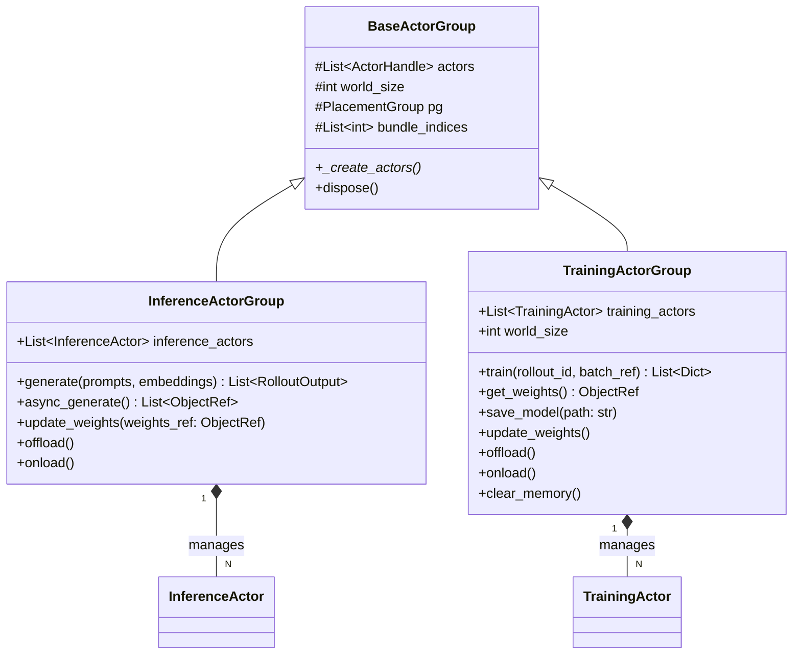
```mermaid
classDiagram
    class BaseActorGroup {
        #List~ActorHandle~ actors
        #int world_size
        #PlacementGroup pg
        #List~int~ bundle_indices
        +_create_actors()*
        +dispose()
    }

    class InferenceActorGroup {
        +List~InferenceActor~ inference_actors
        +generate(prompts, embeddings) List~RolloutOutput~
        +async_generate() List~ObjectRef~
        +update_weights(weights_ref: ObjectRef)
        +offload()
        +onload()
    }

    class TrainingActorGroup {
        +List~TrainingActor~ training_actors
        +int world_size
        +train(rollout_id, batch_ref) List~Dict~
        +get_weights() ObjectRef
        +save_model(path: str)
        +update_weights()
        +offload()
        +onload()
        +clear_memory()
    }

    BaseActorGroup <|-- InferenceActorGroup
    BaseActorGroup <|-- TrainingActorGroup

    InferenceActorGroup "1" *-- "N" InferenceActor : manages
    TrainingActorGroup "1" *-- "N" TrainingActor : manages
```

### 5.3 完整类关系图

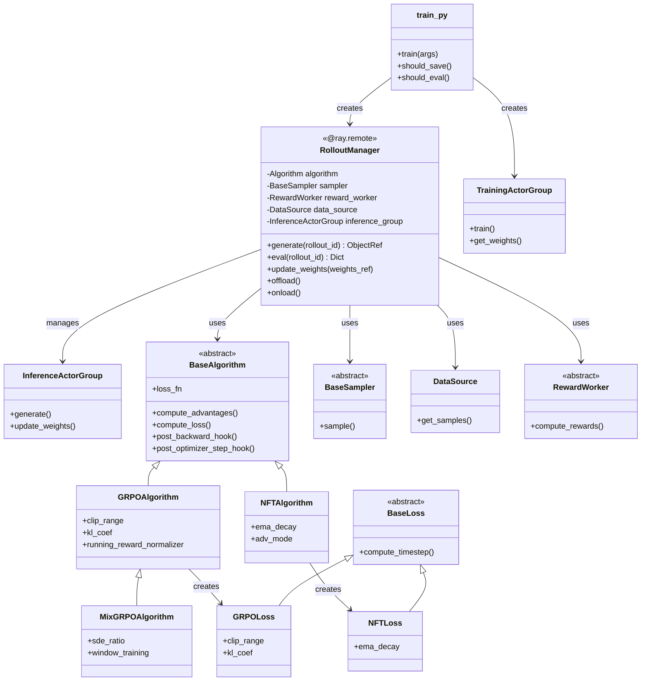
```mermaid
classDiagram
    %% Entry Points
    class train_py {
        +train(args)
        +should_save()
        +should_eval()
    }

    %% Ray Layer
    class RolloutManager {
        <<@ray.remote>>
        -Algorithm algorithm
        -BaseSampler sampler
        -RewardWorker reward_worker
        -DataSource data_source
        -InferenceActorGroup inference_group
        +generate(rollout_id) ObjectRef
        +eval(rollout_id) Dict
        +update_weights(weights_ref)
        +offload()
        +onload()
    }

    class InferenceActorGroup {
        +generate()
        +update_weights()
    }

    class TrainingActorGroup {
        +train()
        +get_weights()
    }

    %% Algorithm Layer
    class BaseAlgorithm {
        <<abstract>>
        +compute_advantages()
        +compute_loss()
        +loss_fn
        +post_backward_hook()
        +post_optimizer_step_hook()
    }

    class GRPOAlgorithm {
        +clip_range
        +kl_coef
        +running_reward_normalizer
    }

    class MixGRPOAlgorithm {
        +sde_ratio
        +window_training
    }

    class NFTAlgorithm {
        +ema_decay
        +adv_mode
    }

    %% Loss Layer
    class BaseLoss {
        <<abstract>>
        +compute_timestep()
    }

    class GRPOLoss {
        +clip_range
        +kl_coef
    }

    class NFTLoss {
        +ema_decay
    }

    %% Sampler Layer
    class BaseSampler {
        <<abstract>>
        +sample()
    }

    %% Data Layer
    class DataSource {
        +get_samples()
    }

    class RewardWorker {
        <<abstract>>
        +compute_rewards()
    }

    %% Relationships
    train_py --> RolloutManager : creates
    train_py --> TrainingActorGroup : creates

    RolloutManager --> InferenceActorGroup : manages
    RolloutManager --> BaseAlgorithm : uses
    RolloutManager --> BaseSampler : uses
    RolloutManager --> RewardWorker : uses
    RolloutManager --> DataSource : uses

    BaseAlgorithm <|-- GRPOAlgorithm
    GRPOAlgorithm <|-- MixGRPOAlgorithm
    BaseAlgorithm <|-- NFTAlgorithm
    GRPOAlgorithm --> GRPOLoss : creates
    NFTAlgorithm --> NFTLoss : creates

    BaseLoss <|-- GRPOLoss
    BaseLoss <|-- NFTLoss
```

---

## 6. Component Diagram

### 6.1 系统分层架构

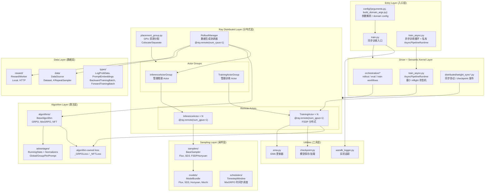
```mermaid
graph TB
    subgraph EntryLayer["Entry Layer (入口层)"]
        Train["train.py<br/>同步训练入口"]
        TrainAsync["train_async.py<br/>异步训练循环 + 私有 AsyncPipelineRuntime"]
        Config["config/{arguments.py, build_domain_args.py}<br/>参数解析 / domain config"]
    end

    subgraph RuntimeLayer["Driver + Semantic Kernel Layer"]
        WF["orchestration/*<br/>rollout / eval / train workflows"]
        APR["train_async.py<br/>AsyncPipelineRuntime<br/>最小 inflight 状态机"]
        WSC["distributed/weight_sync*.py<br/>同步协议 / checkpoint 发布"]
    end

    subgraph RayLayer["Ray Distributed Layer (分布式层)"]
        PG["placement_group.py<br/>GPU 资源分配<br/>Colocate/Separate"]
        RM["RolloutManager<br/>数据生成协调器<br/>@ray.remote(num_cpus=1)"]

        subgraph ActorGroups["Actor Groups"]
            IAG["InferenceActorGroup<br/>管理推理 Actor"]
            TAG["TrainingActorGroup<br/>管理训练 Actor"]
        end

        subgraph Actors["Remote Actors"]
            IA["InferenceActor × N<br/>@ray.remote(num_gpus=1)"]
            TA["TrainingActor × N<br/>@ray.remote(num_gpus=1)<br/>FSDP 分布式"]
        end
    end

    subgraph AlgorithmLayer["Algorithm Layer (算法层)"]
        Algo["algorithms/<br/>BaseAlgorithm<br/>GRPO, MixGRPO, NFT"]
        Loss["algorithm-owned loss<br/>_GRPOLoss / _NFTLoss"]
        Adv["advantages/<br/>RunningStats + Normalizers<br/>Global/Group/PerPrompt"]
    end

    subgraph SamplingLayer["Sampling Layer (采样层)"]
        Sampler["samplers/<br/>BaseSampler<br/>Flux, SD3, FSDPHunyuan"]
        Model["models/<br/>ModelBundle<br/>Flux, SD3, Hunyuan, Mochi"]
        Sched["schedulers/<br/>TimestepWindow<br/>MixGRPO 时间步调度"]
    end

    subgraph DataLayer["Data Layer (数据层)"]
        Data["data/<br/>DataSource<br/>Dataset, KRepeatSampler"]
        Reward["reward/<br/>RewardWorker<br/>Local, HTTP"]
        Types["types/<br/>LogProbData, PromptEmbeddings<br/>BackwardTrainingBatch, ForwardTrainingBatch"]
    end

    subgraph UtilsLayer["Utilities (工具层)"]
        Ckpt["checkpoint.py<br/>模型保存/加载"]
        EMA["ema.py<br/>EMA 更新器"]
        WandB["wandb_logger.py<br/>实验追踪"]
    end

    %% Connections
    Train --> RuntimeLayer
    TrainAsync --> APR
    Config --> Train
    WF --> RayLayer
    APR --> RayLayer
    WSC --> TA

    PG --> ActorGroups
    RM --> IAG
    IAG --> IA
    TAG --> TA

    IA --> Sampler
    Sampler --> Model
    TA --> Loss

    RM --> Algo
    Algo --> Loss
    Algo --> Adv

    RM --> Data
    RM --> Reward

    TA --> Ckpt
    TA --> EMA
    Train --> WandB
```

### 6.2 数据流组件图

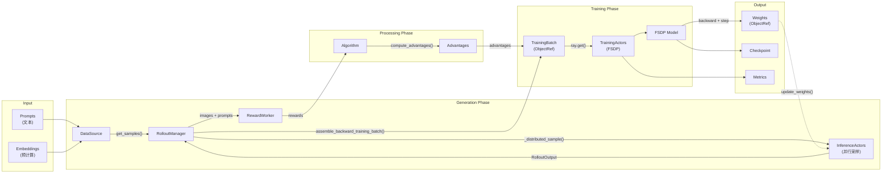
```mermaid
flowchart LR
    subgraph Input["Input"]
        Prompts["Prompts<br/>(文本)"]
        Embeds["Embeddings<br/>(预计算)"]
    end

    subgraph Generation["Generation Phase"]
        DS["DataSource"]
        RM["RolloutManager"]
        IA["InferenceActors<br/>(并行采样)"]
        RW["RewardWorker"]
    end

    subgraph Processing["Processing Phase"]
        Algo["Algorithm"]
        Adv["Advantages"]
    end

    subgraph Training["Training Phase"]
        Batch["TrainingBatch<br/>(ObjectRef)"]
        TA["TrainingActors<br/>(FSDP)"]
        FSDP["FSDP Model"]
    end

    subgraph Output["Output"]
        Weights["Weights<br/>(ObjectRef)"]
        Ckpt["Checkpoint"]
        Metrics["Metrics"]
    end

    Prompts --> DS
    Embeds --> DS
    DS -->|"get_samples()"| RM
    RM -->|"_distributed_sample()"| IA
    IA -->|"RolloutOutput"| RM
    RM -->|"images + prompts"| RW
    RW -->|"rewards"| Algo
    Algo -->|"compute_advantages()"| Adv
    Adv -->|"advantages"| Batch
    RM -->|"assemble_backward_training_batch()"| Batch
    Batch -->|"ray.get()"| TA
    TA --> FSDP
    FSDP -->|"backward + step"| Weights
    FSDP --> Ckpt
    TA --> Metrics

    Weights -.->|"update_weights()"| IA
```

---

## 7. Colocate 与 Ray 架构分析

### 7.1 Ray 在框架中的角色

| 使用场景 | Ray 特性 | 代码位置 | 说明 |
|----------|----------|----------|------|
| **GPU 资源管理** | `PlacementGroup` | `placement_group.py` | 统一管理 GPU 分配，支持 PACK/SPREAD 策略 |
| **Actor 调度** | `PlacementGroupSchedulingStrategy` | `actor_group.py` | 确保 Actor 在指定 GPU 上运行 |
| **远程执行** | `@ray.remote`, `.remote()` | 所有 Actor | 远程方法调用，异步执行 |
| **数据传递** | `ray.put()`, `ray.get()`, `ObjectRef` | `rollout_manager.py` | 零拷贝数据共享 |
| **异步等待** | `ray.wait()` | `train.py` | 权重收集完成确认 |

### 7.2 Ray Actor 创建与调度流程

```mermaid
sequenceDiagram
    participant Main as Main Process
    participant Ray as Ray Runtime
    participant PG as PlacementGroup
    participant Actor as Actor Instance

    Main->>Ray: ray.init(address=...)
    Note over Ray: 连接到 Ray 集群

    Main->>Ray: placement_group(bundles=[{GPU:1}]*N, strategy="PACK")
    Ray->>PG: 分配 GPU 资源
    Note over PG: 等待资源就绪
    Ray-->>Main: pg.ready()

    loop 创建每个 Actor
        Main->>Ray: Actor.options(<br/>num_gpus=1,<br/>scheduling_strategy=PG[i]<br/>).remote()
        Ray->>PG: 在 bundle[i] 上创建
        PG->>Actor: __init__()
        Ray-->>Main: ActorHandle
    end

    Main->>Actor: actor.init.remote(config)
    Actor->>Actor: 加载模型、采样器、优化器
    Note over Actor: 初始化完成，模型在 GPU
    Actor-->>Main: initialized

    Main->>Actor: actor.generate.remote(data)
    Actor->>Actor: 执行采样
    Actor->>Ray: ray.put(result)
    Note over Ray: 存入 Object Store
    Ray-->>Main: ObjectRef

    Main->>Ray: ray.get(result_ref)
    Ray-->>Main: 实际数据
```

### 7.3 Colocate 模式详解

#### 核心思想

在同一组 GPU 上**交替运行**推理和训练，通过 offload/onload 切换，大幅减少所需 GPU 数量。

#### 时间线视图


```mermaid
gantt
    title Colocate Mode - GPU Memory Timeline
    dateFormat X
    axisFormat %s

    section Rollout 0
    Inference ON (采样)     :active, a1, 0, 30
    Offload to CPU          :a2, 30, 35
    Training ON (训练)      :active, a3, 35, 70
    Offload to CPU          :a4, 70, 75
    Weight Sync             :a5, 75, 80

    section Rollout 1
    Inference ON            :active, b1, 80, 110
    Offload to CPU          :b2, 110, 115
    Training ON             :active, b3, 115, 150
    Offload to CPU          :b4, 150, 155
    Weight Sync             :b5, 155, 160
```

#### 状态机

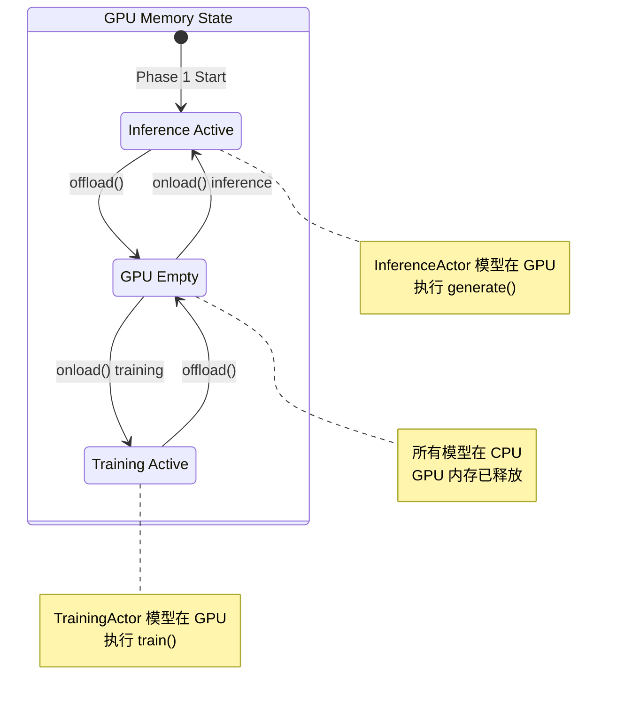
```mermaid
stateDiagram-v2
    state "GPU Memory State" as GPU {
        [*] --> InferenceActive: Phase 1 Start

        state "Inference Active" as InferenceActive
        note right of InferenceActive
            InferenceActor 模型在 GPU
            执行 generate()
        end note

        InferenceActive --> GPUEmpty: offload()

        state "GPU Empty" as GPUEmpty
        note right of GPUEmpty
            所有模型在 CPU
            GPU 内存已释放
        end note

        GPUEmpty --> TrainingActive: onload() training

        state "Training Active" as TrainingActive
        note right of TrainingActive
            TrainingActor 模型在 GPU
            执行 train()
        end note

        TrainingActive --> GPUEmpty: offload()
        GPUEmpty --> InferenceActive: onload() inference
    }
```

#### Offload/Onload 实现

```python
# InferenceActor
class InferenceActor:
    def offload(self):
        """将模型移至 CPU，释放 GPU 内存"""
        self.model_bundle.transformer.to("cpu")
        if self.vae is not None:
            self.vae.to("cpu")
        torch.cuda.empty_cache()
        self._is_offloaded = True

    def onload(self):
        """将模型移回 GPU"""
        self.model_bundle.transformer.to("cuda")
        if self.vae is not None:
            self.vae.to("cuda")
        self._is_offloaded = False

# TrainingActor
class TrainingActor:
    def offload(self):
        """将模型和优化器状态移至 CPU"""
        self.model.to("cpu")
        # 优化器状态也需要移动
        for state in self.optimizer.state.values():
            for k, v in state.items():
                if isinstance(v, torch.Tensor):
                    state[k] = v.to("cpu")
        torch.cuda.empty_cache()

    def onload(self):
        """将模型和优化器状态移回 GPU"""
        self.model.to("cuda")
        for state in self.optimizer.state.values():
            for k, v in state.items():
                if isinstance(v, torch.Tensor):
                    state[k] = v.to("cuda")
```

### 7.4 异步训练模式 (train_async.py) [v4.0 重构]

`train_async.py` 单文件实现异步 rollout/train 重叠。通过
`python -m diffusionrl.train_async ...` 启用。`AsyncPipelineRuntime` 现在是该文件内联的私有
helper，而不是额外的 `runtime/async_runtime.py`。

当前约束：
- 仅支持 separate（`colocate_rollout_training=false`）
- 默认关闭 offload（避免 rollout/train overlap 期间的状态抖动）
- 通过 `update_weights_interval` 在 generation 边界执行权重同步

#### AsyncPipelineRuntime 状态机（当前主线）

```python
@dataclass(frozen=True)
class InflightRollout:
    """已启动但尚未消费的 rollout"""
    rollout_id: int
    future: Any            # ray.ObjectRef

@dataclass(frozen=True)
class ResolvedRollout:
    """从 inflight future 解析出的结果"""
    rollout_id: int
    result: Any            # buffer admission 结果

class AsyncPipelineRuntime:
    """
    异步管道的最小生产者-消费者状态机

    追踪:
    - inflight rollout futures (有界队列)
    - rollout id 排序
    """
    def __init__(self, *, max_inflight=1, initial_rollout_id=0): ...

    def can_launch(self) -> bool: ...
    def launch_rollout(self, rollout_id, future): ...
    def resolve_next_rollout(self, resolver) -> ResolvedRollout: ...
    def assert_no_inflight_for_weight_sync(self) -> None: ...
```

#### 异步训练循环时序图

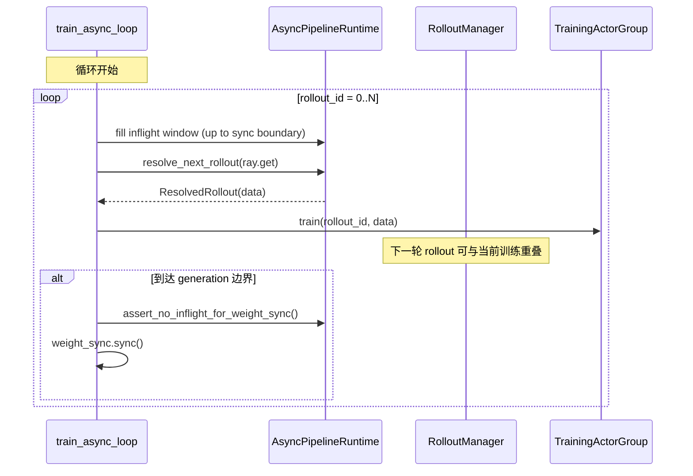
```mermaid
sequenceDiagram
    participant TL as train_async_loop
    participant RT as AsyncPipelineRuntime
    participant RM as RolloutManager
    participant TG as TrainingActorGroup

    Note over TL: 循环开始

    loop rollout_id = 0..N
        TL->>RT: fill inflight window (up to sync boundary)
        TL->>RT: resolve_next_rollout(ray.get)
        RT-->>TL: ResolvedRollout(data)
        TL->>TG: train(rollout_id, data)
        Note over RM: 下一轮 rollout 可与当前训练重叠

        alt 到达 generation 边界
            TL->>RT: assert_no_inflight_for_weight_sync()
            TL->>TL: weight_sync.sync()
        end
    end
```

#### 同步边界保证

| 检查点 | 方法 | 说明 |
|--------|------|------|
| **有界 inflight** | `can_launch()` / `launch_rollout()` | rollout overlap 不超过 `async_max_inflight` |
| **按 rollout_id 消费** | `resolve_next_rollout()` | 始终按最老的 inflight rollout 取回 |
| **同步前清空** | `assert_no_inflight_for_weight_sync()` | generation 边界上才允许权重同步 |

#### 权重同步协议 [current]

当前实现通过 `sync.protocol` 选择权重同步协议：

| 模式 | 配置 | 传输方式 | 适用场景 |
|------|------|----------|---------|
| **Tensor Payload** | `sync.protocol="tensor_payload"` | 训练端分桶张量 → rollout service 直接接收 | 单节点 / SGLang rollout |
| **NCCL Broadcast** | `sync.protocol="nccl_broadcast"` | 持久 NCCL 组广播 | 多节点 / SGLang rollout |
| **Checkpoint Path** | `sync.protocol="checkpoint_path"` | 原子写文件 → 各 Actor 读文件 | 共享存储 / checkpoint 消费型 rollout |

Checkpoint Path 模式使用 `weight_sync_checkpoint.py` 实现原子写入：
```python
# 原子发布：tmp 文件 → fsync → rename(final) → ready marker
publish_checkpoint_atomic(state_dict, checkpoint_path)
# 等待就绪：轮询 checkpoint + ready marker
wait_for_published_checkpoint(checkpoint_path, timeout_s=120)
# 清理
cleanup_published_checkpoint(checkpoint_path)
```

### 7.5 FSDP 分布式训练集成

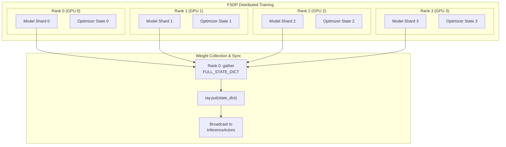
```mermaid
graph TB
    subgraph FSDP["FSDP Distributed Training"]
        direction LR

        subgraph Rank0["Rank 0 (GPU 0)"]
            M0["Model Shard 0"]
            O0["Optimizer State 0"]
        end

        subgraph Rank1["Rank 1 (GPU 1)"]
            M1["Model Shard 1"]
            O1["Optimizer State 1"]
        end

        subgraph Rank2["Rank 2 (GPU 2)"]
            M2["Model Shard 2"]
            O2["Optimizer State 2"]
        end

        subgraph Rank3["Rank 3 (GPU 3)"]
            M3["Model Shard 3"]
            O3["Optimizer State 3"]
        end
    end

    subgraph Sync["Weight Collection & Sync"]
        Gather["Rank 0: gather<br/>FULL_STATE_DICT"]
        Put["ray.put(state_dict)"]
        Broadcast["Broadcast to<br/>InferenceActors"]
    end

    M0 & M1 & M2 & M3 --> Gather
    Gather --> Put
    Put --> Broadcast
```

**FSDP 配置代码**：

```python
# TrainingActor 中的 FSDP 初始化
from torch.distributed.fsdp import FullyShardedDataParallel as FSDP
from torch.distributed.fsdp import ShardingStrategy, MixedPrecision

model = FSDP(
    model,
    sharding_strategy=ShardingStrategy.FULL_SHARD,  # 完全分片
    mixed_precision=MixedPrecision(
        param_dtype=torch.bfloat16,
        reduce_dtype=torch.bfloat16,
        buffer_dtype=torch.bfloat16,
    ),
    auto_wrap_policy=transformer_auto_wrap_policy,
    cpu_offload=None,  # 不使用 FSDP 的 CPU offload
)

# 权重收集（仅 Rank 0）
def get_weights(self):
    if self.rank == 0:
        with FSDP.state_dict_type(self.model, StateDictType.FULL_STATE_DICT):
            state_dict = self.model.state_dict()
            return ray.put(state_dict)
    return None
```

### 7.6 Ray Object Reference 数据传递

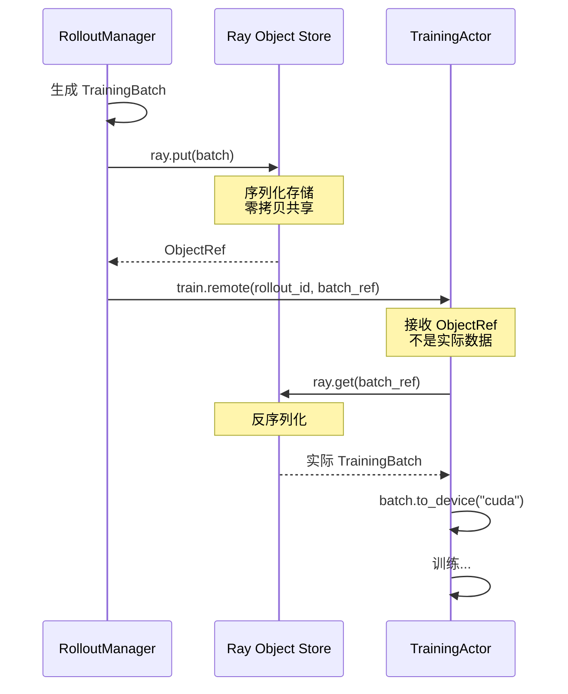
```mermaid
sequenceDiagram
    participant RM as RolloutManager
    participant OS as Ray Object Store
    participant TA as TrainingActor

    RM->>RM: 生成 TrainingBatch
    RM->>OS: ray.put(batch)
    Note over OS: 序列化存储<br/>零拷贝共享
    OS-->>RM: ObjectRef

    RM->>TA: train.remote(rollout_id, batch_ref)
    Note over TA: 接收 ObjectRef<br/>不是实际数据

    TA->>OS: ray.get(batch_ref)
    Note over OS: 反序列化
    OS-->>TA: 实际 TrainingBatch

    TA->>TA: batch.to_device("cuda")
    TA->>TA: 训练...
```

**优势**：
- 数据只序列化一次，多个 Actor 可共享
- 跨节点时自动处理网络传输
- 支持大型张量的高效传递

---

## 8. Reward 系统架构

### 8.1 Reward 在训练生命周期中的位置

Reward 计算是 GRPO 训练管道的核心环节，位于**采样**和**优势计算**之间：

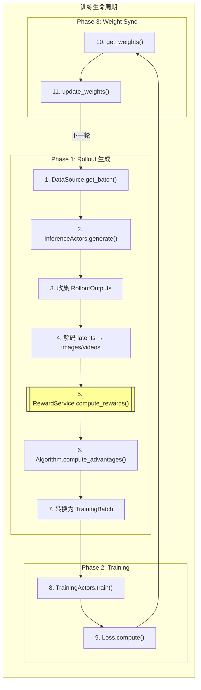
```mermaid
flowchart TB
    subgraph Lifecycle["训练生命周期"]
        direction TB

        subgraph Phase1["Phase 1: Rollout 生成"]
            A1["1. DataSource.get_batch()"] --> A2["2. InferenceActors.generate()"]
            A2 --> A3["3. 收集 RolloutOutputs"]
            A3 --> A4["4. 解码 latents → images/videos"]
            A4 --> A5[["5. RewardService.compute_rewards()"]]
            A5 --> A6["6. Algorithm.compute_advantages()"]
            A6 --> A7["7. 转换为 TrainingBatch"]
        end

        subgraph Phase2["Phase 2: Training"]
            B1["8. TrainingActors.train()"]
            B1 --> B2["9. Loss.compute()"]
        end

        subgraph Phase3["Phase 3: Weight Sync"]
            C1["10. get_weights()"]
            C1 --> C2["11. update_weights()"]
        end

        A7 --> B1
        B2 --> C1
        C2 -->|"下一轮"| A1
    end

    style A5 fill:#ff9,stroke:#333,stroke-width:2px
```

**Reward 计算时机**：
- 在 `RolloutManager.generate()` 内部调用
- 输入：解码后的图像/视频 + 原始 prompts
- 输出：`rewards: Tensor[B]`，每个样本一个标量奖励

### 8.2 Reward 数据流详解

```mermaid
sequenceDiagram
    participant RM as RolloutManager
    participant IA as InferenceActors
    participant RS as RewardService
    participant RW as RewardWorker(s)
    participant Algo as Algorithm

    RM->>IA: generate(batch, sde_indices)
    IA-->>RM: List[RolloutOutput]

    Note over RM: 收集所有 Actor 的输出
    Note over RM: 解码 latents → images (VAE)

    RM->>RS: compute_rewards(request)
    Note over RS: RewardRequest:<br/>- images: List[PIL.Image]<br/>- prompts: List[str]

    RS->>RW: compute_rewards(request)

    alt LocalRewardWorker (CPU)
        RW->>RW: model.score(images, prompts)
    else RayRewardWorker (独立 GPU)
        RW->>RW: ray.get(actor.compute.remote(...))
    else HTTPRewardWorker (远程)
        RW->>RW: POST /compute_rewards
    end

    RW-->>RS: RewardResponse
    Note over RS: RewardResponse:<br/>- rewards: List[float]<br/>- compute_time: float

    RS-->>RM: rewards: Tensor[B]

    RM->>Algo: compute_advantages(rewards, group_ids)
    Note over Algo: 归一化: global / group
    Algo-->>RM: advantages: Tensor[B]

    Note over RM: 组装 TrainingBatch
```

### 8.3 RewardService 统一入口

`RewardService` 是奖励计算的统一抽象层，根据配置自动选择最优后端：

```mermaid
graph TB
    subgraph RewardService["RewardService (统一入口)"]
        Config["配置分析"]
        Config -->|"use_http_reward=True<br/>或 reward_service_urls"| HTTP["HTTPRewardWorker"]
        Config -->|"reward_dedicated_num_gpus > 0<br/>且有 PlacementGroup"| Ray["RayRewardWorker"]
        Config -->|"默认"| Local["LocalRewardWorker (CPU)"]
    end

    HTTP --> ExtService["外部 HTTP 服务"]
    Ray --> GPUActor["独立 GPU Actor<br/>(Ray PlacementGroup)"]
    Local --> CPU["CPU 计算"]

    Note1["注意: colocate_reward 模式<br/>不经过 RewardService<br/>由 InferenceActor 直接处理"]
```

**后端选择优先级**:
1. `use_http_reward=True` 或 `reward_service_urls` → HTTPRewardWorker
2. `reward_dedicated_num_gpus > 0` 且有 PlacementGroup → RayRewardWorker
3. 默认 → LocalRewardWorker (CPU)

> **注意**: `colocate_reward=True` 模式不经过 RewardService，而是由 InferenceActor 内部的 LocalRewardWorker 处理。

### 8.4 Reward Worker 类型详解

#### 类继承结构

```mermaid
classDiagram
    class BaseRewardWorker {
        <<abstract>>
        +str model_name
        +float weight
        +int batch_size
        +float timeout
        +compute_rewards(request)* RewardResponse
        +is_available()* bool
        +compute_rewards_async(request)
        +compute_rewards_batch(requests)
        +offload()
        +onload()
        +dispose()
    }

    class LocalRewardWorker {
        +str device
        +dtype
        +model: Any
        +processor: Any
        +reward_fn: Callable
        -_load_pickscore()
        -_load_hpsv2()
        -_load_clip()
        -_load_aesthetic()
    }

    class HTTPRewardWorker {
        +str base_url
        +int max_retries
        +aiohttp session
        +compute_rewards_async()
    }

    class RayRewardWorker {
        +PlacementGroup pg
        +List bundle_indices
        +List gpu_ids
        +bool parallel_mode
        -List~_RewardActor~ actors
    }

    class _RewardActor {
        <<ray.remote>>
        -BaseRewardWorker worker
        +compute_rewards()
        +offload()
        +onload()
    }

    BaseRewardWorker <|-- LocalRewardWorker
    BaseRewardWorker <|-- HTTPRewardWorker
    BaseRewardWorker <|-- RayRewardWorker
    RayRewardWorker *-- _RewardActor
```

#### Worker 类型对比

| Worker 类型 | 配置条件 | 资源占用 | 生命周期管理 | 适用场景 |
|------------|---------|---------|-------------|---------|
| **LocalRewardWorker** | 默认 | CPU (或同进程 GPU) | 与 RolloutManager 相同 | 小型奖励模型 (PickScore) |
| **HTTPRewardWorker** | `use_http_reward=True` | 无（远程） | 无状态 | 外部服务、微服务架构 |
| **RayRewardWorker** | `reward_dedicated_num_gpus > 0` | 独立 PlacementGroup | 独立 Actor 生命周期 | 大型奖励模型 (需要专用 GPU) |
| **Colocate 内置** | `colocate_reward=True` | InferenceActor 共享 | 随 InferenceActor offload/onload | GPU 资源有限 |

### 8.5 支持的奖励模型

| 模型名 | 类型 | 输入 | 输出 | 说明 |
|-------|------|-----|------|------|
| **pickscore** | Image-Text Alignment | 图像 + prompt | 对齐分数 | PickScore_v1 |
| **hpsv2** | Image-Text Alignment | 图像 + prompt | HPS 分数 | Human Preference Score v2 |
| **clip** | Similarity | 图像 + prompt | CLIP 相似度 | OpenAI CLIP |
| **aesthetic** | Aesthetic | 图像 | 美学分数 | LAION Aesthetic |
| **custom** | 自定义 | 任意 | 任意 | 通过 `reward_fn` 参数 |

```python
# LocalRewardWorker 模型加载
class LocalRewardWorker:
    def _load_model(self):
        if self.model_name == "pickscore":
            self._load_pickscore()    # yuvalkirstain/PickScore_v1
        elif self.model_name == "hpsv2":
            self._load_hpsv2()        # HPSv2
        elif self.model_name == "clip":
            self._load_clip()         # OpenAI CLIP
        elif self.model_name == "aesthetic":
            self._load_aesthetic()    # LAION Aesthetic
```

### 8.6 多奖励模型聚合

```python
# 配置示例
reward_models: List[str] = ["pickscore", "hpsv2"]
reward_weights: List[float] = [0.3, 0.7]
component_aggregation: str = "weighted_sum"  # weighted_sum, mean, min, max
```

**聚合流程**：

```mermaid
flowchart LR
    subgraph Workers["多个 RewardWorker"]
        W1["PickScore<br/>weight=0.3"]
        W2["HPSv2<br/>weight=0.7"]
    end

    subgraph Results["各模型结果"]
        R1["[0.8, 0.6, 0.9]"]
        R2["[0.7, 0.8, 0.75]"]
    end

    subgraph Aggregate["聚合"]
        Agg["weighted_sum:<br/>0.3*R1 + 0.7*R2"]
    end

    subgraph Final["最终奖励"]
        F["[0.73, 0.74, 0.795]"]
    end

    W1 --> R1
    W2 --> R2
    R1 --> Agg
    R2 --> Agg
    Agg --> F
```

### 8.7 Reward Worker 生命周期

#### 初始化时机

```python
# RolloutManager.init() 中
def init(self, config):
    # ... 加载其他组件 ...

    # 初始化 RewardService（自动选择后端）
    self.reward_service = RewardService(args, reward_pg_result)

    # 或者 colocate 模式下，InferenceActor 内置
    # InferenceActor.__init__()
    if self.colocate_reward:
        self.reward_worker = LocalRewardWorker(
            model_name=config["reward_model_name"],
            device="cuda",
        )
```

#### Offload/Onload (Colocate 模式)

在 Colocate 模式下，Reward Worker 需要与 InferenceActor 一起进行 offload/onload：

```mermaid
stateDiagram-v2
    state "InferenceActor + Reward" as Combined {
        [*] --> Active

        state "Active (GPU)" as Active
        note right of Active
            InferenceActor: GPU
            RewardWorker: GPU (colocate)
            可执行 generate() + compute_rewards()
        end note

        Active --> Offloaded: offload()

        state "Offloaded (CPU)" as Offloaded
        note right of Offloaded
            InferenceActor: CPU
            RewardWorker: CPU
            GPU 内存释放给 Training
        end note

        Offloaded --> Active: onload()
    }
```

```python
# InferenceActor 的 offload/onload
class InferenceActor:
    def offload(self):
        self.engine.offload()  # 推理模型 → CPU
        if self.reward_worker:
            self.reward_worker.offload()  # 奖励模型 → CPU
        torch.cuda.empty_cache()

    def onload(self):
        self.engine.onload()  # 推理模型 → GPU
        if self.reward_worker:
            self.reward_worker.onload()  # 奖励模型 → GPU
```

### 8.8 四种 Reward 部署模式

```mermaid
graph TB
    subgraph Mode1["模式 1: CPU Local (默认)"]
        RM1["RolloutManager"]
        LW1["LocalRewardWorker<br/>(CPU)"]
        RM1 --> LW1
    end

    subgraph Mode2["模式 2: HTTP Remote"]
        RM2["RolloutManager"]
        HW2["HTTPRewardWorker"]
        ES2["External Service<br/>(独立部署)"]
        RM2 --> HW2
        HW2 -->|HTTP| ES2
    end

    subgraph Mode3["模式 3: Independent GPU"]
        RM3["RolloutManager"]
        RS3["RewardService"]
        RW3["RayRewardWorker"]
        RA3["_RewardActor<br/>(独立 GPU PlacementGroup)"]
        RM3 --> RS3
        RS3 --> RW3
        RW3 -->|Ray| RA3
    end

    subgraph Mode4["模式 4: Colocate GPU"]
        IA4["InferenceActor"]
        LW4["LocalRewardWorker<br/>(内置, 共享 GPU)"]
        IA4 --> LW4
    end
```

#### 配置对照表

| 模式 | 配置参数 | GPU 使用 | 适用场景 |
|-----|---------|---------|---------|
| **CPU Local** | 默认 | 无 | 开发测试、小模型 |
| **HTTP Remote** | `use_http_reward=True`<br/>`reward_service_url="..."` | 无（远程） | 生产环境、微服务 |
| **Independent GPU** | `reward_dedicated_num_gpus=N`<br/>(N > 0) | N 个独立 GPU | 大型奖励模型 |
| **Colocate GPU** | `colocate_rollout_training=True`<br/>`colocate_reward=True` | 与 Inference 共享 | 资源受限 |

### 8.9 核心数据结构

```python
@dataclass
class RewardRequest:
    """奖励计算请求"""
    images: Optional[List[PIL.Image]] = None   # 图像输入
    videos: Optional[List[Tensor]] = None      # 视频输入 [B,T,C,H,W]
    prompts: List[str] = field(default_factory=list)  # 文本 prompts
    metadata: Optional[List[Dict]] = None      # 额外元数据
    reward_types: List[RewardType] = ...       # 请求的奖励类型
    return_components: bool = False            # 是否返回分项

    @property
    def batch_size(self) -> int: ...
    @property
    def is_video(self) -> bool: ...

@dataclass
class RewardResponse:
    """奖励计算响应"""
    rewards: List[float]                       # 主奖励 [B]
    reward_components: Dict[str, List[float]]  # 分项奖励
    successes: List[bool]                      # 成功标志
    errors: List[Optional[str]]                # 错误信息
    compute_time: float                        # 计算耗时

    def to_tensor(self, device) -> Tensor: ...
```

### 8.10 GPU 配置详解

```python
# 奖励 GPU 配置参数
reward_dedicated_num_gpus: int = 0           # 独立奖励 GPU 总数 (0 = CPU)
reward_dedicated_gpus_per_actor: int = 1     # 每个 actor 的 GPU 数 (大模型需要多卡)
reward_dedicated_num_nodes: int = 0          # 独立奖励节点数 (多节点)
reward_dedicated_num_gpus_per_node: int = 0  # 每节点 GPU 数
```

说明：`reward_dedicated_num_gpus` 与 `reward_dedicated_num_nodes` 二选一，不要同时设置。

**GPU 分配示例**：

```
# 场景: reward_dedicated_num_gpus=4, reward_dedicated_gpus_per_actor=2
# 结果: 2 个 RayRewardWorker，每个使用 2 GPU

┌──────────────────────────────────────┐
│        Reward PlacementGroup          │
│  ┌────────────┐  ┌────────────┐      │
│  │ Actor 0    │  │ Actor 1    │      │
│  │ GPU 0 + 1  │  │ GPU 2 + 3  │      │
│  │ (2-GPU)    │  │ (2-GPU)    │      │
│  └────────────┘  └────────────┘      │
└──────────────────────────────────────┘
```

---

## 9. 配置参数详解

### 9.1 TrainingArguments 主要参数组

| 参数组 | 关键参数 | 说明 |
|-------|---------|------|
| **动态加载路径** | `algorithm_path`, `sampler_path`, `reward_path`, `model_path` | 支持自定义实现 |
| **模型配置** | `pretrained_model_saved_path`, `model_type`, `vae_saved_path` | FLUX/SD3/Hunyuan/Mochi |
| **算法配置** | `clip_range`, `kl_coef`, `adv_normalization`, `sde_type` | PPO 超参数 |
| **采样配置** | `num_inference_steps`, `eta`, `shift`, `sde_ratio`, `init_same_noise` | SDE 采样控制 |
| **NFT 配置** | `nft_beta`, `nft_adv_mode`, `use_ema`, `ema_decay`, `nft_timestep_mode`, `nft_shuffle_timesteps`, `nft_apply_shift` | DiffusionNFT 特定 |
| **GRPO 归一化配置** | `adv_normalization`, `use_global_std`, `trimmed_ratio` | advantage 归一化 |
| **Ray 资源** | `rollout_num_nodes/gpus`, `training_num_nodes/gpus`, `reward_num_gpus` | 分布式配置 |
| **引擎配置** | `sampler_engine_type`, `sp_size`, `tp_size`, `fsdp_num_gpus` | 推理后端 |
| **Offload** | `offload`, `offload_train`, `offload_rollout`, `colocate_rollout_training` | 内存优化 |
| **采样模式** | `training_actor_direct_sampling` | `false`=独立 rollout actor, `true`=training actor 直采样 |
| **训练优化** | `use_gradient_checkpointing`, `gradient_steps_per_epoch`, `cross_rank_shuffle` | 内存/性能优化 |
| **数据分区** | `partition_train_data`, `prompts_per_rollout` | 大批次数据分区 |
| **Colocate 精细控制** | `colocate_training_gpu_fraction`, `colocate_rollout_gpu_fraction` | GPU 分配比例 |
| **异步入口参数** | `async_max_inflight`, `update_weights_interval` | `train_async.py` 的 rollout/train 重叠控制 [v4.0] |
| **权重同步** | `sync.protocol`, `sync.dir` | disabled / tensor_payload / nccl_broadcast / checkpoint_path |

#### v3.0 新增参数说明

| 参数 | 类型 | 默认值 | 说明 |
|------|------|--------|------|
| `training_actor_direct_sampling` | bool | False | `false` 使用独立 rollout actor，`true` 训练 actor 兼做采样（FSDP 直采样） |
| `init_same_noise` | bool | False | DanceGRPO/MixGRPO：同一 prompt 的多个采样共享初始噪声 |
| `adv_normalization` | str | "group" | advantage 归一化策略：`global` / `group` |
| `use_global_std` | bool | False | grouped normalization 时使用全局 std |
| `use_gradient_checkpointing` | bool | False | 梯度检查点，减少显存 |
| `partition_train_data` | bool | False | 将 rollout 数据分区到各训练 Actor |
| `cross_rank_shuffle` | bool | False | 跨 rank 数据洗牌 |
| `nft_timestep_mode` | str | "random" | NFT 时间步采样模式 |
| `nft_shuffle_timesteps` | bool | False | NFT 时间步洗牌 |
| `nft_apply_shift` | bool | True | NFT 是否应用时间偏移 |

#### v4.0 新增参数说明

| 参数 | 类型 | 默认值 | 说明 |
|------|------|--------|------|
| `async_max_inflight` | int | 1 | 异步管道最大 inflight rollout 数量 |
| `update_weights_interval` | int | 1 | 权重同步频率（每 N 个 rollout 同步一次） |
| `sync.protocol` | str | "auto" | 权重同步协议：`auto` / `disabled` / `tensor_payload` / `nccl_broadcast` / `checkpoint_path` |
| `sync.dir` | str | "outputs/weight_sync" | checkpoint_path 模式下的权重临时目录 |

#### validate_args() 验证逻辑 (v3.0 新增)

`TrainingArguments.validate_args()` 包含以下验证：
- **FLUX SDE 类型标准化**：`model_type=="flux"` 时，`dance` → `flux_dance`，`sde`/`flow` → `flux_flow`
- **算法-损失一致性验证**：确保算法类型和损失类型匹配
- **资源配置验证**：检查 GPU 分配合理性

### 9.2 当前推荐配置入口

当前主线不再维护 `config/defaults.py` 预设模块。推荐的入口是：

| 入口 | 说明 |
|--------|------|
| `scripts/minimal_flux.yaml` | FLUX 的最小 YAML 配置 |
| `scripts/minimal_hunyuan.yaml` | Hunyuan 的最小 YAML 配置 |
| `scripts/train_*.sh` | 常用算法/模型/模式脚本模板 |
| `README.md` 中的 CLI 示例 | 直接从命令行启动时的最短路径 |

### 9.3 模型类型自动映射

```python
# 模型类型 → 模型 Bundle
MODEL_TYPE_TO_PATH = {
    "flux": "diffusionRL.models.flux.FluxModelBundle",
    "sd3": "diffusionRL.models.sd3.SD3ModelBundle",
    "hunyuan": "diffusionRL.models.hunyuan.HunyuanModelBundle",
    "mochi": "diffusionRL.models.mochi.MochiModelBundle",
}

# 模型类型 → 引擎类型
MODEL_TYPE_TO_SAMPLER_ENGINE = {
    "flux": "fsdp",      # 图像模型用 FSDP
    "sd3": "fsdp",
    "hunyuan": "fsdp",   # 视频模型可走 FSDP 原生采样
    "mochi": "sglang",   # Mochi 使用 dedicated rollout engine
}
```

---

## 10. 总结

### 10.1 架构亮点

| 特性 | 描述 | 优势 |
|------|------|------|
| **模块化架构** | 算法、采样器、奖励、损失函数都是可插拔的 | 易于扩展新算法 |
| **多引擎支持** | FSDP/SGLang 推理后端 | 灵活适配图像/视频模型 |
| **Ray 分布式** | PlacementGroup + Actor 实现灵活的资源调度 | 支持多机多卡 |
| **Colocate 优化** | offload/onload 复用 GPU | 4 GPU 完成 8 GPU 的工作 |
| **类型安全** | dataclass 定义清晰的数据契约 | 减少运行时错误 |
| **算法 Hook 系统** | post_backward/post_optimizer_step Hook | 算法自定义训练行为无需改 Actor |
| **双采样后端** | inference / training 采样模式 | 灵活的推理采样策略 |
| **语义包分层** | `orchestration` / `buffer` / `training` / `distributed` | 当前主线结构更清晰 |
| **FSDP 集成** | 原生支持大模型分布式训练 | 训练更大的模型 |
| **注册表系统** | Loss/Engine/Strategy 注册表 | 运行时扩展无需改代码 |
| **异步训练循环** | `train_async.py` + 最小 `AsyncPipelineRuntime` | rollout/train 重叠提升吞吐 [v4.0] |
| **多协议权重同步** | tensor_payload / nccl_broadcast / checkpoint_path | 适配单节点/多节点场景 [v4.0] |
| **原子 checkpoint 发布** | weight_sync_checkpoint.py 原子写入 | 避免读写竞争和数据损坏 [v4.0] |
| **完整测试套件** | `tests/` 下的多个模块覆盖核心契约 | 回归保护 [v4.0] |

### 10.2 设计模式总结

```mermaid
mindmap
    root((DiffusionRL<br/>设计模式))
        动态加载
            importlib
            module path 字符串
            load_function/load_class
        工厂模式
            create_rollout_manager()
            create_training_actor_group()
            get_loss() / create_engine()
            create_weight_sync()
        注册表模式
            LOSS_REGISTRY
            ENGINE_REGISTRY
            STRATEGIES
        策略模式
            Algorithm 选择
            Advantage 归一化策略
            Sampler 选择
            WeightSyncCoordinator
        模板方法
            BaseAlgorithm
            BaseSampler
            BaseLoss
            BaseRolloutEngine
        状态机模式
            AsyncPipelineRuntime
            InflightRollout 生命周期
            inflight rollout 队列
        观察者模式
            WandB Logger
            Metrics 收集
        对象池模式
            Actor Group 管理
            资源复用
```

### 10.3 扩展指南

| 扩展点 | 步骤 | 示例 |
|--------|------|------|
| **新算法** | 1. 继承 `BaseAlgorithm`<br/>2. 实现 `get_sampling_requirements()`<br/>3. 实现 `compute_loss()`<br/>4. 可选：实现 Hook 方法 | 参考 `algorithms/grpo.py` |
| **新采样器** | 1. 继承 `BaseSampler`<br/>2. 实现 `sample()`<br/>3. 可选：使用 `@register_engine` | 参考 `fsdp/flux_sampler.py` |
| **新损失函数** | 1. 继承 `BaseLoss`<br/>2. 实现 `compute()`<br/>3. 使用 `register_loss()` 注册 | 参考 `grpo_loss.py` |
| **新奖励模型** | 1. 继承 `BaseRewardWorker`<br/>2. 实现 `compute_rewards()` | 参考 `local.py` |
| **新模型架构** | 1. 实现 `ModelBundle` 接口<br/>2. 在 `models/` 下添加文件<br/>3. 更新 `MODEL_TYPE_TO_PATH` | 参考 `flux.py` |
| **新推理引擎** | 1. 继承 `BaseRolloutEngine`<br/>2. 实现所有抽象方法<br/>3. 使用 `@register_engine` | 参考 `fsdp/engine.py` |

### 10.4 性能考量

| 场景 | 推荐配置 | 原因 |
|------|----------|------|
| **资源充足** | Separate + Overlap | 最大化吞吐量 |
| **资源有限** | Colocate + PACK | 最小化 GPU 需求 |
| **大模型训练** | FSDP + FULL_SHARD | 内存效率最高 |
| **多节点训练** | FSDP + HYBRID_SHARD | 减少跨节点通信 |
| **视频模型** | Hunyuan(FSDP) / Mochi(SGLang) | 依据模型默认 rollout 路径选择 |
| **多节点** | SPREAD + Pipeline | 容错性好，吞吐稳定 |

### 10.5 支持的模型

| 模型类型 | 任务 | 引擎 | 采样器 |
|---------|------|-----|-------|
| **FLUX** | 图像生成 | FSDP | FluxSampler |
| **SD3** | 图像生成 | FSDP | SD3Sampler |
| **HunyuanVideo** | 视频生成 | FSDP | FSDPHunyuanSampler |
| **Mochi** | 视频生成 | SGLang | SGLangRolloutEngine |

---

*文档版本: 4.0*
*最后更新: 2026-03-22*
