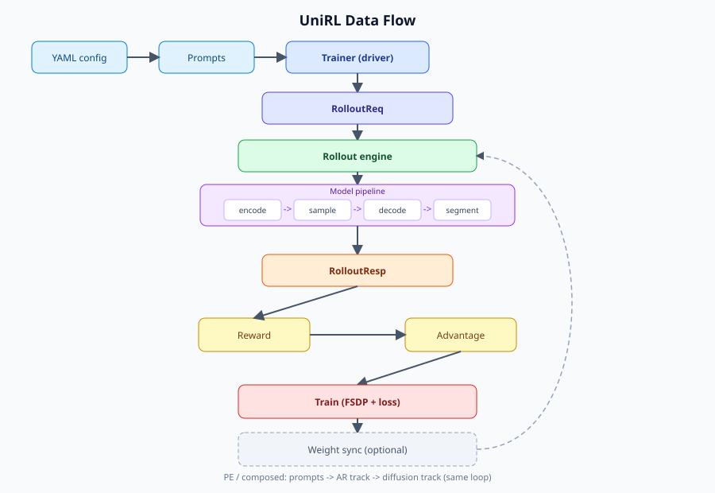

# Code Architecture

<div align="center">
  
</div>

This package is organized around one runtime loop:

```text
unirl.train_diffusion | train_vlm | train_pe | train_unified_model
  -> register and validate Hydra config
  -> <Domain>Trainer acquires a Ray DevicePool (placement)
  -> trainer builds the rollout workers and train workers
  -> loop: rollout -> reward -> advantage -> train -> optional weight sync
```

The code intentionally separates the per-domain trainer lifecycle, Ray worker
orchestration, rollout engines, the train stack, and algorithm loss math.

## Deployment modes

The rollout engine and optional `sync:` section define how GPUs are used:

| Mode | Layout | Sync |
|---|---|---|
| Train-side sampling | Training workers generate samples directly | Not used |
| Separate rollout | Rollout and training use different GPU pools | Required |
| Colocated rollout | Rollout and training share GPU bundles with offload/onload | Required |

## Module Map

| Path | Responsibility |
|---|---|
| `train_diffusion.py`, `train_vlm.py`, `train_pe.py`, `train_unified_model.py` | Per-domain Hydra entrypoints |
| `trainer/` | Per-domain training lifecycle (`base.py` + `diffusion`/`vlm`/`pe`/`hi3`): owns placement, builds workers, and runs the rollout→reward→advantage→train loop |
| `config/` | Config dataclasses, `_target_` instantiation (`build`/`materialize`), cross-component validation |
| `distributed/` | Ray worker base (`Remote`) + placement/dispatch (`group/`), tensor transport (`tensor/`), and weight sync (`weight_sync/`) |
| `rollout/` | Rollout engine contracts and implementations (`engine/`: trainside, sglang, sglang_llm, vllm_omni, composed) |
| `train/` | Train stack: `TrainStack`, FSDP backend, LoRA/NFT/mirror injection, EMA shadow, optimizer/lr |
| `algorithms/` | Per-track loss algorithms (GRPO, NFT, DPPO, DRPO) |
| `models/` | Per-model bundles, pipelines, stages, conditions; text/vision/vae helpers |
| `reward/` | `RewardService` holding one backend — local scorers or the remote HTTP client |
| `sde/` | SDE step kernels, σ schedule/shift, initial-noise recipe |
| `types/` | Shared typed contracts: `RolloutReq` / `RolloutResp`, conditions, segments, rewards, sampling |
| `data/` | Data source and dataset readers |
| `utils/` | Logging, dtype, media, timing, checkpoint, and misc helpers |

## Runtime Data Flow

1. An entrypoint composes the chosen `examples/<domain>/<recipe>.yaml` and runs validators.
2. The `<Domain>Trainer` (e.g. `trainer/diffusion.py`) acquires a Ray `DevicePool` and builds the rollout and train workers.
3. The trainer builds a typed `RolloutReq` and dispatches it to the rollout engine.
4. The engine returns a `RolloutResp`, whose `tracks[name]` carry conditions, segments, rewards, and media previews.
5. `RewardService.score_and_attach` attaches rewards; `RolloutTrack.compute_advantages` z-scores them into advantages.
6. `TrainStack.train_track(...)` shards the track across train workers and runs the mini-batch optimizer loop.
7. Each train worker owns a model `Bundle`, an `FSDPBackend`, and one loss algorithm.
8. Dedicated-rollout modes (separate / colocate) sync trainer weights back to the rollout workers.

## Deeper Module Docs

- `config/README.md`: Hydra groups, config ownership, validators.
- `rollout/README.md`: rollout modes, engines, request/response flow.
- `train/readme.md`: train stack, FSDP backend, injection, EMA shadow.
- `algorithms/README.md`: per-track loss algorithms.
- `reward/README.md`: reward backends and custom scorers.
- `models/README.md`: model bundle and per-model package contracts.
- `sde/README.md`: SDE kernels, σ schedule, initial noise.
- `distributed/weight_sync/README.md`: trainer→rollout weight-sync backends.
